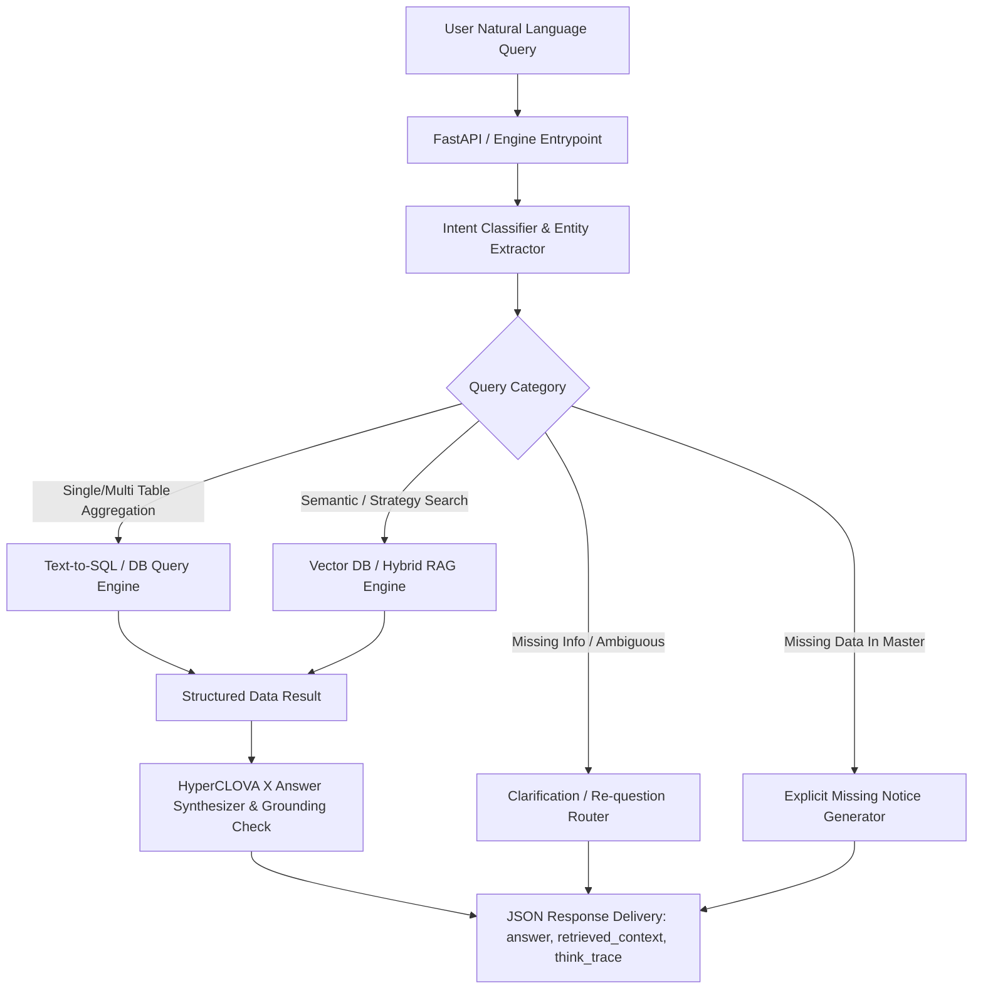

# 🤖 금융상품 AI Agent 구축 프로젝트 (`PROJECT.md`)

> **미래에셋 금융상품 데이터 기반 Agent RAG & QA 시스템 개발**  
> 대규모 금융 상품 마스터 데이터(국내채권, 국내/해외 ETF, 공모펀드)를 스스로 탐색·필터링·연산하고 근거에 기반해 답변하는 **HyperCLOVA X 기반 AI Agent**

---

## 1. 프로젝트 개요 (Project Overview)

### 🎯 대회의 목적
금융상품 데이터(국내채권, 국내/해외 ETF, 공모펀드)를 기반으로 **자연어 질의에 맞는 상품 정보를 조회, 비교, 설명하는 금융상품 AI Agent**를 구축합니다.  
단순 키워드/문서 검색을 넘어, 대규모 정형 상품 데이터(약 14.5만 건)를 Agent가 스스로 탐색, 조인, 필터링, 정렬 및 연산하여 근거 기반 답변을 제공하는 **Agentic RAG 및 QA 시스템** 구현이 핵심 과제입니다.

### 🤖 금융상품 Agent의 핵심 역할
1. **데이터 구조화 및 스키마 설계**: 서로 다른 4종 마스터 데이터의 속성과 특성을 분석하여 SQL/Vector Hybrid index 등 최적의 구조로 설계
2. **검색 & Agent 오케스트레이션**: 자연어 질의에 맞는 검색·필터링·연산 플랜을 수립하고 정확한 상품 비교 및 정보 도출
3. **질의 의도 및 정밀 파싱**: 사용자 질의 내 복합 조건(자산군, 투자지역, 위험등급, 총보수, 기간별 수익률, AUM 등)을 정확히 도출하고 정형 조건으로 파싱

### 🚨 필수 제약 조건 (Critical Rules)
> [!CAUTION]
> **LLM 모델 제한**: **반드시 HyperCLOVA X만 사용**해야 합니다. (타 LLM 모델 사용 시 평가 대상에서 즉시 제외)

- **데이터 우선순위**: 주최 측 제공 스냅샷 데이터가 평가의 absolute ground truth이며, 외부 데이터와 상충 시 주최 측 데이터를 우선 적용.
- **답변 생성 및 환각 방지 원칙**:
  - 데이터에 기반한 답변 생성 및 근거 데이터(`retrieved_context`, 참조 데이터명/종목코드 등) 명시 필수
  - 데이터에 근거하지 않은 수익률 전망 및 단정적 투자 추천 절대 금지 (Hallucination 0% 지향)
  - 정보 부족 시 자의적 추측 금지 -> `"확인할 수 없음"`을 명시하거나 필요한 조건을 역질문하여 대화 구체화
- **본선 및 멘토링 필수 참석 조건**:
  - 본선 및 멘토링 기간(**10.01 ~ 10.16**) 중 **팀원 전원 오프라인 대면 참석 원칙** (불가피한 불참 사유 발생 시 사전 협의 필수)
  - 오프라인 멘토링은 멘토 그룹 간 조율을 거쳐 **약 2~3회 진행** 예정

---

## 2. 주요 일정 (Timeline)

| 구분 | 일정 | 장소/비고 |
| :--- | :--- | :--- |
| **접수** | 2026.07.06 ~ 07.20 (23:59까지) | 온라인 웹페이지 |
| **오프라인 설명회** | 2026.08.06 (목) 13:00 ~ 17:30 | 네이버 그린팩토리 2층 커넥트홀 (팀당 최소 1명 필참) |
| **과제 세부 공지** | 2026.07.27 (월) | 최종 배정주제, 데이터셋 공지 |
| **예선 개발 기간** | 2026.07.27 ~ 09.06 | **핵심 개발 & 서버 구축 기간 (9/6 23:59 마감)** |
| **API 서버 필수 활성화 기간** | **2026.09.07 ~ 09.20** | **평가 기간 내 API 서버 상시 가동 필수** (변경 시 사전 공지) |
| **예선 평가** | 2026.09.07 ~ 09.30 | 정량/정성 오토배치 평가 진행 |
| **본선 진출팀 발표**| 2026.10.01 | **최종 6개 팀 진출** |
| **본선 및 멘토링** | 2026.10.01 ~ 10.16 | 오프라인 대면 진행 (네이버 1784 / 미래에셋증권 사옥, 약 2~3회) |
| **결선 및 최종발표**| 2026년 10월 중 | 세부 일정 및 장소 추후 공지 (현업 활용성 & 리스크 관리 평가) |

---

## 3. 데이터 명세 및 결측 특성 (Data Specification & Missing Data)

**기준일**: 2026-07-11 추출 스냅샷 데이터 (총 4개 테이블, 약 14.5만 건)

> [!WARNING]
> **Agent 예외 처리 및 결측 대응 필수 (Hallucination 방지)**  
> 데이터베이스에 값이 결측되어 있거나 포함되지 않은 속성에 대해 Agent가 임의로 수치를 추측하지 않고, `"확인할 수 없음"` 또는 조건 구체화 역질문으로 응답하도록 설계해야 합니다.

| 테이블 ID | 테이블명 | 레코드 건수 | 주요 정보 | ⚠️ 데이터 결측/특이사항 (Agent 주의) |
| :--- | :--- | :--- | :--- | :--- |
| `PRBD01N001` | **국내채권마스터** | 42,394건 | 종목 기본정보, 채권종류, 신용/위험등급, 발행/만기일, 표면금리, 듀레이션, 평가가격 등 | **매수 및 세후 수익률**은 매수가능 종목 중 **일부만 수록**되어 있음 |
| `PREF01N001` | **국내ETF마스터** | 1,734건 | 운용사, 위험등급, 투자자산군/지역, 기간별 수익률, 순자산, 거래대금, 분배/연금거래 여부 등 | **기초지수**와 **총보수 정보**는 **일부 종목만 수록**되어 있음 |
| `PREF02N001` | **해외ETF마스터** | 5,646건 | 티커, ISIN, 상장시장, 거래통화, 기초지수, 운용사, 총보수, 운용전략(영문), AUM, 종가, 거래량 등 | 총보수/운용전략 등 영문 데이터 파싱 및 통화 환율 고려 |
| `PRFD01N001` | **공모펀드마스터** | 95,619건 | 종목 기본정보, 운용속성, 벤치마크, 투자지역, 환헤지 여부, 기간별 수익률, 순자산, 위험등급 등 | **보수 정보가 아예 포함되어 있지 않음** (펀드 보수 질의 시 "데이터 미제공/확인 불가" 명시 필수) |

---

## 4. 평가 기준 및 페널티 규정 (Evaluation Criteria & Penalty)

### 📊 정량적 요소 (기능 및 성능)
- **상품 검색 및 조회 정확도**: 비공개 평가 질의(난이도 상/중/하 혼합)에 대해 복합 조건에 부합하는 상품을 누락 없이 탐색하는가?
- **비교 및 연산 처리 능력**: 동종 및 이종 상품간 보수, 수익률 비교, 정렬, Top-N 추출, 집계 처리의 정확성
- **외부 연동성 & SLA**: 제출한 평가용 API 서버가 규격에 맞게 HTTP 요청을 수신하고 지연 없이 stable하게 응답하는가?

### 🎨 정성적 요소 (Agent 품질 및 안전성)
- **근거 기반 답변 (Grounding)**: 답변 작성 시 마스터 데이터 내 항목 및 숫자를 정확히 인용하며 근거 제시
- **환각 통제 (Hallucination Control)**: 데이터 결측 항목이나 미제공 정보에 대해 추측하지 않고 적절히 제어하는가?
- **안전한 투자 가이드라인 준수**: 단정적 수익률 전망 금지, 조건 부족 시 역질문을 통한 질의 구체화
- **아키텍처 우수성**: 데이터 구조화, Text-to-SQL/Vector RAG 파이프라인, Agent Workflow 타당성

### 🏆 결선 평가 요소 (최종 6개 팀)
- **현업 활용성 (Practical Utility)**: 실제 금융 서비스 및 현업 비즈니스 씬에서의 실효성 및 완성도
- **리스크 관리 (Risk Management)**: 불확실한 투자 정보 전달 방지, 금융 준법/가이드라인 준수 및 안전장치

### 🚫 실격 페널티 (Penalty Rule)
> [!CAUTION]
> **코드/서버 변경 절대 금지**: **2026년 9월 6일 23:59 (예선 제출 마감) 이후** Github 저장소 커밋/Push, API 서버 배포 update 등 코드 및 결과물 변경 행위가 적발되는 경우 **즉시 실격 처리**됩니다.

---

## 5. 제출물 및 서버 구축 규격 (Submission & Infrastructure)

### 📦 제출물 목록 및 채널 (예선 마감: 2026.09.06 23:59)
- **제출 채널**: 주최 측이 제공하는 **Github Organization 내 Private Repository에 Push**하여 제출
- **대용량 파일 제출 방법**: 모델 가중치, 인덱스 등 대용량 파일은 압축 파일(`.zip`, `.tar.gz` 등) 형태로 **범용 클라우드 스토리지(Google Drive, Ncloud Object Storage 등)에 업로드 후 다운로드 공유 링크를 제출**

1. **소스코드**: 구현체 코드, 재현 가능한 `Dockerfile`, `requirements.txt`, 구동 가이드 `README.md`
2. **기술 제안서**: 제안 요약, 문제 정의, 시스템 아키텍처, 파이프라인 흐름도, 시나리오, 기대효과 (자유 양식)
3. **평가용 API 서버 정보**: End-point URL + API 명세서 (요청/응답 JSON 스키마)

### 🌐 API 서버 구축 환경 및 운영 주의사항
- **서버 활성화 기간**: **2026.09.07 ~ 2026.09.20 (상시 활성화 필수)**
- **네트워크 필수 조건**: 주최 측 오토배치 평가 시스템이 접근할 수 있도록 **Public 망 통신이 가능한 네트워크(Public IP / FQDN Domain)** 설정 필수
- **네이버클라우드플랫폼 (NCP) 사용 시 유의사항**:
  - 제공되는 크레딧을 활용하여 NCP에 서버를 개설하거나, 참가팀이 선호하는 cloud/on-premise 환경에 자유롭게 구축 가능
  - > [!WARNING]
    > 제공된 NCP 크레딧 한도를 초과하여 과금되는 비용에 대해서는 주최 측의 별도 보전이 없으므로 인스턴스 스펙 및 트래픽 관리에 각별히 유의해야 합니다.

### 🔌 REST API 인터페이스 명세

#### 1) Request 규격 (주최 측 -> 참가팀 API)
```bash
# cURL 예시
curl -G "https://{team-endpoint}/answer" \
  --data-urlencode "question_id=Q-001" \
  --data-urlencode "question=국내 상장 ETF 중 최근 1년 수익률이 가장 높은 채권형 ETF 3개를 알려줘."
```

```python
# Python 예시
import requests

response = requests.get(
    "https://{team-endpoint}/answer",
    params={
        "question_id": "Q-001",
        "question": "국내 상장 ETF 중 최근 1년 수익률이 가장 높은 채권형 ETF 3개를 알려줘."
    }
)
result = response.json()
```

#### 2) Response JSON Schema (참가팀 API -> 주최 측)
```json
{
  "question_id": "Q-001",
  "question": "국내 상장 ETF 중 최근 1년 수익률이 가장 높은 채권형 ETF 3개를 알려줘.",
  "retrieved_context": "PRBD01N001/PREF01N001 조회 결과: 1. KBSTAR KIS국고채30년EN (코드: 456780, 1년수익률: 12.5%), 2. ACE 미국30년물국채엔화노출(합성 H) (코드: 472160, 1년수익률: 11.8%), 3. KODEX 미국30년국채액티브 (코드: 461580, 1년수익률: 10.2%)",
  "think_trace": "1. [Intent Classification] 질의 분류: 국내 ETF 대상 조건 검색 및 정렬\n2. [Query Generation] PREF01N001 마스터 테이블에서 '자산군=채권' 필터링 후 1년 수익률 내림차순 정렬 Top 3 추출 SQL 실행\n3. [Execution Result] 상위 3개 종목 데이터 확보\n4. [Answer Synthesis] HyperCLOVA X를 활용해 수치 및 근거 기반으로 최종 답변 구성",
  "answer": "국내 상장 ETF 중 최근 1년 수익률이 가장 높은 채권형 ETF 상위 3개 종목은 다음과 같습니다.\n\n1. **KBSTAR KIS국고채30년EN** (1년 수익률: 12.5%)\n2. **ACE 미국30년물국채엔화노출(합성 H)** (1년 수익률: 11.8%)\n3. **KODEX 미국30년국채액티브** (1년 수익률: 10.2%)\n\n*본 답변은 2026년 7월 11일 기준 마스터 데이터(PREF01N001)에 근거한 정보이며, 미래 투자 수익률을 보장하지 않습니다.*"
}
```

---

## 6. 개발 아키텍처 및 로드맵 (Architecture & Roadmap)



- **Database Strategy**: 4종 CSV/DB 마스터 데이터의 DB 테이블화 + BM25 & Vector Hybrid Indexing
- **Missing Data Handler**: `PRFD01N001` 펀드 보수 미제공, `PRBD01N001` 세후수익률 일부 결측, `PREF01N001` 기초지수/총보수 일부 결측 자동 감지 및 처리 로직
- **HyperCLOVA X Prompt Engineering**: System Prompt 내 Grounding 강제, JSON format strict validation, Hallucination guardrail 구축
