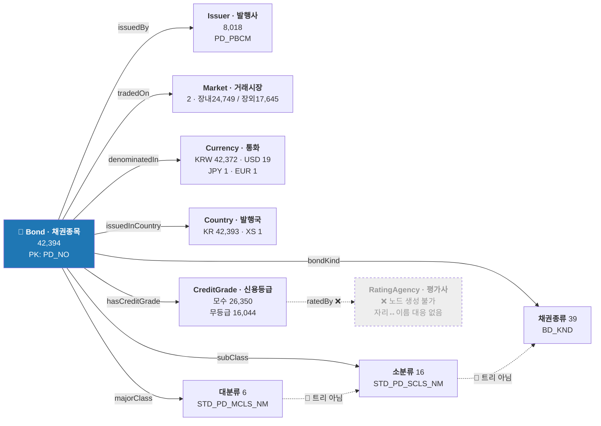
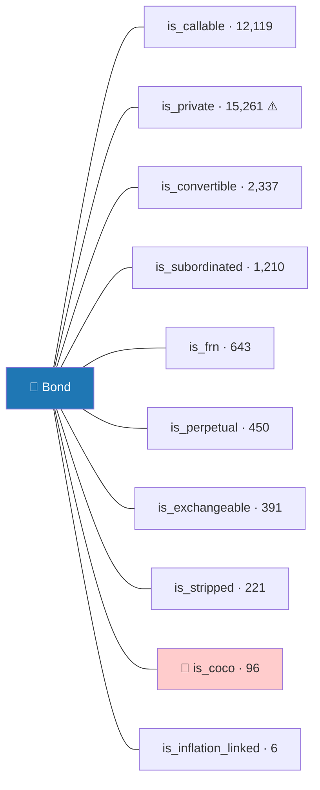
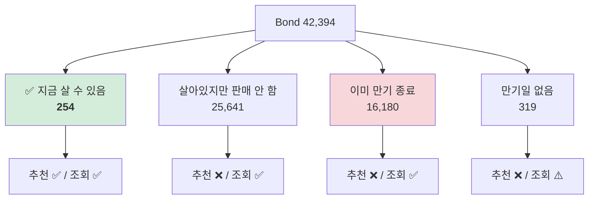
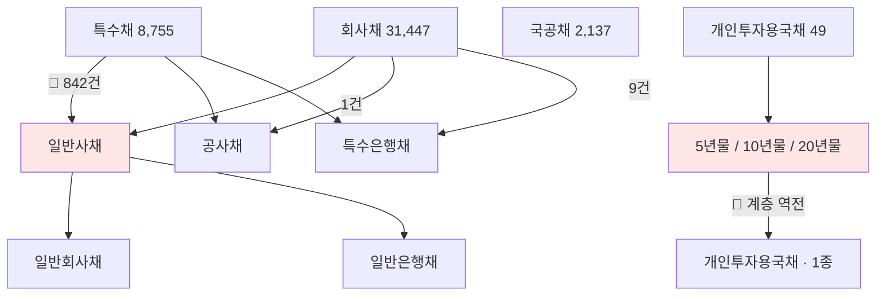
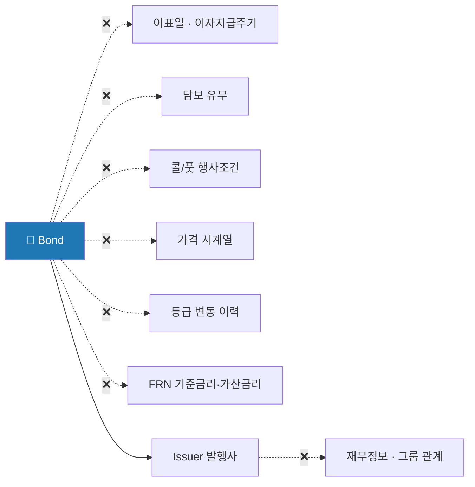

# 🕸️ 국내채권 구조도 — 작업 산출물 기준 정리

> `domestic_bonds` **42,394행 × 40컬럼** 을 **NEXT_STEPS §4.1 작업 순서**(① yaml → ② axis → ③ 층위 → ⑤ 질의 → ⑥ 발굴)에 맞춰 재배치하고, **컬럼 40개의 의미·결측 이유·도메인 법칙**을 온톨로지 작성용으로 요약한 문서입니다.
>
> - 작업 지시·yaml 형식 → `docs/NEXT_STEPS.md` §4.1 · §5.1
> - 개념 설명 전체 → `docs/domain/domestic_bonds.md`
> - 근거 숫자·재현 SQL → `docs/eda/domestic_bonds_notes.md`
> - **이 문서에 새로운 사실은 없습니다.** 위 문서들의 내용을 작업 단위로 재배치·요약했습니다.
>
> 표기: ✅ 확인됨 · 🔸 추정(원본 정의 없음, 워크샵 확정 필요) · ❌ 불가 · 🔴 함정 · 📌 발행 시 확정(불변) · 🕐 시점 값

---

## 0. 한 장 요약



> 🔑 **중심 노드는 `Bond` 하나입니다.** 공모펀드처럼 클래스/모펀드로 행이 쪼개져 있지 않아
> **행 하나 = 채권 한 종목**이고, 40개 컬럼 중 대부분이 여기 직접 붙는 속성입니다.
> 밖으로 나가는 관계는 **6개뿐**이고, 그중 3개(분류 3층)는 🔴 계층이 깨져 있습니다.
> 모든 엣지가 **N:1**입니다 — 다대다도, 채권끼리 잇는 엣지도 없어서
> **그래프라기보다 별 모양(star)** 에 가깝습니다.

### 이 문서 ↔ NEXT_STEPS §4.1 대응표

| NEXT_STEPS §4.1 작업 | 이 문서 | 결과물이 가는 곳 |
| :--- | :--- | :--- |
| **① yaml 작성** (최우선) | §1 컬럼 사전 · §2 결측 지도 · §3 query_rules 근거 · §4 kg_entity · §5 명명 변형 · §6 범주형 값 | `ontology/enums/domestic_bonds.yaml` |
| **② axis 8축 채점** | §7 채점 전 구조 제약 | `axis_derivation` (yaml 안) |
| **③ 층위 확인** | §8 | yaml `unit`·`layer` |
| — (되묻기·answer_policy 설계) | §9 도메인 법칙 | yaml `answer_policy` · `clarify` 분기 |
| **⑤ 예상질의 10문항** | §10 질의 경로 3종 | `eval/questions_domestic_bonds.jsonl` |
| **⑥ 발굴 (채권 5종)** | §11 없는 것 | yaml `note` 의 `TODO(수집):` |
| 워크샵 안건 | §12 미확정 | 8/17~18 워크샵 |

---

## 1. [작업①] 컬럼 사전 — 40컬럼의 의미·결측·함정 전수

역할별 8묶음. 각 묶음 머리에 **yaml에 채울 깊이**를 적었습니다.
한글명 출처는 도메인 문서 §9(약어 재구성)이며 ✅ = 값으로 확인 / 🔸 = **원본 `Sheet1_Schema` 대조 필요** (채권은 한글명 40개 전부 공란 — NEXT_STEPS §4.1 ④).

> 📌 NEXT_STEPS §5.1 원칙 — **모든 컬럼을 같은 깊이로 채우지 않습니다.**
> `answer_policy` 는 결측·이상값 있는 컬럼, `value_semantics` 는 범주형, `layer` 는 교차 축에만.

### 1.1 식별 (6) — 📌 불변 · yaml: `korean_name`+`note`, 약어명 3종은 `missing_semantics: ""`

| 컬럼 | 한글명 | 한 줄 의미 | 결측·함정 → 어떻게 다루나 |
| :--- | :--- | :--- | :--- |
| `PD_NO` | 종목코드 ✅ | **PK.** 12자리 ISIN — 앞 3자리에 대분류가 인코딩 (§7.1) | 결측 0 · 중복 0 |
| `PD_NM` | 종목명 ✅ | 🔑 **구조화된 정보** — 국고채는 `01875-5103` = 표면 1.875%·만기 2051-03. 특수구조·분리채권 식별의 **유일 수단** (§5.2) | 🔴 패딩 3.3% **혼재** — TRIM 없으면 종목마다 검색 성패가 갈림 |
| `PD_ABRV_NM` | 종목약어명 ✅ | 화면 표시용 약어 | NULL 69 + 공백 296 = **실결측 365** → *"약어명 없으면 정식명(`PD_NM`)으로 대체"* |
| `PD_ENG_NM` | 종목영문명 ✅ | 영문 정식명 | NULL 26 + 공백 298 |
| `PD_ABRV_ENG_NM` | 종목영문약어명 ✅ | 영문 약어 | NULL 72 + 공백 298 |
| `PD_CTRY_CD` | 발행국가코드 ✅ | 발행 국가 | `KR` 42,393 / `XS` 1 (예탁기구, 국가 아님) — 사실상 상수 |

### 1.2 분류 (3) — 📌 불변 · yaml: `value_semantics` 전수 + 계층 깨짐 `note`

| 컬럼 | 한글명 | 한 줄 의미 | 결측·함정 → 어떻게 다루나 |
| :--- | :--- | :--- | :--- |
| `STD_PD_MCLS_NM` | 표준상품 대분류명 ✅ | **발행 주체 기준 1차 분류(6종)** = 부도위험의 1차 축 (§6.1) | ✅ 유일하게 안전한 층 — axis 매핑은 여기만 |
| `STD_PD_SCLS_NM` | 표준상품 소분류명 ✅ | 2차 분류 16종 | 결측 13 = 외화 6(구조적 부재) + 회사채 미부여 7 · 🔴 대분류 특정 불가 (§7.1) |
| `BD_KND` | 채권종류 ✅ | 가장 세밀한 39종 (§6.1) | 결측 924 · 🔴 패딩으로 51개 값으로 갈라짐 · 상위 역추적 불가 · 🔴 분리채권 221건이 평범한 `국고채권`으로 묻힘 (§9.1) |

### 1.3 발행자·시장 (3) — 📌 불변 · yaml: `value_semantics` + 정규화 `note`

| 컬럼 | 한글명 | 한 줄 의미 | 결측·함정 → 어떻게 다루나 |
| :--- | :--- | :--- | :--- |
| `PD_PBCM` | 발행사 ✅ | **위험의 근원** — "누가 빌렸나". 8,018개 | 결측 2.2% · `(주)` 위치 제각각 (§5.1) · 🔴 종목 수 ≠ 규모 · MBS/ABS는 발행사 ≠ 위험 (§9.6) |
| `PD_EXG_MKT` | 거래시장 ✅ | 장내(거래소·개인 위주) / 장외(1:1 상대·기관 위주) — 🔴 **거래 방식이 아니라 종목 속성** | 종목당 한쪽만 기록 · 🔴 단독 group-by 금지 (§9.5) |
| `CURR_CD` | 통화코드 ✅ | 표시 통화 | `KRW` 42,372 — 사실상 상수 · 오염값 `000` 1건 |

### 1.4 발행조건 (4) — 📌 발행 시 확정 (🔴 예외: FRN 643건)

| 컬럼 | 한글명 | 한 줄 의미 | 결측·함정 → 어떻게 다루나 |
| :--- | :--- | :--- | :--- |
| `SRFC_IRT` | 표면금리 ✅ | 액면(10,000원) 대비 **매년 약속한 이자율(%)** = 발행 당시 시장금리의 박제 | 🔴 **한 컬럼에 네 의미** (§9.1): 일반채=발행 시 약속 / FRN 643건=오늘의 스냅샷 🔸 / 분리채권 221건=명목값 / **할인채 172건=발행 시 할인율 ✅**. 🔴 `0` 2,758건은 결측 아님 — **53.2%가 CB** |
| `ISU_DT` | 발행일 ✅ | YYYYMMDD 형태 숫자(REAL) | |
| `MAT_DT` | 만기일 ✅ | 원금 상환일 — **이후 채권은 소멸** | 센티넬 `0` 316건 · `99991231` 4건 · 만기상태 4분할의 기준 (§3.2) |
| `ISU_BAL_AMT` | 발행잔액 ✅ | 이 종목이 시장에 풀린 총액(원) = **유동성·규모 지표** | `0` 4,942건 · 발행사 **규모** 비교는 이 컬럼으로 (종목 수 아님, §9.6) |

### 1.5 신용·위험등급 (4) — 🕐 평가 시점 값 · yaml: **최대 깊이** (`answer_policy`+`value_semantics`+`layer`+`kg_entity`)

| 컬럼 | 한글명 | 한 줄 의미 | 결측·함정 → 어떻게 다루나 |
| :--- | :--- | :--- | :--- |
| `CRD_GRD` | 신용등급(대표) ✅ | **부도위험 점수의 요약본** — AAA~C, 한국식 중간값 `0` 표기 | 🔴 `'AA'` 조회 0건 (`AA0` 표기) · 결측 41.6%는 대부분 **무등급(정상)** · 그중 1,600건은 `PD_EVCO`에 값 있음 → **병합 후 판단** (§3.3) |
| `CRD_GRD_DT` | 등급 평가일 ✅ | 언제 평가받았나 | 날짜 자리에 `0` 존재 |
| `PD_EVCO_CRD_GRD` | 평가사별 신용등급 ✅ | **원본** — 평가사 각각의 등급을 콤마 결합, `0` 표기 없음 | 🔴 자리↔평가사 대응 없음 (§4.1) · 의견 갈림 258건(1.1%) |
| `PD_RISK_GCD` | 위험등급코드 ✅ | 판매 관점 **상품 위험도 0~6, 낮을수록 위험** — 금리위험 포함이라 신용등급과 **다른 축** | 결측 0 · 🔴 명세(1~5)와 실범위(0~6) 불일치 · 0등급 58건 워크샵 (§12) |

### 1.6 위험지표 (5) — 🕐 평가사 산출 · yaml: `unit` + 센티넬 `missing_semantics`

| 컬럼 | 한글명 | 한 줄 의미 | 결측·함정 → 어떻게 다루나 |
| :--- | :--- | :--- | :--- |
| `DUR` | 듀레이션 ✅ | **금리 1%p 변화 시 가격 변동률** = 금리위험의 크기 | 센티넬 `99` 2건 · 🔴 이론 위반(DUR>잔존만기) 1,035건 — 대부분 영구채·CB · `0` 8,268건 · 🔴 안전할수록 높음 (§9.3) |
| `COV` | 볼록성 ✅ | 듀레이션의 곡률 보정 — 일반 질의엔 거의 안 씀 | |
| `NDY_DUR` | 익일 듀레이션 🔸 | 익일 기준 재계산 추정 | `0` 위장결측 332건 |
| `NDY_COV` | 익일 볼록성 🔸 | 〃 | |
| `REMAINING_DAYS` | 잔존일수 ✅ | 만기까지 남은 일수 | `0` 7,805건 = 만기 도래 · 🔴 만기 지났는데 `>0` 3,296건 **모순** → `MAT_DT` 기준 재계산 권장 🔸 |

### 1.7 가격 (6) — 🕐 · yaml: `answer_policy` + 🔴 `NDY_*` 사용 금지 `note`

| 컬럼 | 한글명 | 한 줄 의미 | 결측·함정 → 어떻게 다루나 |
| :--- | :--- | :--- | :--- |
| `EVAL_PRICE` | 평가가격(클린) ✅ | **액면 10,000원 기준 시장가, 경과이자 제외** — 호가·비교의 기준 | 예: `7252.44` = "만원짜리가 지금 7,252원" (할인 상태, §9.2) |
| `APPLIED_YIELD` | 적용수익률 ✅ | 그 가격에 대응하는 **시장 YTM** | 🔴 `=0` **1,289건 위장결측** = 만기도래 550(산출 중단) + **사모 주식연계채 728(산출 대상 아님 — YTM 무의미)** + 만기불명 11 (노트 §D.14-②) → `query_rules.수익률정상` |
| `DIRTY` | 더티프라이스 ✅해석 | 경과이자 포함 **실제 결제금액** | 🔴 **94.5%가 `EVAL_PRICE` 복사 의심** 🔸 · `=0` 8건 · 경과이자 역산 불가 → **사용 보류** (워크샵) |
| `NDY_EVAL_PRICE` | 익일 평가가격 🔸 | 익일 기준 재계산 추정 | 🔴 미산출을 `0`으로 — 원본>0인데 0인 **8,503건** → **사용 금지** |
| `NDY_APPLIED_YIELD` | 익일 적용수익률 🔸 | 〃 | 🔴 위장결측 7,824건 → 사용 금지 |
| `NDY_DIRTY` | 익일 더티 🔸 | 〃 | 🔴 위장결측 8,495건 → 사용 금지 |

### 1.8 매수·수익률 (8) — 🕐 유통시장 정보: **증권사가 "지금 팝니다" 해야 생김** · yaml: `answer_policy` 필수

| 컬럼 | 한글명 | 한 줄 의미 | 결측·함정 → 어떻게 다루나 |
| :--- | :--- | :--- | :--- |
| `BUY_YIELD` | 매수수익률 ✅ | **지금 사서 만기까지 보유 시 세전 YTM** — 세금 컬럼들의 기준값 | 결측 97.9% = *"지금 매물이 아님"* (`not_applicable`) · 모수 881 → 실질 254 (§2.3) · 🔴 ETF·펀드의 실현수익률과 **다른 개념** (§8) |
| `AFTER_TAX_YIELD` | 개인 세후수익률 🔸 | 이자소득세 15.4% 반영한 실수령 기준 | 🔴 일괄 ×0.846이 아님 — 매매차익 비과세로 0.88~0.95 (§9.4) · 세후>세전 37건 · 음수 1건 **미해명** |
| `CORP_PRETAX_YIELD` | 법인 세전수익률 🔸 | 법인은 원천징수 없이 법인세로 정산 | |
| `CORP_AFTER_TAX_YIELD` | 법인 세후수익률 🔸 | 〃 | 세전=세후인 행 39건 |
| `PREF_TAX_YIELD` | 세금우대 수익률 🔸 | ISA 등 우대세율 계좌 기준 | |
| `AVG_ANNUAL_TAX_YIELD` | 연평균 과세수익률 🔸 | — | 🔴 **non-null 881건 전량 `0` — 사용 금지** (`IS NULL`로 안 잡힘) |
| `DEPO_EQUIV_YIELD_154` | 예금환산수익률 ✅ | **"이 채권 = 연 몇 % 예금과 같나"** — `154` = 세율 15.4% | ✅ `×0.846 = AFTER_TAX_YIELD` 가 880/881건 성립 — 일반인에게 가장 친절한 눈금 |
| `BUYABLE_QUANTITY` | 매수가능수량 ✅ | 지금 살 수 있는 수량 | 881건 중 `0` 556건 → **실질 325** |

### 1.9 메타 (1)

| 컬럼 | 한글명 | 한 줄 의미 | 비고 |
| :--- | :--- | :--- | :--- |
| `PD_STD_INFO_UPDATE` | 기준정보 갱신일 ✅ | 행별 정보 갱신 시점 | 최댓값 **2026-02-24** — 기준일 논쟁의 데이터 측 증거 (§12) · ✅ **FRN `SRFC_IRT` 의 기준 시점 근사치** — 단 84건은 스탬프-값 불일치 (§9.1-⑶) |

> 🔴 **값을 그대로 온톨로지 enum 에 넣으면 안 됩니다.**
> 공백 패딩 때문에 `BD_KND` 39종이 **51종으로** 등록되고,
> 위험등급을 명세대로 `1~5` 로 제약하면 **10,408건(24.6%)이 차단**됩니다.

---

## 2. [작업①] 결측 지도 — 빈칸이 다 같은 빈칸이 아닙니다

### 2.1 결측률 3층위 — 결측률이 채권의 "인생 단계"를 반영합니다

채권에는 발행시장(조건 확정)과 유통시장(매매)의 두 단계가 있고, **값이 "언제 생기는가"가 컬럼마다 다릅니다:**

| 층위 | 컬럼 | 값 있는 행 | 언제 생기나 |
| :--- | :--- | ---: | :--- |
| ① **발행 조건** 📌 | `SRFC_IRT` `MAT_DT` `ISU_DT` `ISU_BAL_AMT` | **42,392~394 (100%)** | 채권이 **존재하면** 반드시 |
| ② **평가 정보** 🕐 | `EVAL_PRICE` `APPLIED_YIELD` `DUR` | 31,823 (75.1%) | **평가사가 값을 매기면** |
| ③ **매수 정보** 🕐 | `BUY_YIELD` 계열 7종 | **881 (2.1%)** | **증권사가 "지금 팝니다" 해야** |

```
평가O 매수X  :  30,942건   ← "값어치는 아는데 지금 파는 물건이 아님"
평가O 매수O  :     881건
평가X 매수O  :       0건   ← 완벽한 포함관계
```

> 🔑 **`BUY_YIELD` 결측 97.9%는 "데이터 부실"이 아니라 "지금 안 팔고 있어서"입니다.**
> *"값을 모른다"* 가 아니라 *"지금 매물이 아니다"* 로 답해야 합니다.

### 2.2 결측 7유형 — 판정과 답변 문구 (노트 §B.2)

**일괄 `dropna()` 하거나 일괄 "확인 불가"로 답하면 전부 틀립니다.** yaml `missing_reason`·`answer_policy` 의 근거:

| # | 유형 | 대표 사례 | 답변·처리 |
| :-: | :--- | :--- | :--- |
| 1 | **구조적 부재** (`not_applicable`) | 국채의 `CRD_GRD` · 외화채권 6건의 소분류 | *"국채는 신용등급이 **부여되지 않습니다**"* — 확인 불가 ❌ |
| 2 | **상태 표현** — 결측 자체가 정보 | `BUY_YIELD` 41,513건 | *"현재 **판매 중이 아닙니다**"* |
| 3 | **미산출** | `DUR` 13,376 · `REMAINING_DAYS` 10,645 (만기 도래분) | 모수에서 제외 + 사유 명시 |
| 4 | **복구 가능** — 다른 컬럼에 있음 | `CRD_GRD` 결측 중 **1,600건이 `PD_EVCO`에 존재** | **병합 후 판단** |
| 5 | 🔴 **센티넬 위장** — `NULL` 아닌 값으로 | `AVG_ANNUAL_TAX_YIELD` 전량 0 · `DUR=99` · `MAT_DT=99991231` · `NDY_*=0` 8,503 · `APPLIED_YIELD=0` 1,289 | `IS NULL`로 안 잡힘 — **값 분포로 탐지** |
| 6 | 🔴 **복사 위장** — 다른 컬럼 값 복사 | `DIRTY` 27,430건이 `EVAL_PRICE` 복사 추정 🔸 | 컬럼 간 동일성 검사 |
| 7 | ⚠️ **정상값 오해** — 비어 보이지만 진짜 값 | `SRFC_IRT=0` 2,758건 = 할인채·CB | **결측 처리 금지** |

> 🔑 판정 순서: **⑦ 정상값인가 → ⑤⑥ 위장인가 → ④ 복구 가능한가 → ①②③ 어떤 부재인가**

### 2.3 모수 사다리 — "몇 개 중에서 고른 건지"를 항상 밝힙니다

```
42,394  전체
   └ 31,823  평가 정보 있음 (75.1%)
        └ 881  지금 호가 있음 (2.1%)          ← 🔴 그중 277건은 이미 만기 도래
             └ 325  매수 가능 수량 > 0 (0.8%)
                  └ 254  만기도 안 지남 (0.6%)  ← "지금 살 수 있는 채권"의 진짜 모수
```

> 🔴 *"수익률 높은 채권 추천"* 의 실질 모수는 42,394가 아니라 **254건(0.6%)** 입니다.
> **"판매 중" 표시조차 그대로 믿으면 안 됩니다** — 881건의 31.4%가 만기 도래분.
> 목적별 모수도 다릅니다: *시장 구조 설명* 은 16,349건(클린 모수), *상품 추천* 은 58~325건 — 섞으면 안 됩니다.

---

## 3. [작업①] yaml `query_rules` 근거 — 구조가 만드는 함정 3종

NEXT_STEPS §4.1 ①의 `query_rules` 8종 중, **구조에서 오는** 세 가지의 근거입니다.
(나머지 — 수익률정상·익일값금지·과세수익률금지·듀레이션정상·매수가능·문자열비교 — 는 §1 각 컬럼 행과 노트 §D 참조)

### 3.1 특수구조 → `query_rules.특수구조제외`

📊 **15,306건 (36.1%) — 3건 중 1건**이 하나 이상 해당합니다. 예외 처리할 규모가 아닙니다.
**노드가 아니라 Bond 에 붙는 O/X 플래그**로 표현합니다.

> ⚠️ 2026-08-20 정정 — ① `is_private` 는 15,261건('사모' 부분일치 = 괄호 내부 표기 전체, 전건 장외.
> 이전 10,067 은 어떤 패턴으로도 재현 불가). ② 합집합 15,306 은 **사모를 포함하지 않은** 구조
> 플래그만의 수치다(사모 포함 시 18,768+) — 사모는 "구조가 아니라 발행 방식"(`domestic_bonds.md` §6.4).
> `특수구조제외` 셋에 is_private 을 넣을지는 별도 결정 필요.



**왜 단일 "종류" 컬럼이 안 되나 — 겹치기 때문입니다:**

| | 전환 | 영구채 | 코코 | 후순위 | 콜옵션 |
| :--- | ---: | ---: | ---: | ---: | ---: |
| **영구채 296** | 0 | 296 | 0 | **250** | **295** |
| **코코본드 96** | 0 | 0 | 96 | **95** | 17 |
| **후순위 1,210** | 26 | 250 | 95 | 1,210 | **615** |

> 영구채 296건 중 **295건이 콜옵션부, 250건이 후순위**입니다. 하나만 고르게 만들면 표현이 안 됩니다.

**🔴 판정은 전부 종목명 파싱입니다 — 별도 컬럼이 없습니다.**

```
퀀타매트릭스 3CB(신종)(사모/전환/콜/후)   ← 한 채권에 플래그 4개가 동시에
```

정규식을 **구분자 기준**(`[(/]후[)/]`)으로 짜야 합니다. `(후)` 만 찾으면 218건, **992건이 빠집니다.**

> 🔴 **[2026-08-16 신규] 위 10종 목록에 빠져 있던 유형 3종** (노트 §D.14-② 부수 발견):
> **BW(신주인수권부)** `\d+BW` **133건** — CB·EB와 함께 주식연계 3형제인데 누락 ·
> **풋옵션부** `[(/]풋[)/]` **2,150건** — 콜(12,119)만 있고 풋이 누락 (투자자가 조기상환 요구 가능 = 콜과 반대 방향) ·
> `\d+PB` 50건 — 의미 **미해독**. → `is_bw` · `is_puttable` 플래그 추가, PB는 미해독 목록으로.

**이 플래그들이 없으면 조용히 깨지는 것 → 각 컬럼 yaml `note` 에 이 건수를 적으세요:**

| 깨지는 규칙 | 실제 |
| :--- | :--- |
| *표면금리 0 = 할인채* | `SRFC_IRT=0` 2,758건 중 **53.2%가 전환사채** |
| *AA등급 = 안전* | 🔴 코코본드 96건이 전부 AA급 — **원금이 소각될 수 있는데 필터를 통과** |
| *등급으로 거르기* | 전환사채의 **99.1%**, 콜옵션부 71.0%, 후순위 62.1% 가 등급 없음 → 통째로 사라짐 |

> ⚠️ 플래그는 **파생 컬럼으로 만들지 않습니다** (NEXT_STEPS 3원칙 ②).
> 정규식 자체를 yaml 규칙으로 선언하고, 추천·랭킹 질의에서 기본 제외합니다.

### 3.2 만기 상태 4분할 → `query_rules.만기상태`



> 🔴 **만기 종료분 16,180건을 지우면 안 됩니다.** 발행사 8,015곳 중 **2,291곳(28.6%)이 여기에만** 있어서,
> 지우면 *"○○회사 채권 알려줘"* 에 *"없습니다"* 라는 **거짓말**이 나갑니다. 삭제가 아니라 **상태 표시**입니다.
> 이력 가치도 큽니다 — *"2020년 발행 채권의 표면금리"* 는 만기 도래분 없이는 **62% 왜곡**됩니다.

> 🔴 **미확정 — 4분할의 경계가 아직 안 정해졌습니다.** 기준일이 `2026-07-11` 이냐 `2026-02-24` 냐에 따라
> 만기 종료가 **16,180 vs 11,940** 으로 갈립니다. → §12 워크샵 안건 · 노트 §D.1 · §J.7-1

### 3.3 신용등급 두 컬럼·표기 → `query_rules.등급정규화`

| 사실 | 규모 | yaml에 들어갈 곳 |
| :--- | :--- | :--- |
| 표기가 `AA` 가 아니라 **`AA0`** — `'AA'` 조회 시 0건 | 등급 20종 | `CRD_GRD.value_semantics` + `query_rules.등급정규화` |
| `CRD_GRD` 단독 24,750 → `PD_EVCO_CRD_GRD` 병합 시 **26,350 (+1,600)** | +1,600건 | `CRD_GRD.note` (병합 후 판단) |
| 병합해도 남는 진짜 무등급 | **16,044건** | `answer_policy` — "확인 불가"가 아니라 **"국채는 등급이 부여되지 않습니다"** |

---

## 4. [작업①] yaml `kg_entity` — 노드·엣지 전수

yaml을 채울 때 "이 컬럼 값이 나중에 KG 개체가 되는가"를 판단하는 재료입니다.
(판별 기준: **이 값으로 다른 테이블을 찾아가는가** — NEXT_STEPS §3.1)

### 4.1 만들 수 있는 노드 / 없는 노드

| 노드 | 출처 컬럼 | 개수 | 라벨 | 상태 | KG 후보? |
| :--- | :--- | ---: | :--- | :--- | :--- |
| **Bond** 채권종목 | `PD_NO` | 42,394 | `PD_NM` | ✅ PK 중복 0 | — (자기 자신) |
| **Issuer** 발행사 | `PD_PBCM` | 8,018 | 자기 자신 | 🔸 표기 정규화 필요 | ✅ `kg_organization` (4테이블 교차) |
| **CreditGrade** 신용등급 | `CRD_GRD` + `PD_EVCO_CRD_GRD` | — | `AA0`… | 🔸 `0` 접미사 정규화 필수 | ❌ 채권 전용 → SQL 컬럼으로 충분 |
| **RiskGrade** 위험등급 | `PD_RISK_GCD` | 0~6 | — | 🔴 실제 범위 0~6 (§8) | ✅ `kg_riskgrade` (4테이블 교차) |
| **Market** 거래시장 | `PD_EXG_MKT` | 2 | 장내/장외 | 🔴 교란변수 (§9.5) | ❌ |
| **Currency** 통화 | `CURR_CD` | 4 | `KRW`… | 🔴 오염값 `000` 1건 | ✅ 공유 개체 6종에 포함 |
| **Country** 발행국 | `PD_CTRY_CD` | 2 | `KR`/`XS` | 🔸 `XS`는 국가 아님(예탁기구) | ❌ 42,393/42,394 가 `KR` — 사실상 상수 |
| **대분류** | `STD_PD_MCLS_NM` | 6 | 국공채… | ✅ 유일하게 안전한 층 | ❌ 채권 전용 |
| **소분류** | `STD_PD_SCLS_NM` | 16 | 국고채… | 🔴 결측 13, 대분류 특정 불가 | ❌ |
| **채권종류** | `BD_KND` | 39 | 국고채권… | 🔴 결측 924, 상위 역추적 불가 | ❌ |
| **RatingAgency** 평가사 | — | — | — | ❌ **생성 불가** (아래) | ❌ |

**❌ RatingAgency 가 왜 안 되나** — `PD_EVCO_CRD_GRD` 는 `'AAA, AAA, AA+'` 처럼 콤마로만 결합돼 있고,
**첫 번째 자리가 한신평인지 NICE인지 데이터에 없습니다.** 알 수 있는 건 여기까지입니다:

| 알 수 있음 ✅ | 알 수 없음 ❌ |
| :--- | :--- |
| 몇 곳이 평가했나 — 3곳 14,776 · 2곳 7,829 · 1곳 2,361 | 어느 평가사가 매겼나 |
| 의견이 갈렸나 — **258건(1.1%)** | 평가사별 성향 비교 |

> 🔴 **`Bond -ratedBy-> RatingAgency` 엣지는 만들면 안 됩니다.** 대신 `평가사수`·`의견갈림` 을
> **Bond의 속성**으로 두는 게 데이터가 실제로 지지하는 최대치입니다.
> → 자리↔이름 대응표는 §11 발굴 대상 (`TODO(수집):` 신용평가사 이름).

### 4.2 엣지 전수 — 전부 N:1

| 관계 | 근거 | 주의 |
| :--- | :--- | :--- |
| `Bond -issuedBy-> Issuer` | `PD_PBCM` | 🔸 `(주)` 위치가 앞뒤 제각각 → 정규화 전엔 동일사가 갈라짐 |
| `Bond -tradedOn-> Market` | `PD_EXG_MKT` | 🔴 종목당 **한쪽만** 기록 — 같은 채권의 장내/장외 비교 불가 |
| `Bond -hasCreditGrade-> CreditGrade` | 두 컬럼 병합 | 🔴 §3.3 — 병합 안 하면 1,600건 누락 |
| `Bond -majorClass-> 대분류` | `STD_PD_MCLS_NM` | ✅ 이 층만 신뢰 가능 |
| `Bond -subClass-> 소분류` | `STD_PD_SCLS_NM` | 🔴 상위 특정 불가 (§7.1) |
| `Bond -bondKind-> 채권종류` | `BD_KND` | 🔴 상위 특정 불가 (§7.1) |
| `Bond -denominatedIn-> Currency` | `CURR_CD` | 42,372/42,394 가 `KRW` — 사실상 상수 |
| `Bond -issuedInCountry-> Country` | `PD_CTRY_CD` | 42,393/42,394 가 `KR` — 사실상 상수 |

---

## 5. [작업①/KG] 명명 변형 사전 — 같은 대상이 다르게 불리는 지점 전수

질의어 grounding(*"사용자가 말한 것 → 데이터의 실제 값"*)이 실패하는 지점들입니다.
**교차 테이블 항목(①②③)은 워크샵 후 KG 매핑표의 채권 쪽 재료**가 됩니다.

### 5.1 표기 변형

| # | 대상 | 표기들 | 처리 |
| :-: | :--- | :--- | :--- |
| ① | **발행사/운용사** (4테이블 교차) | 채권 `미래에셋…(주)` / 국내ETF `미래에셋`(약칭) / 펀드 `00080012`(코드) / 해외ETF 영문 · `(주)` 위치도 앞뒤 제각각 (`(주)신한은행` vs `하이트진로(주)`) | → `kg_organization` |
| ② | **위험등급** (4테이블 교차) | 채권 정수 `3` / 국내ETF 문자열 `PD_RISK_GCD_13` / 펀드 REAL `3.0` | → `kg_riskgrade` |
| ③ | **통화** | 국내ETF만 `CURR_CD_` 접두사 | → `kg_currency` |
| ④ | **신용등급** (컬럼 간) | 사용자 `AA` / `CRD_GRD` **`AA0`** / `PD_EVCO_CRD_GRD` **`AA`** — 같은 테이블 안에서도 규칙이 갈림 | `0` 접미사 정규화 규칙 (§3.3) |
| ⑤ | **종목 이름 3벌 + 패딩** | 정식명·약어명·영문명·영문약어명 4컬럼 + 뒤 공백 패딩 96~98% (`PD_NM`만 3.3% 혼재) | `TRIM()` 전면 |
| ⑥ | **종목명 공백 흔들림** | `국고채권03000-…`(붙임) vs `국고채권 02250-…`(띄움) vs `국고채권05750-… (6-1)`(괄호 앞 공백) | 파싱 전 정규화 |
| ⑦ | **FRN 표기 4종** | `(변)` 271 / `(콜/변)` 232 / `(변동)`·`(K변동)` 29 (농협 전용) / `변이`·`KOFR-변` 등 111 | 🔴 `(변)`만 잡으면 42% · `천변`(川邊) 오탐 1건 제외 필수 |
| ⑧ | **통안증권** | 통칭·종목명은 `통화안정증권` / `BD_KND` 실값은 **`통화안정채권`** | 🔴 '통화안정증권'으로 `BD_KND` 조회 시 **0건** (노트 §D.15) |

### 5.2 이름·코드 자체가 구조화된 정보입니다

**종목명 인코딩** — 별도 컬럼이 없는 정보가 이름에 박혀 있어, **이름 파싱이 곧 데이터 추출**입니다:

```
국고채권  01875 - 5103  (21-2)          퀀타매트릭스 3CB(신종)(사모/전환/콜/후)
   │        │      │       │                          │      │    └ 특수구조 4개 동시
발행종류  표면금리  만기    발행 회차                  전환사채  신종자본
         1.875%  2051-03  2021년 2회차
```

| 이름 속 단서 | 알 수 있는 것 | 건수 |
| :--- | :--- | ---: |
| `[(/]콜[)/]` · `[(/]사모[)/]` · `[(/]후[)/]` … | 특수구조 플래그 10종 (§3.1) | 15,306 |
| **`분리채권`** | 🔴 **STRIPS 221건 — 사실상 무이표인데 `BD_KND`론 평범한 `국고채권`.** 이름이 유일한 식별 수단 (§9.1) | 221 |
| `이표` / `할인` / `복리` | 이자 지급 방식 명시 | 437 / 172 / 8 |
| 국고채 이름의 숫자 | 표면금리·만기 — `SRFC_IRT`·`MAT_DT`와 일치 검증됨 | — |

**종목코드(ISIN) 앞 3자리** — 분류 트리가 깨져 있고(§7.1) `BD_KND` 결측이 924건이라, **사실상 유일한 분류 보완 수단**:

| 접두 | 건수 | 대응 대분류 |
| :--- | ---: | :--- |
| `KR6` | 31,327 | 회사채 |
| `KR3` | 8,812 | 특수채 |
| `KR2` | 1,631 | 국공채 |
| `KR1` | 333 | 국채 (대분류로는 국공채 284 + 개인투자용국채 49) |
| `KRC` / `KRB` / `KRZ` / `XS3` | 222 / 49 / 19 / 1 | 국공채 / 회사채 / 회사채 / 해외 발행(대분류는 회사채) |

> ⚠️ 2026-08-20 실측 — **1:1 이 아니라 다수 매핑**: `KR3` 에 회사채 57건, `KR6` 에 외화채권 6건 혼재.
> `BD_KND` 결측 보완에 쓸 때는 '추정' 표기 필수 (`domestic_bonds.yaml` name_encoding.isin_prefix 교차표).

---

## 6. [작업①] 범주형 값의 의미 — yaml `value_semantics` 초안

### 6.1 대분류 `STD_PD_MCLS_NM` (6종)

| 값 | 건수 | 발행 주체 | 📖 안전도 (부도위험) |
| :--- | ---: | :--- | :--- |
| `회사채` | 31,447 (74.2%) | 일반 기업 — 은행채·카드채·캐피탈채 포함 | 낮음 (기업마다 다름) |
| `특수채` | 8,755 (20.7%) | 법으로 설립된 공기업 (한전·LH·주금공·산은) — 정부가 사실상 뒤를 봐줌 | 높음 |
| `국공채` | 2,137 (5.0%) | 정부(국고채)·지자체(지방채)·한국은행(통안채) | **최고** |
| `개인투자용국채` | 49 | 정부 (개인 전용) — 🔴 49건 전부 `장외` | 최고 |
| `외화채권-회사채` / `외화채권-금융채` | 5 / 1 | — | — |

> 📖 **금리는 안전도의 역순** (국공채 < 특수채 < 회사채) — 신용스프레드.
> 단, **듀레이션은 안전도의 정순**입니다 (§9.3) — 두 위험이 상충.

### 6.2 신용등급 `CRD_GRD` (20종 — 전수는 yaml에서)

```
 AAA   AA+  AA0  AA-   A+  A0  A-   BBB+ BBB0 BBB-  │  BB+ 이하
 └──────────── 투자등급 (Investment Grade) ────────┘  └─ 투기등급("정크") ─┘
  최고                                    투자 마지노선
```

- **알파벳** = 큰 등급, **+/0/−** = 세분. 🔴 한국은 중간값에 `0` (`AA0`·`A0`)
- 📖 **`BBB-`↔`BB+` 경계가 실무의 결정선** — 많은 기관이 규정상 투기등급 매수 불가
- 📊 분포: `AAA` 12,240 · `AA-` 4,939 · `AA+` 3,191 · `AA0` 1,713 · `A+` 906 · `A0` 904 … 투기등급은 200건 미만. **투자등급에 절대다수**
- 🔴 서열 정의(AAA > AA+ > AA0 > …)는 데이터에 없음 → §11 발굴 #5

### 6.3 위험등급 `PD_RISK_GCD` (0~6)

| 값 | 뜻 | 건수 |
| :-: | :--- | ---: |
| `0` | 🔴 미분류 추정 — 채권에만 존재, 워크샵 확정 | 58 |
| `1` | 매우 높은 위험 | 15,950 |
| `2` / `3` / `4` | 높은 / 다소 높은 / 보통 위험 | 62 / 282 / 1,938 |
| `5` | 낮은 위험 | 13,696 |
| `6` | 매우 낮은 위험 | **10,408** |

> ✅ 방향 확정: 국공채 2,137건 전부 6등급 → **낮을수록 위험**.
> 🔴 신용등급과 **다른 축** — 1등급(가장 위험)에 AAA 498건 (금리위험 포함 지표라서, §8).

### 6.4 그 외 범주형

| 컬럼 | 값 | 뜻 |
| :--- | :--- | :--- |
| `PD_EXG_MKT` | `장내` 24,749 | 한국거래소 — 개인도 참여, 표준화·등급 있는 우량채 위주 |
| | `장외` 17,645 | 증권사·기관 1:1 상대 거래 — 소액 사모·특수구조 몰림 (§9.5) |
| `CURR_CD` | `KRW` 42,372 / `USD` 19 / `JPY` 1 / `EUR` 1 | + 🔴 오염값 `000` 1건 — enum 등재 금지 |
| `PD_CTRY_CD` | `KR` 42,393 | + `XS` 1건 = 국제예탁결제기구(Euroclear/Clearstream) — 국가 아님 |

---

## 7. [작업②] axis 채점 전 알아야 할 구조 제약

가설 8개는 노트 §F.2에, 채점 방법은 NEXT_STEPS §4.1 ②에 있습니다.
**채점 전에 알아야 규칙을 잘못 세우지 않는** 구조 사실 두 가지:

### 7.1 🔴 분류 3층은 트리가 아닙니다 — `axis_issuerType` 규칙 제약

**계층으로 그리면 이렇게 되어야 하는데:**

```
대분류 6  →  소분류 16  →  채권종류 39
```

**실제로는 가지가 서로 얽혀 있습니다:**



**세 가지가 깨져 있습니다:**

| # | 무엇이 | 규모 |
| :-- | :--- | :--- |
| ① | 소분류 **3종이 두 대분류에 동시에** 걸침 | `일반사채` = 회사채 30,116 + **특수채 842** |
| ② | 채권종류 **10종이 여러 소분류에** 걸침 | `일반회사채`·`일반은행채`·`일반특수법인채` 등 |
| ③ | `개인투자용국채` 는 **계층이 뒤집힘** | 하위(1종)보다 상위(3종)가 더 세밀 |

> 🔑 **채점 규칙에 적용:**
> ✅ `axis_issuerType` 은 **대분류(`STD_PD_MCLS_NM`) 단독 매핑**만 유효
> ❌ **소분류·채권종류를 경유해 상위를 역추적하는 규칙은 만들면 안 됩니다** — 842건이 틀립니다
> 🔸 보완 수단은 `PD_NO` 앞 3자리 (§5.2)

### 7.2 ❌ 근거 컬럼이 아예 없는 축 2종 — 채점 불가

| 축 | 왜 불가 | 지금 가능한 최대치 | 처리 |
| :--- | :--- | :--- | :--- |
| `axis_collateralType` | 담보 구분 컬럼 없음 | `Subordinated` 만 종목명 `[(/]후[)/]` 로 1,210건 식별 | §11 발굴 → yaml `axis_derivation.pending_workshop` |
| `axis_issuerCategory` | 발행사 업종(금융/비금융) 컬럼 없음 | `PD_PBCM` 8,018개 문자열 판단뿐 | §11 발굴 → 동일 |

> ⚠️ `axis_couponType` 도 주의 — `SRFC_IRT=0` → `ZeroCoupon` 규칙은 **양방향으로 깨져 있습니다** (§9.1-⑵).
> ✅ `ZeroCoupon` 판정은 **종목명(`할인`·`분리채권`) + 가격 구조**로 (노트 §D.15).
> 못 맞춘 축도 **결과 그대로** 워크샵에 가져갑니다 (NEXT_STEPS §8 체크리스트).

---

## 8. [작업③] 층위 — 다른 테이블과 나란히 못 놓는 것

상세 지시는 NEXT_STEPS §4.1 ③. 이 구조도와 겹치는 사실:

| 항목 | 구조도에서의 근거 | yaml에 들어갈 곳 |
| :--- | :--- | :--- |
| `PD_RISK_GCD` 실제 범위 **0~6** (명세 1~5는 오류) | `1~5` 제약 시 6등급 **10,408건(24.6%) 차단** · 0등급 58건은 채권에만 | `layer.scale` + §12 워크샵 안건 |
| `BUY_YIELD` 는 **YTM** | ETF·펀드의 실현 누적 수익률과 **다른 개념** — 함께 정렬 금지 | `layer.note` 명시 필수 |
| 위험등급 ≠ 신용등급 | 1등급(가장 위험)에 **AAA 498건** — 위험등급은 금리위험 포함 | `CRD_GRD.layer.note` |
| 시장 간 비교 불가 | 종목당 장내/장외 **한쪽만** 기록 (§4.2) | `PD_EXG_MKT.note` |

---

## 9. 도메인 법칙 — 같은 질문에 다른 답이 나오는 지점 6가지

**데이터가 완벽해도 남는** 채권 고유의 성질들입니다. yaml `answer_policy` 와 `clarify`(역질문) 분기의 근거가 됩니다.
각 항목의 ✅/🔸 는 검증 상태 — 🔸 는 §9.7 검증 TODO 대상입니다.

### 9.1 같은 컬럼, 다른 의미 — `SRFC_IRT` 는 한 컬럼에 네 의미가 섞여 있습니다

| 채권 유형 | `SRFC_IRT` 의 실제 의미 | 근거 |
| :--- | :--- | :--- |
| 일반 고정금리채 (대부분) | **발행 당시의 약속** — 만기까지 불변 ✅ | 도메인 §2.2 |
| **FRN 643건** | 🔸 **"오늘의 스냅샷"** — 기준일 현재 적용 금리 | 2025년 발행 FRN 129건이 발행사 제각각인데 **0.37%p 폭에 수렴** (고정금리채는 0.1~20.0 흩어짐). 2012~19년 발행분 86건은 갱신 정지 의심 — 노트 §D.8 |
| **분리채권(STRIPS) 221건** | 🔴 표면금리 1.998%로 적혀 있지만 **실제 현금흐름은 무이표** — DUR ≈ 만기(47년)로 동작 | 노트 §D.13-④. 이름 `분리채권` 파싱이 유일한 식별 수단 |
| **할인채 172건** | ✅ **"발행 시 할인율"** — 이자는 안 주지만 할인율을 표면이율란에 기재하는 관행 | 가격이 무이표 공식으로 원 단위 재현 (10,000÷1.028^0.54 ≈ 9,852 = 실제 9,851.89) — 노트 §D.15 |

> 🔴 *"표면금리 높은/낮은 채권"* 정렬에 넷을 한 축에 놓으면 틀립니다. **층위 문제(테이블 간)가 테이블 안에도 있습니다.**

**⑵ `SRFC_IRT = 0` 의 반전 — "0 = 할인채" 규칙은 양방향으로 깨져 있습니다** ✅ 규명 완료

| 방향 | 실측 |
| :--- | :--- |
| 0인 것 2,758건의 정체 | 🔴 **53.2%(1,468건)가 전환사채** — 이자 대신 주식 전환권. `ZeroCoupon` 아님 (정답축에 `ConvertibleCoupon` 별도) · 통안채 **0건** |
| 이름이 `할인`인 172건 | ✅ **정체 확인 (노트 §D.15)** — 전부 은행 단기 할인채(수출입금융 등). `SRFC_IRT` 에 **할인율 2.38~3.55** 기재 — 0이 아닌 게 정상 |

> 🔑 **→ `axis_couponType` 의 `ZeroCoupon` 판정은 `SRFC_IRT` 가 아니라 종목명(`할인`·`분리채권`) + 가격 구조로.**
> 무이표 판별 시그니처 2종: **DUR ≈ 잔존만기** · **무이표 가격 공식으로 `EVAL_PRICE` 재현** (노트 §D.15)

**⑶ FRN 값의 기준 시점 — "행별 갱신일(`PD_STD_INFO_UPDATE`)"이 근사 규칙입니다** ✅ 2026-08-16 확인

명시 규칙은 없고(컬럼 정의·기준시점 컬럼 부재), 실측으로는 세 부류로 갈립니다:

| FRN 구분 | 갱신일 | `SRFC_IRT` | 신뢰도 |
| :--- | :--- | :--- | :--- |
| 2025~26 발행 171건 | 전부 2026-02-24 | 2.60~2.97 수렴 (당시 단기금리대) | ✅ "갱신일 현재 적용 금리"로 사용 가능 |
| 구형 일부 (갱신 정지) | 2018~2021에 멈춤 | 그 시점 금리와 부합 | 🔸 **그 갱신일 시점의 박제** — 낡은 값 |
| 🔴 구형 84건 | 2026-02-24 (최신) | 0.0~6.03 제각각 | 🔴 **스탬프만 갱신, 값 미재계산 — 사용 금지** |

> 🔴 FRN 중 `SRFC_IRT=0.0` (도로공사·토지주택 `(변)` 등)은 할인채가 아니라 **산출 중단 위장결측**입니다.
> → yaml: *"FRN 표면금리는 최근 발행분(갱신일 2026-02-24 + 2024~ 발행)에 한해 스냅샷으로 신뢰, 구형은 사용 금지"* — 노트 §D.8 갱신 블록.

**⑷ 왜 이런 일이 생기나 — 마스터는 "등록부"입니다** (온톨로지 시사점)

📖 스키마는 다수(일반 이표채) 기준으로 설계돼 있어, 소수 유형의 특수성이 컬럼으로 표현되지 않습니다:

- FRN의 계약은 숫자가 아니라 **공식**(*"CD금리 + 0.5%"*) — 숫자 컬럼에 못 넣으니 현재값 스냅샷을 기재
- 분리채권은 모체 국고채에서 파생·등록되며 **모체의 서류상 표면금리를 상속**받은 것으로 추정 🔸 (방증: `BD_KND` 결측인 20건은 0.0 — 처리가 비일관)
- 할인채는 이자가 없으니 **할인율을 표면이율란에 기재**하는 실무 관행
- → 특수성의 흔적은 컬럼이 아니라 **종목명에만** 남음 — 종목명 파싱이 필수인 근본 이유

> 🔑 **`.ttl` 설계에 반영:** "이자를 실제로 받는가"가 유형별로 다르므로 `couponRate` 를 단일 속성으로 두면 안 됩니다.
>
> | 유형 | 이 숫자의 정체 | 실제 이자 지급 |
> | :--- | :--- | :-: |
> | 일반채 | 약속된 이자율 (불변) | ✅ |
> | FRN | 현재 적용 이자율 (재설정마다 변함) | ✅ |
> | 분리채권 | 모체의 명목값 | ❌ |
> | 할인채 | 발행 시 할인율 | ❌ |
>
> `realizedReturn` vs `yieldToMaturity` 분리(NEXT_STEPS §0.4 함정 ③)와 같은 구조의 **속성 분리**가 필요합니다 — 워크샵 안건.

### 9.2 가격↔수익률 역관계 — "싸다"가 정반대 두 뜻이 됩니다 ✅

채권의 제1법칙: **시장금리 ↑ → 가격 ↓** (받을 돈이 발행 때 고정돼 있어, 균형 수단이 가격뿐).

- 액면가 컬럼이 없는 것도 도메인 관행 — **한국 채권 = 액면 10,000원 고정.** `EVAL_PRICE 7252` = "만원짜리가 7,252원"(할인), `10,300` = 할증
- 🔴 그래서 *"싼 채권"* = **가격이 낮다(= 수익률이 높다 = 위험할 수 있다)** 와 **수익률이 낮다** 의 정반대 두 해석 → `clarify`
- **"수익률"도 3가지**: 표면금리(약속·불변) / **YTM**(지금 사면 얻는 것·매일 변함 — 사용자가 보통 묻는 것) / 실현수익률(사후·데이터 없음)

### 9.3 위험이 두 종류라 "안전한 채권"의 답이 정반대로 갈립니다 ✅

| | 부도위험 (신용) | 금리위험 (듀레이션) |
| :--- | :--- | :--- |
| 잣대 | `CRD_GRD` · 대분류 | `DUR` |
| **국고채는?** | **최저** (등급을 안 매기는 이유) | **최고** — DUR 평균 4.52, 118건이 15 이상 |

- 🔴 **안전할수록 듀레이션이 높습니다** — 국공채 4.52 > 특수채 4.01 > 회사채 2.05 (저신용 기업은 장기로 못 빌리니까). 등급별로도 AAA 3.55 > … > AA- 1.43
- **보유 의도가 답을 뒤집습니다** — 만기까지 보유하면 듀레이션 위험은 실현되지 않음(받을 돈 불변) / 중도 매도 가능성이 있으면 듀레이션이 1순위 → 역질문 *"만기까지 보유하실 건가요?"*
- 🔴 **2차 함정**: 듀레이션 분석에 등급 필터를 걸면 **국공채가 2건만 남습니다** (국채 무등급이라). **신용위험 축은 `CRD_GRD` 가 아니라 대분류로** 잡아야 합니다 — 노트 §D.13-⑤

### 9.4 세금 구조가 수익률 컬럼 7개를 만들었습니다

- 컬럼이 7개인 건 상품이 7개라서가 아니라 **"누가 사느냐"(개인 15.4% 원천징수 / 법인 사후 정산 / 세금우대)의 경우의 수** ✅
- ✅ 검증된 관계식: **`DEPO_EQUIV_YIELD_154` × 0.846 = `AFTER_TAX_YIELD`** (881건 중 880건 성립, `154`=세율 15.4%)
- 🔸 **일괄 0.846이 아닌 이유**: 개인은 **매매차익 비과세**라 과세가 이자분에 한정 → 할인채일수록 세금 타격이 작음 (세후/세전 = 할증채 0.9042 / 할인채 0.9375). 정확한 산식은 원본 정의 없음
- 🔴 미해명 이상값: **세후 > 세전 37건** (전부 깊은 할인채 — 방향은 설명되나 산식상 불성립) · **세후 음수 1건** (`교보생명보험신종자본증권 3`)
- → 기본값: **개인 세후** 기준으로 답하고 *"개인 기준 세후입니다"* 명시 (노트 §I.4)

### 9.5 장내/장외 수익률 차이는 시장 효과가 아니라 구성 효과입니다 ✅

- 원시 비교: 장외 YTM 6.127% vs 장내 3.200% — **2배 차이처럼 보이지만**
- 담긴 채권이 다릅니다: 장외 = 회사채 94.2% · **등급 없음 83.3%** · **특수구조 65.4%** · 발행잔액 평균 132억(장내 1,437억)
- **대분류·등급·잔존만기를 통제하면 차이가 0.03~0.2%p로 소멸** → *"장외라서 높다"* 는 거짓 상관. `PD_EXG_MKT` 단독 group-by 금지
- 장외 등급 없음 83.3%는 *"우량채 부재"* 가 아니라 **"미평가"** (§2.2 유형 1의 변형)
- 🔴 **개인투자용국채 49건이 전부 장외** — "개인 = 장내" 단순 대응이 깨짐 (정부 직접 판매 구조 추정 🔸)
- ⚠️ 특수구조 필터(§3.1)와 사실상 중복 — 두 필터를 겹쳐 걸지 말 것

### 9.6 발행사를 읽는 법 — 두 가지 오독 ✅

| 오독 | 실제 |
| :--- | :--- |
| **종목 수 = 규모** | ❌ 대한민국 535종목 < 하나캐피탈 541종목. 캐피탈·카드사는 "자주 조금씩" 조달하는 구조라 종목 수가 많을 뿐. **규모는 `ISU_BAL_AMT`로** (국고채 한 종목 46.97조) |
| **발행사 = 위험** | ❌ MBS(2,159)·유동화/Conduit(5,590)는 **발행자가 회사가 아니라 자산** — 원 회사가 망해도 채권은 살아 있어 원 회사보다 등급이 높을 수 있음. `PD_PBCM`만으로 위험 판단 금지 |

### 9.7 질의 용어 다의성 5종 + 검증 TODO

**같은 단어가 여러 뜻 — 임의로 하나를 고르면 틀린 답이 그럴듯하게 나갑니다** (→ `clarify`, 노트 §I.3):

| 사용자가 쓴 말 | 가능한 뜻 | 고르면 달라지는 것 |
| :--- | :--- | :--- |
| **"수익률"** | 표면금리 / **YTM** / 세후 / 예금환산 | 같은 채권이 1.875% ~ 4.2% |
| **"위험"** | 부도위험 / 금리위험 | **국공채가 최저 또는 최고** (§9.3) |
| **"등급"** | 신용등급 / 위험등급 / 평가사별·최저·다수결 | 258건에서 갈림 |
| **"만기"** | 만기일 / 잔존만기 / 듀레이션 | 영구채 450건이 57년으로 잡힘 |
| **"싸다"** | 가격 낮음 / 수익률 높음 | **정반대** (§9.2) |

**🔬 검증 TODO — 이 절에서 아직 🔸 인 것들** (다음 작업: 구체화·검증)

| # | 항목 | 상태 | 확인 방법 |
| :-: | :--- | :--- | :--- |
| 1 | FRN `SRFC_IRT` = 스냅샷 (§9.1) | 🔸 정합적 · ✅ **기준 시점 부분 해명 (2026-08-16)** — 행별 갱신일이 근사 규칙, 구형 86건은 갱신 정지/스탬프-값 불일치로 분해 (§9.1-⑶) | 남은 것: 불일치 84건의 원인 — 원본 정의 필요 |
| 2 | ~~`할인` 172건의 정체~~ | ✅ **해결 (2026-08-16)** — 할인채는 `SRFC_IRT` 에 할인율 기재 | 노트 §D.15 |
| 3 | `DIRTY` 94.5% = 복사 (§1.7) | 🔸 추정 | 워크샵 — 사용 가부 결정 |
| 4 | 세금 산식·세후>세전 37건 (§9.4) | 🔸 **세율 근거 확보 (2026-08-20)** — 15.4%·매매차익 비과세·개인국채 분리과세(조특법 §91의23) 전부 법령 확인, ×0.846 산식 정합 (`lookups/bond_tax_rules.md`). **세후>세전 37건·음수 1건의 원본 산식만 잔존** | 원본 정의 필요 (주최 ⑰) |
| 5 | ~~개인투자용국채 장외 이유~~ | ✅ **확정 (2026-08-20)** — 미래에셋증권 **단독 판매대행**(2024.2 기재부 선정) 전용계좌 청약뿐, **소유권 이전 불가 + 유통시장 부존재** → 장내 거래가 제도적으로 불가능 = "49건 전부 장외" 필연 (`lookups/ktb_individual_structure.md`) | — |
| 6 | 🆕 만기 도래분 `EVAL_PRICE = 10000.0` 일괄 파킹 의심 | 🔴 103건 확인, 전수 미확인 | 만기 도래 11,101건 전체 스윕 (노트 §D.15 부수 발견 ②) |
| 7 | ~~통안증권 할인형/이표형 구분 기준~~ | ✅ **해결 (2026-08-20 전수 실측)** — `DC` 접두 67건 = 전부 91일물 **할인형**(생존분 DUR≈잔존·액면 미만) / 비DC 34건 = **전부 이표형**, 접미 `-01/-02/-03` = 1/2/3년물(13·13·8건 — 생존분 액면 초과 평가가·DUR<잔존, 할인채는 만기 전 10,000 초과 불가). 🔴 이표형이 34/101(33.7%) — "통안=할인채" 단정 금지 확정 | couponType 유도: 통안은 `DC` 접두로 100% 분리 (yaml 반영) |
| 8 | 🆕 `\d+PB` 50건의 의미 | 🔴 미해독 | 종목명·발행 정보 대조 (노트 §D.14-②) |
| 9 | 🆕 `is_bw`(133) · `is_puttable`(2,150) 플래그 추가 반영 | ✅ 규모 확인 | §3.1 플래그 목록·특수구조 합집합 재계산 (15,306건이 늘어날 수 있음) |

---

## 10. [작업⑤] 질의가 이 구조를 타는 경로 — 예상질의의 씨앗

각 경로가 그대로 `eval/questions_domestic_bonds.jsonl` 문항 하나가 됩니다 (형식: NEXT_STEPS §5.2).

**① *"AA등급 이상 안전한 채권"*** — 가장 조용한 오답이 나오는 경로 (`qtype: 조건검색`)

```
Bond ──hasCreditGrade──> CreditGrade ≥ AA
  │
  ├─ 🔴 정규화 안 하면        'AA' 매칭 0건  (실제 값은 'AA0')          → §3.3
  ├─ 🔴 두 컬럼 병합 안 하면   1,600건 누락                             → §3.3
  ├─ 🔴 is_coco 안 빼면       원금 소각 채권 96건이 전부 통과            → §3.1
  └─ 🔴 상태 안 거르면        이미 만기 끝난 채권이 추천됨               → §3.2
       ↓
  "지금 살 수 있는 254건 중에서 골랐습니다" ← 모수를 반드시 밝힘 (§2.3)
```

**② *"○○회사 채권 뭐 있어?"*** — 상태 표시가 없으면 거짓말이 나가는 경로 (`qtype: 조건검색`)

```
Issuer(정규화) ──issuedBy⁻¹──> Bond ──state──> 4상태
                                        ↓
        만기 종료분도 보여주되 "만기 종료(2025-03-15)" 표시
        + "지금 판매 중인 건 없습니다"
```

**③ *"안전한 채권 추천"*** — 구조로는 못 정하고 **되물어야** 하는 경로 (`expected_behavior: clarify`)

```
"안전" ─┬─ 부도위험 → 대분류=국공채   (DUR 평균 4.52 · 금리위험은 높음)
        └─ 금리위험 → DUR 낮은 단기채 (부도위험은 높을 수 있음)
                 🔴 두 답이 정반대 → 되묻기 (§9.3)
```

> 🔑 **되묻는 것은 답변 실패가 아니라 유효한 답변입니다.** → `domestic_bonds_notes.md` §I
> 이 외에 "원래 없는 것" 문항(BOND-003 유형)을 꼭 넣으세요 — §3.3 무등급 16,044건이 그 재료입니다.
> §9.7 다의어 5종도 각각 `clarify` 문항 후보입니다.

---

## 11. [작업⑥] 이을 수 없는 선 — `TODO(수집):` 후보



📖 **마스터 데이터는 "채권의 신분증"입니다.** 발행 조건과 **한 시점의 평가값**은 있지만,
매일 변하는 시계열도, 투자설명서에 적히는 상세 조건도 없습니다.

| 없는 것 | 결과 | NEXT_STEPS §6.2 발굴 대상? |
| :--- | :--- | :--- |
| 담보 구분 | `axis_collateralType` 유도 불가 (§7.2) | ✅ #1 코드북 (발행 시 확정) |
| 발행사 업종 | `axis_issuerCategory` 유도 불가 (§7.2) | ✅ #2 코드북 |
| 이표일·이자지급주기 | 경과이자 계산 불가 → `DIRTY` 검증 불가 | ✅ #3 코드북 (종목명 `이표` 437건으로 일부만 추정) |
| 평가사 자리↔이름 | RatingAgency 노드 생성 불가 (§4.1) | ✅ #4 코드북 |
| 신용등급 서열 정의 | 20종의 순서(AAA > AA+ > AA0 > …) — 정렬·비교 질의 | ✅ #5 코드북 |
| 발행사 재무정보·계열 관계 | 발행사끼리 잇는 엣지가 **하나도 없음** | — |
| 같은 종목의 장내/장외 양쪽 값 | 시장 간 가격 비교 불가 (종목당 한쪽만 기록) | — |
| 액면가·최소 매수 단위 | 관행상 10,000원 고정 / 증권사별 상이 — 컬럼 자체가 없음 | — (`answer_policy` 로 해결) |
| 국채의 신용등급 | 📖 원래 안 매김 — **결측이지만 정상** (`not_applicable`) | — (수집 아님, `answer_policy` 로 해결) |

> 발굴 항목은 별도 파일이 아니라 **해당 컬럼 yaml `note` 에 `TODO(수집):` 으로** 남깁니다 (NEXT_STEPS §5.5).

### 11.1 외부 수집 판정 기준 — "지식은 되고, 시장 상태는 안 된다"

주최측이 허용한 외부 데이터는 **데이터셋의 값을 해석해 주는 불변 지식(코드북)**이지,
**기준일 이후의 시장 상태(시계열)**가 아닙니다 (NEXT_STEPS §6.3).

| 구분 | 예시 | 수집 |
| :--- | :--- | :--- |
| 코드북 (불변) | 등급 정의표, 세금 규칙, 용어 정의, 발행기관 배경 | ✅ |
| 시계열 (시장 상태) | 현재 판매 목록·호가·금리, 도매(장외) 매물 | ❌ `as_of ≤ 기준일` 소급 불가 |

**판정 사례 — "판매 254건이 너무 적으니 현재 판매 목록을 외부에서 가져오면?"** → ❌
- "지금 뭘 파는가"는 매일 바뀌는 시계열. 오늘 수집하면 기준일(7/11) 상태와 달라 **데이터셋과 모순되는 답 = 오답**.
- 도매(기관 장외) 매물은 실시간 협상이라 **정적 데이터 자체가 외부에도 없음** (장외 17,645건 중 `BUY_YIELD` 있음 14건 — §6.5).
- 254건의 작음은 메꿀 구멍이 아니라 **데이터셋의 사실** — 상태 ② 25,641건은 `answer_policy` 로 답함:
  *"당사 판매 목록에는 현재 없습니다. 만기 전 채권이라 장외에서 거래될 수는 있으나, 기관 간 거래 영역이라 이 데이터로는 매물 여부를 확인할 수 없습니다."*

**"어디서 살 수 있나요?" 질의 — `BUY_YIELD` 의 주어는 시장이 아니라 미래에셋:**
- 이 데이터셋은 "한국에서 살 수 있는 채권" 목록이 아니라 **"미래에셋 진열대" 목록** — `BUY_YIELD` 있음 = 당사 판매 중.
- 개인의 매수 관문은 사실상 증권사 리테일뿐 (보험사·연기금 등 도매 기관은 개인 창구 없음). 예외: 개인투자용국채는 정부 지정 **단독 판매대행사 = 미래에셋증권** 청약 — 데이터에 49건이 있는 이유.
- 판매 254건 → "미래에셋증권에서 매수 가능". 상태 ② → **타사 판매 여부는 데이터에 없음** — "어디서도 못 산다"는 거짓말 위험. `answer_policy`:
  *"당사 판매 목록에는 현재 없습니다. 다른 증권사가 보유 물량으로 판매 중일 수는 있으나 타사 판매 여부는 이 데이터에 수록되어 있지 않습니다. 각 증권사 앱의 장외채권 목록에서 확인하실 수 있습니다."*

**"소매 판매가 원래 적다"의 외부 근거 (발표·질의 대비):**
- 구조: 채권시장은 기관 중심 + 관행 거래단위 건당 ~100억 원 + 거래의 80%+ 가 장외 (KDI 경제정보센터 채권시장 해설)
- 통계: 개인 채권 순매수 — 2018~21 연평균 4.0조 → 2023 40.0조(역대 최대)인데, 발행잔액 ~2,687조(2023.6, 금투협) 대비 **1.5%** (자본시장연구원 자본시장포커스 2024-18호, 정화영 「최근 개인 채권투자 확대의 특징」)
- 관행: 개인 매수 = 증권사가 도매 확보한 인벤토리를 소매 진열하는 방식 (증권사 장외채권 안내) → 진열 종목 수 자체가 제한적. 2024년 개인투자용국채 제도 신설(우리 데이터 49건) 자체가 낮은 개인 접근성의 방증

**수집 후보 (전부 코드북 성격 — 위 표의 #4·#5 외 추가):**

| # | 후보 | 쓰임 |
| :-- | :--- | :--- |
| 6 | 신용등급 **의미** 정의 (AAA~D 각 등급 설명, 투자/투기등급 경계 BBB-) | 데이터엔 등급 "값"만 있고 "뜻"이 없음 — "AA-면 안전한가요?" 답변 |
| 7 | 세금 규칙 (이자소득세 15.4%, 개인투자용국채 과세 혜택) | §9.7 검증 TODO "세금 산식"의 근거 자료 |
| 8 | 용어·구조 정의 (FRN·분리채권·BW·풋옵션·할인채·선/후순위) | "선순위가 뭐예요?" 류 개념 질의 |
| 9 | 발행기관 제도 배경 (통안채=한국은행, 국민주택채=의무매입) | 발행사 노드의 설명 속성 |

---

## 12. 미확정 → 워크샵(8/17~18) 안건

| # | 미확정 | 영향 |
| :-- | :--- | :--- |
| 1 | 🔴 **데이터 기준일** `2026-07-11` vs `2026-02-24` (데이터 증거: `PD_STD_INFO_UPDATE` 최댓값·잔존일수 역산) | §3.2 상태 4분할 경계가 안 정해짐 (16,180 vs 11,940) |
| 2 | 🔴 상태 4분할을 온톨로지에서 **노드로 둘지 속성으로 둘지** | 스키마 확정 대기 |
| 3 | 🔴 위험등급 **`0`등급 58건** — 채권에만 존재 | RiskGrade 공유 개체의 범위 (§8) |
| 4 | ~~발행사 개수 8,018 vs 8,015~~ ✅ **2026-08-20 해소** — 8,018 = 전체 distinct TRIM / 8,015 = 만기일 유효(`MAT_DT>0`) 기준 (그중 만기 종료에만 2,291 = 28.6% 정확 재현). 서술 시 모수 병기 | — |
| 5 | 🟡 평가사 의견 갈린 **258건**을 최저/다수결 중 무엇으로 | `CreditGrade` 값이 갈림 |
| 6 | 🟡 특수구조 15,306건의 **기본 처리 정책** | 추천 질의 필터 (§3.1) |
| 7 | 🟡 `DIRTY` · `NDY_*` **사용 가부** | "실제 결제금액" 질의의 답변 가능 범위 (§1.7) |
| 8 | 🟡 §9.7 검증 TODO | FRN 스탬프-값 불일치 84건 · 세금 산식 · `EVAL_PRICE=10000` 파킹 등 (`할인` 172건은 ✅ 해결 — 노트 §D.15) |
| 9 | 🟡 `couponRate` **속성 분리** — 지급되는 이자율(일반·FRN) vs 명목·할인율(분리채권·할인채) | `.ttl` 속성 설계 (§9.1-⑷) — `realizedReturn`/`yieldToMaturity` 분리와 같은 구조 |

> NEXT_STEPS §8 "주요 안건"의 *채권 만기 4상태 · 0등급 58건* 이 여기 1·3번입니다.

---

## 부록: 참고 문서

| 문서 | 내용 |
| :--- | :--- |
| `docs/NEXT_STEPS.md` §4.1 · §5.1 | 작업 지시 · yaml 형식과 완성 예시 |
| `docs/domain/domestic_bonds.md` | 채권 도메인 이해 — 개념 · 컬럼 40개 의미 (이 문서 §1·§9의 원전) |
| `docs/domain/domestic_bonds_sample.md` | 실제 행 하나로 40컬럼 한 줄씩 읽기 |
| `docs/eda/domestic_bonds_notes.md` | EDA 결과 — 모든 숫자의 재현 SQL · 함정 · 미해결 |
| `ontology/enums/public_funds.yaml` | 같은 구조를 yaml 로 옮긴 선례 (T4 공모펀드) |
