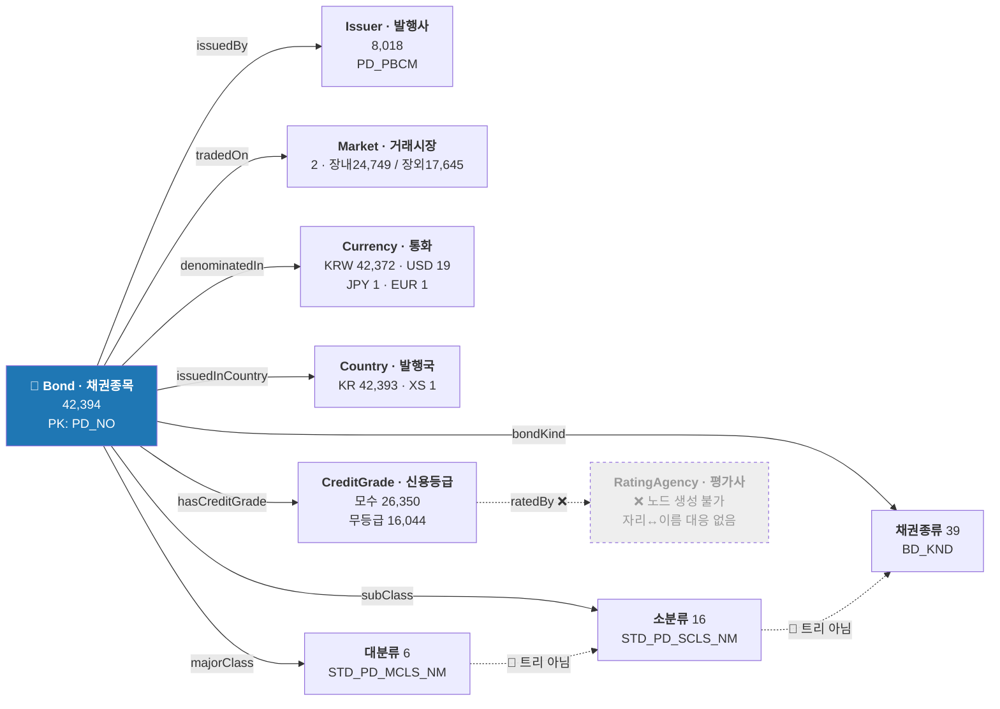
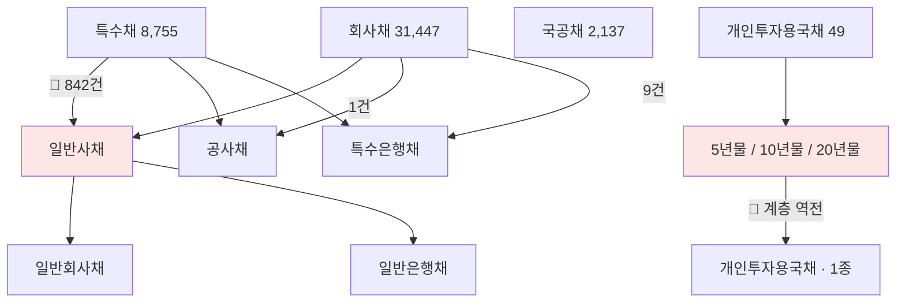
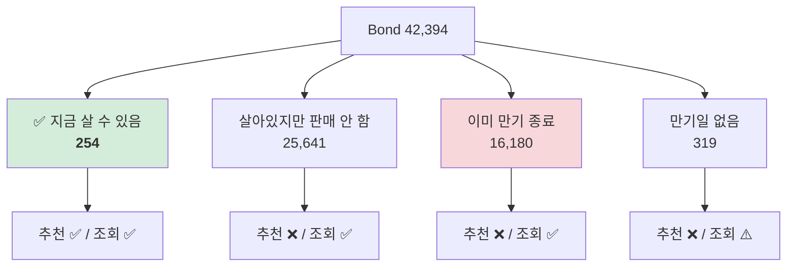
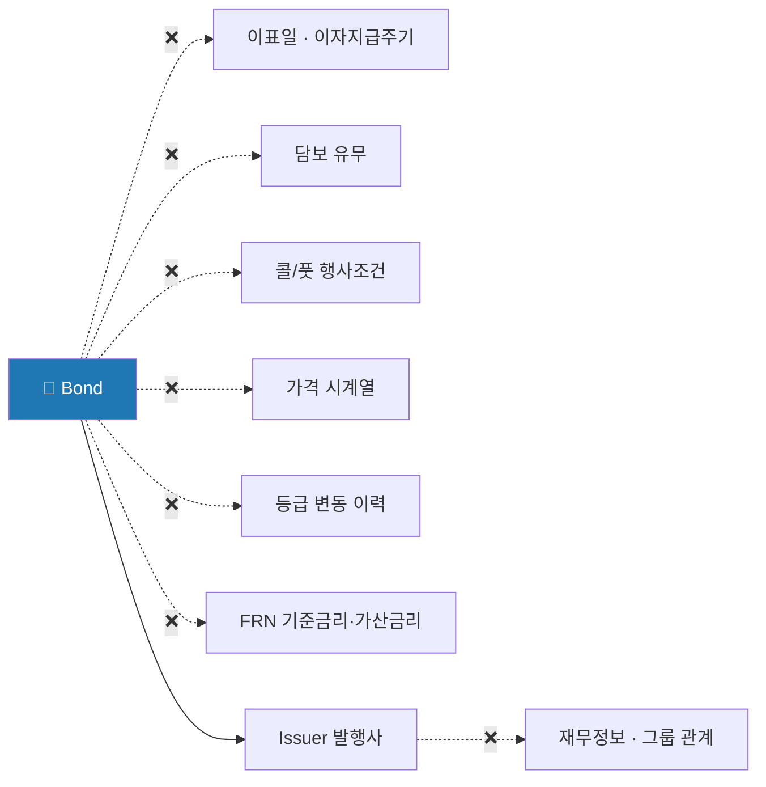

# 🕸️ 국내채권 네트워크 구조도

> `domestic_bonds` **42,394행 × 40컬럼** 을 **노드 · 엣지 · 속성 · 플래그** 로 재배치한 한 장 요약입니다.
>
> - 개념 설명 → `docs/domain/domestic_bonds.md`
> - 근거 숫자·재현 SQL → `docs/eda/domestic_bonds_notes.md`
> - **이 문서에 새로운 사실은 없습니다.** 위 두 문서의 내용을 구조만 바꿔 담았습니다.
>
> 표기: ✅ 만들 수 있음 · 🔸 조건부 · ❌ 만들 수 없음 · 🔴 함정

---

## 0. 한 장 요약



> 🔑 **중심 노드는 `Bond` 하나입니다.** 공모펀드처럼 클래스/모펀드로 행이 쪼개져 있지 않아
> **행 하나 = 채권 한 종목**이고, 40개 컬럼 중 대부분이 여기 직접 붙는 속성입니다.
> 밖으로 나가는 관계는 **6개뿐**이고, 그중 3개(분류 3층)는 🔴 계층이 깨져 있습니다.

---

## 1. 노드 — 만들 수 있는 것 / 없는 것

| 노드 | 출처 컬럼 | 개수 | 라벨 | 상태 |
| :--- | :--- | ---: | :--- | :--- |
| **Bond** 채권종목 | `PD_NO` | 42,394 | `PD_NM` | ✅ PK 중복 0 |
| **Issuer** 발행사 | `PD_PBCM` | 8,018 | 자기 자신 | 🔸 표기 정규화 필요 |
| **CreditGrade** 신용등급 | `CRD_GRD` + `PD_EVCO_CRD_GRD` | — | `AA0`… | 🔸 `0` 접미사 정규화 필수 |
| **Market** 거래시장 | `PD_EXG_MKT` | 2 | 장내/장외 | 🔴 교란변수 — §4 |
| **Currency** 통화 | `CURR_CD` | 4 | `KRW`… | 🔴 오염값 `000` 1건 |
| **Country** 발행국 | `PD_CTRY_CD` | 2 | `KR`/`XS` | 🔸 `XS`는 국가 아님(예탁기구) |
| **대분류** | `STD_PD_MCLS_NM` | 6 | 국공채… | ✅ 유일하게 안전한 층 |
| **소분류** | `STD_PD_SCLS_NM` | 16 | 국고채… | 🔴 결측 13, 대분류 특정 불가 |
| **채권종류** | `BD_KND` | 39 | 국고채권… | 🔴 결측 924, 상위 역추적 불가 |
| **RatingAgency** 평가사 | — | — | — | ❌ **생성 불가** |

**❌ RatingAgency 가 왜 안 되나** — `PD_EVCO_CRD_GRD` 는 `'AAA, AAA, AA+'` 처럼 콤마로만 결합돼 있고,
**첫 번째 자리가 한신평인지 NICE인지 데이터에 없습니다.** 알 수 있는 건 여기까지입니다:

| 알 수 있음 ✅ | 알 수 없음 ❌ |
| :--- | :--- |
| 몇 곳이 평가했나 — 3곳 14,776 · 2곳 7,829 · 1곳 2,361 | 어느 평가사가 매겼나 |
| 의견이 갈렸나 — **258건(1.1%)** | 평가사별 성향 비교 |

> 🔴 **`Bond -ratedBy-> RatingAgency` 엣지는 만들면 안 됩니다.** 대신 `평가사수`·`의견갈림` 을
> **Bond의 속성**으로 두는 게 데이터가 실제로 지지하는 최대치입니다.

---

## 2. 엣지 — 관계 전수

| 관계 | 카디널리티 | 근거 | 주의 |
| :--- | :--- | :--- | :--- |
| `Bond -issuedBy-> Issuer` | N:1 | `PD_PBCM` | 🔸 `(주)` 위치가 앞뒤 제각각 → 정규화 전엔 동일사가 갈라짐 |
| `Bond -tradedOn-> Market` | N:1 | `PD_EXG_MKT` | 🔴 종목당 **한쪽만** 기록 — 같은 채권의 장내/장외 비교 불가 |
| `Bond -hasCreditGrade-> CreditGrade` | N:1 | 두 컬럼 병합 | 🔴 `CRD_GRD` 단독 24,750 → 병합 시 **26,350 (+1,600)** |
| `Bond -majorClass-> 대분류` | N:1 | `STD_PD_MCLS_NM` | ✅ 이 층만 신뢰 가능 |
| `Bond -subClass-> 소분류` | N:1 | `STD_PD_SCLS_NM` | 🔴 상위 특정 불가 |
| `Bond -bondKind-> 채권종류` | N:1 | `BD_KND` | 🔴 상위 특정 불가 |
| `Bond -denominatedIn-> Currency` | N:1 | `CURR_CD` | 42,372/42,394 가 `KRW` — 사실상 상수 |
| `Bond -issuedInCountry-> Country` | N:1 | `PD_CTRY_CD` | 42,393/42,394 가 `KR` — 사실상 상수 |

> 🔑 **모든 엣지가 N:1 입니다.** 다대다 관계도, 채권끼리 잇는 엣지도 없습니다.
> 이 데이터는 **그래프라기보다 별 모양(star)** 에 가깝습니다 — 중심에 Bond, 주변에 분류 차원들.

---

## 3. 🔴 분류 3층은 트리가 아닙니다

**계층으로 그리면 이렇게 되어야 하는데:**

```
대분류 6  →  소분류 16  →  채권종류 39
```

**실제로는 가지가 서로 얽혀 있습니다:**



**세 가지가 깨져 있습니다:**

| # | 무엇이 | 규모 |
| :-- | :--- | :--- |
| ① | 소분류 **3종이 두 대분류에 동시에** 걸침 | `일반사채` = 회사채 30,116 + **특수채 842** |
| ② | 채권종류 **10종이 여러 소분류에** 걸침 | `일반회사채`·`일반은행채`·`일반특수법인채` 등 |
| ③ | `개인투자용국채` 는 **계층이 뒤집힘** | 하위(1종)보다 상위(3종)가 더 세밀 |

> 🔑 **온톨로지 규칙**
> ✅ `대분류` 는 그대로 써도 됩니다 (`axis_issuerType` 단독 매핑 유효)
> ❌ **소분류·채권종류를 경유해 상위를 역추적하는 규칙은 만들면 안 됩니다** — 842건이 틀립니다
> 🔸 보완 수단은 `PD_NO` 앞 3자리 (`KR6`=회사채 31,327 · `KR3`=특수채 8,812 · `KR2`=국공채 1,631)

---

## 4. 🔴 특수구조는 노드가 아니라 **O/X 플래그**입니다

📊 **15,306건 (36.1%) — 3건 중 1건**이 하나 이상 해당합니다. 예외 처리할 규모가 아닙니다.


**왜 단일 "종류" 컬럼이 안 되나 — 겹치기 때문입니다:**

| | 전환 | 영구채 | 코코 | 후순위 | 콜옵션 |
| :--- | ---: | ---: | ---: | ---: | ---: |
| **영구채 296** | 0 | 296 | 0 | **250** | **295** |
| **코코본드 96** | 0 | 0 | 96 | **95** | 17 |
| **후순위 1,210** | 26 | 250 | 95 | 1,210 | **615** |

> 영구채 296건 중 **295건이 콜옵션부, 250건이 후순위**입니다. 하나만 고르게 만들면 표현이 안 됩니다.

**🔴 판정은 전부 종목명 파싱입니다 — 별도 컬럼이 없습니다.**

```
퀀타매트릭스 3CB(신종)(사모/전환/콜/후)   ← 한 채권에 플래그 4개가 동시에
```

정규식을 **구분자 기준**(`[(/]후[)/]`)으로 짜야 합니다. `(후)` 만 찾으면 218건, **992건이 빠집니다.**

**이 플래그들이 없으면 조용히 깨지는 것:**

| 깨지는 규칙 | 실제 |
| :--- | :--- |
| *표면금리 0 = 할인채* | `SRFC_IRT=0` 2,758건 중 **53.2%가 전환사채** |
| *AA등급 = 안전* | 🔴 코코본드 96건이 전부 AA급 — **원금이 소각될 수 있는데 필터를 통과** |
| *등급으로 거르기* | 전환사채의 **99.1%**, 콜옵션부 71.0%, 후순위 62.1% 가 등급 없음 → 통째로 사라짐 |

---

## 5. 상태 — 노드를 4가지로 나누는 축



> 🔴 **만기 종료분 16,180건을 지우면 안 됩니다.** 발행사 8,015곳 중 **2,291곳(28.6%)이 여기에만** 있어서,
> 지우면 *"○○회사 채권 알려줘"* 에 *"없습니다"* 라는 **거짓말**이 나갑니다. 삭제가 아니라 **상태 표시**입니다.

> 🔴 **미확정 — 이 4분할의 경계가 아직 안 정해졌습니다.** 기준일이 `2026-07-11` 이냐 `2026-02-24` 냐에 따라
> 만기 종료가 **16,180 vs 11,940** 으로 갈립니다. → `domestic_bonds_notes.md` §D.1 · §J.7-1

---

## 6. 속성 40컬럼이 어디에 붙나

전부 **Bond 노드에 직접** 붙습니다. 역할별로 8묶음:

| 묶음 | 개수 | 컬럼 | 신뢰도 |
| :--- | ---: | :--- | :--- |
| **식별** | 6 | `PD_NO` `PD_NM` `PD_ABRV_NM` `PD_ENG_NM` `PD_ABRV_ENG_NM` `PD_CTRY_CD` | ✅ |
| **분류** | 3 | `STD_PD_MCLS_NM` `STD_PD_SCLS_NM` `BD_KND` | 🔴 §3 |
| **발행자·시장** | 3 | `PD_PBCM` `PD_EXG_MKT` `CURR_CD` | 🔸 정규화 필요 |
| **발행조건** | 4 | `SRFC_IRT` `ISU_DT` `MAT_DT` `ISU_BAL_AMT` | 🔴 FRN 643건은 고정값 아님 |
| **신용·위험등급** | 4 | `CRD_GRD` `CRD_GRD_DT` `PD_EVCO_CRD_GRD` `PD_RISK_GCD` | 🔴 `AA0` 표기 · 실제 범위 0~6 |
| **위험지표** | 5 | `DUR` `COV` `NDY_DUR` `NDY_COV` `REMAINING_DAYS` | 🔴 이론 위반 1,035건 |
| **가격** | 6 | `EVAL_PRICE` `APPLIED_YIELD` `DIRTY` + `NDY_` 3종 | 🔴 `DIRTY` 94.5% 미산출 의심 |
| **매수·수익률** | 8 | `BUY_YIELD` `AFTER_TAX_YIELD` `CORP_*` `PREF_TAX_YIELD` `DEPO_EQUIV_YIELD_154` `BUYABLE_QUANTITY` `AVG_ANNUAL_TAX_YIELD` | 🔴 `AVG_ANNUAL_TAX_YIELD` **전량 0 · 사용 불가** |
| **메타** | 1 | `PD_STD_INFO_UPDATE` | ✅ |

> 🔴 **속성을 값 그대로 온톨로지 enum 에 넣으면 안 됩니다.**
> 공백 패딩 때문에 39종이 **51종으로** 등록되고, 위험등급을 명세대로 `1~5` 로 제약하면 **10,408건(24.6%)이 차단**됩니다.

---

## 7. 이을 수 없는 선 — 이 그래프에 없는 것



📖 **마스터 데이터는 "채권의 신분증"입니다.** 발행 조건과 **한 시점의 평가값**은 있지만,
매일 변하는 시계열도, 투자설명서에 적히는 상세 조건도 없습니다.

| 없는 것 | 결과 |
| :--- | :--- |
| 이표일 | 경과이자를 직접 계산할 수 없음 → `DIRTY` 검증 불가 |
| 발행사 재무정보·계열 관계 | 발행사끼리 잇는 엣지가 **하나도 없음** |
| 같은 종목의 장내/장외 양쪽 값 | 시장 간 가격 비교 불가 (종목당 한쪽만 기록) |
| 국채의 신용등급 | 📖 원래 안 매김 — **결측이지만 정상** |

---

## 8. 질의가 이 그래프를 타는 경로

**① *"AA등급 이상 안전한 채권"*** — 가장 조용한 오답이 나오는 경로

```
Bond ──hasCreditGrade──> CreditGrade ≥ AA
  │
  ├─ 🔴 정규화 안 하면        'AA' 매칭 0건  (실제 값은 'AA0')
  ├─ 🔴 두 컬럼 병합 안 하면   1,600건 누락
  ├─ 🔴 is_coco 안 빼면       원금 소각 채권 96건이 전부 통과
  └─ 🔴 상태 안 거르면        이미 만기 끝난 채권이 추천됨
       ↓
  "지금 살 수 있는 254건 중에서 골랐습니다" ← 모수를 반드시 밝힘
```

**② *"○○회사 채권 뭐 있어?"*** — 상태 노드가 없으면 거짓말이 나가는 경로

```
Issuer(정규화) ──issuedBy⁻¹──> Bond ──state──> 4상태
                                        ↓
        만기 종료분도 보여주되 "만기 종료(2025-03-15)" 표시
        + "지금 판매 중인 건 없습니다"
```

**③ *"안전한 채권 추천"*** — 그래프로는 못 정하고 **되물어야** 하는 경로

```
"안전" ─┬─ 부도위험 → 대분류=국공채   (DUR 평균 4.52 · 금리위험은 높음)
        └─ 금리위험 → DUR 낮은 단기채 (부도위험은 높을 수 있음)
                 🔴 두 답이 정반대 → 되묻기
```

> 🔑 **되묻는 것은 답변 실패가 아니라 유효한 답변입니다.** → `domestic_bonds_notes.md` §I

---

## 9. 이 구조도에서 아직 미확정인 것

| # | 미확정 | 영향 |
| :-- | :--- | :--- |
| 1 | 🔴 **데이터 기준일** `2026-07-11` vs `2026-02-24` | §5 상태 4분할 경계가 안 정해짐 (16,180 vs 11,940) |
| 2 | 🔴 상태 4분할을 온톨로지에서 **노드로 둘지 속성으로 둘지** | 스키마 확정 대기 |
| 3 | 🟡 **발행사 개수 8,018 vs 8,015** — 두 문서가 다름 | 정규화·결측 처리 차이로 보이나 미확인 |
| 4 | 🟡 평가사 의견 갈린 **258건**을 최저/다수결 중 무엇으로 | `CreditGrade` 노드 값이 갈림 |
| 5 | 🟡 특수구조 15,306건의 **기본 처리 정책** | 추천 질의 필터 |

---

## 부록: 참고 문서

| 문서 | 내용 |
| :--- | :--- |
| `docs/domain/domestic_bonds.md` | 채권 도메인 이해 — 개념 · 컬럼 40개 의미 |
| `docs/eda/domestic_bonds_notes.md` | EDA 결과 — 모든 숫자의 재현 SQL · 함정 · 미해결 |
| `ontology/enums/public_funds.yaml` | 같은 구조를 yaml 로 옮긴 선례 (T4 공모펀드) |
