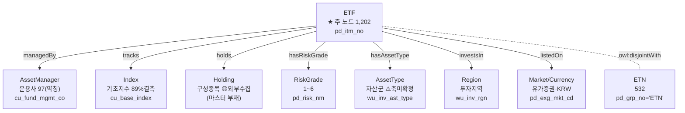

# 🧬 국내ETF 엔티티 구조도 — 워크샵 논의용 초안

> ⚠️ **초안(제안)입니다.** 개체·관계 확정은 온톨로지 워크샵(8/17~18)에서 팀 합의.
> 형식은 `docs/eda/public_funds_entity_map.md`(공모펀드) 를 따름.
> 근거: `ontology/enums/domestic_etfs.yaml` + DB 실측 (`domestic_etfs` 1,734행 · ETF 1,202 / ETN 532)

---

## 1. 한눈에 — 무엇이 개체이고 무엇이 속성인가

```
                  ┌──────────────────┐
                  │  AssetManager    │ 97(약칭)  운용사 (cu_fund_mgmt_co)
                  └────────▲─────────┘           🔴 약칭·오염, KG 정규화 필요
                           │ managedBy
        ┌──────────────────┴──────────────────┐
        │              ETF                     │  1,202  ★ 주 노드
        │           pd_itm_no                  │         속성이 여기 붙음
        │        ⊥ disjointWith ETN(532)       │
        └──┬────────┬────────┬────────┬────────┘
   tracks  │  holds │ hasRisk│investsIn│ hasAssetType
           ▼        ▼  Grade ▼         ▼
   ┌────────────┐ ┌────────┐ ┌────────┐ ┌──────────┐ ┌──────────┐
   │   Index    │ │Holding │ │RiskGrade│ │  Region  │ │ AssetType│
   │ 기초지수    │ │구성종목 │ │  1~6    │ │투자지역   │ │ 자산군    │
   │cu_base_idx │ │외부수집 │ │pd_risk  │ │wu_inv_rgn│ │wu_inv_ast│
   │🔴89%결측    │ │🟡외부   │ │         │ │          │ │⚠️축 미확정│
   └────────────┘ └────────┘ └────────┘ └──────────┘ └──────────┘
        🔵 해외ETF와 통용(같은 지수)      🔵 통용        🔵 통용

  ※ ETF/ETN 은 pd_grp_no 로 구분. disjointWith(배타적) — 삭제 말고 구분만.
  ※ 총보수·AUM·수익률·레버리지 등은 개체 아님 → ETF 속성(값)
```

### 관계도 (mermaid)



---

## 2. 엔티티 (제안) — 8종

| 엔티티 | 출처 컬럼 | 개수 | 레이블 | 관계(제안) | 상태 |
| :--- | :--- | ---: | :--- | :--- | :--- |
| **ETF** | `pd_itm_no` | 1,202 | `pd_nm` | — | ★ 주 노드 |
| **ETN** | `pd_grp_no='ETN'` | 532 | `pd_nm` | ETF `owl:disjointWith` ETN | 삭제말고 구분 |
| **AssetManager** | `cu_fund_mgmt_co` | 97 | (약칭) | ETF -managedBy→ AM | 🔴 약칭·오염, KG 정규화 |
| **Index** | `cu_base_index` | 19 | `cu_base_index` | ETF -tracks→ Index | 🔴 89% 결측 · 🔵 해외ETF 통용 |
| **Holding** | (마스터 없음) | 외부 | 종목명 | ETF -holds→ Holding | 🟡 외부수집(FunETF, 7/10) |
| **RiskGrade** | `pd_risk_nm`/`_cd` | 6 | 1~6 | ETF -hasRiskGrade→ RiskGrade | 방향: 1=위험/6=안전 |
| **Region** | `wu_inv_rgn` | 11 | 한글 | ETF -investsIn→ Region | 🔵 해외ETF(영문)와 매핑필요 |
| **AssetType** | `wu_inv_ast_type` | 8 | 한글 | ETF -hasAssetType→ AssetType | ⚠️ axis 92%, 워크샵 |

> 🔵 = 다른 상품군과 통용(KG 조인 대상): 운용사·기초지수·지역·자산군·위험등급·통화

---

## 3. 개체 아님 = ETF 속성(값)

여러 ETF가 공유·역검색하지 않는, 그 ETF만의 값 → **개체(노드) 아님**:

```
총보수 cu_charge_rt · AUM du_last_aum · 수익률 du_er_1y/ytd
레버리지 cu_lev_fector · 운용전략 cu_strtegy · 판매/거래 pd_sale_yn/pd_tr_yn
연금 pd_pen_tr_yn · 종가/거래대금 du_clpr/du_val_1d
```

---

## 4. 🔴 워크샵에서 확정할 것

| 안건 | 선택지 / 제안 |
| :--- | :--- |
| ETF/ETN 클래스 층위 | ✅ PDF 확정: `fp:Product → fp:ETF`, ETF `owl:disjointWith` ETN |
| **Index(기초지수)** | **✅ B안 제안: 독립 개체.** 공모펀드 `Benchmark`(391, ETF와 17종 통용)와 **통일**하면 ETF↔펀드↔해외ETF 교차질의 가능. 국내 89%결측은 상품명 유추로 보완 |
| RiskGrade | 개체? 값+순서제약? |
| AssetType/underlyingScope | 🟡 주최측 문의 예정 (국고채→Equity 등 axis 기준 불명확) |
| 국내/해외 ETF | `etf_kr.ttl` / `etf_gl.ttl` 분리, 둘 다 `fp:ETF` 하위 |

### 4.1 🔵 공모펀드와 통일 (교차질의 핵심)

| 개체 | 국내ETF | 공모펀드 | 통일 시 가능해지는 질의 |
| :--- | :--- | :--- | :--- |
| **기초지수/벤치마크** | `cu_base_index` (Index) | `bmrk_nm` (Benchmark, 391) | "S&P500 추종 ETF + 그 지수 벤치마크 펀드" |
| **운용사** | `cu_fund_mgmt_co` | `or_co_xtn_itt_cd` | "미래에셋 운용 ETF+펀드 비교" |
| **투자지역** | `wu_inv_rgn` | `fd_ivst_rgn_desc` | 상품군 교차 지역검색 |

> 💡 **구성종목(Holding) 형식도 펀드와 통일 가능** — 펀드도 재간접/편입 종목 개념 있음.
> 제안 스키마: `{상품코드, 종목티커, 종목명, 비중%, 수량, as_of}` (ETF holdings와 동일 구조).
> → 리드(펀드 담당)와 holdings/KG 스키마 통일 협의.
