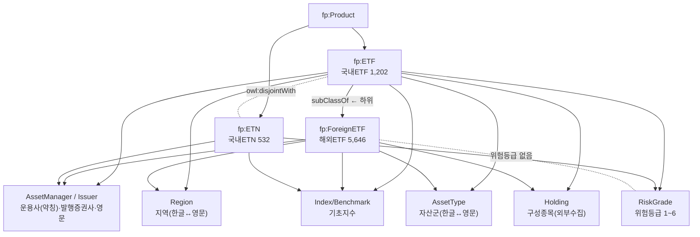

# 🧬 ETF 트랙 통합 엔티티 구조도 — 국내ETF · ETN · 해외ETF

> ⚠️ **초안(제안).** 개체·관계 확정은 온톨로지 워크샵에서 팀 합의.
> 국내ETF 단독 구조도([domestic_etfs_entity_map.md](domestic_etfs_entity_map.md))를 **3종 통합**으로 확장.
> 근거: `domestic_etfs`(1,734: ETF 1,202 / ETN 532) + `overseas_etfs`(5,646) DB 실측.

---

## 1. 클래스 층위 (PDF 규격 확정)

```
fp:Product
   │
   ├── fp:ETF ─────────────── owl:disjointWith ──── fp:ETN
   │     ├── (국내ETF 1,202)                          국내ETN 532 + 해외ETN 59
   │     └── fp:ForeignETF (해외ETF 5,587)            (증권사 발행)
   │           ↑ PDF: rdfs:subClassOf fp:ETF
```

- **ETN** = ETF와 **배타적 형제**(disjoint). "레버리지 ETF" 질의에 ETN 섞이면 오답.
- **해외ETF**(`ForeignETF`) = ETF의 **하위클래스**. ETF의 일종이나 스키마가 크게 다름.

> 🔴 **함정 — 테이블 ≠ 상품종류** (2026-08-22 ttl 반영):
> `overseas_etfs` 테이블 5,646건은 **ETF 5,587 + ETN 59** 다. `domestic_etfs` 도 ETF 1,202 + ETN 532.
> 즉 **테이블 클래스(`:DomesticETF`·`:OverseasETF`)를 `:ETF` 하위로 두면 안 된다** — ETN 행까지
> ETF 로 단정해 `owl:disjointWith` 와 모순이 된다. 상품종류 판별은 **`pd_grp_no`** 로 한다.

### 관계도 (mermaid)



---

## 2. 개체를 3종이 어떻게 공유하나 (통용 vs 전용)

| 개체 | 국내ETF | 국내ETN | 해외ETF | 통용 열쇠(코드북) |
| :--- | :--- | :--- | :--- | :--- |
| **AssetManager/Issuer** | 운용사 약칭 | 🔴 **발행 증권사** | 영문(BlackRock 등) | `asset_manager.csv` + 증권사코드(미확보) |
| **Index/Benchmark** | 🔴 89% 결측 | 있음 | 🟡 **51.9% 유효**(2,933건) | 표기 정규화 필요 |
| **Region** | 한글 11종 | 한글 | 영문 59종 | `region_map.csv` ✅ |
| **AssetType** | 한글 8종 | 한글 | 영문 6종 | `asset_type_map.csv` ✅ |
| **Holding** | FunETF 수집 | FunETF | 🟡 **SEC EDGAR**(CIK 99.8%) | 스키마 통일 |
| **RiskGrade** | 1~6 있음 | 있음 | 🔴 **컬럼 없음** | — |

> 🟢통용 = KG에서 한 노드로 합침(교차질의). 🔴 = 그 상품군의 함정/공백.

---

## 3. 상품군별 특징 — "어떻게 다뤄야 하나"

### 3.1 국내ETN (532) — "ETF와 안 섞이게"
- `pd_grp_no='ETN'` 로 구분, `owl:disjointWith` ETF.
- 만드는 주체가 **운용사가 아니라 증권사**(발행사) → `AssetManager`가 아니라 **`Issuer`** 역할.
- 🔴 **증권사 코드 미확보**(펀드 데이터에 없음) — 메리츠·신한투자·삼성증권 등 10곳. 금투협 증권사표 조회 필요.
- 섹터코드 `3`=일반ETN, `9`=단일종목ETN, `4`=특수(금현물) ✅ 해독됨.

### 3.2 해외ETF (5,646) — "국내와 언어·단위 맞추기"
- 별도 테이블 `overseas_etfs`, `fp:ForeignETF`.
- **영문 라벨** → `region_map`·`asset_type_map`로 국내와 연결 ✅.
- **AUM = USD** → `fx_rate`로 환산해야 국내(원)와 비교 ✅.
- ✅ **SEC EDGAR 구성종목 수집 실증 완료** (2026-08-20) — AUM 상위 200 중 186 ETF·274,997행 수집. 🔵 CIK 운용사 단위(distinct 374) 문제는 SEC 공식 매핑 `company_tickers_mf.json`(티커→seriesId 직접 제공)으로 **해소** — seriesId 로 NPORT-P 를 정확히 특정. 상세: `data/external/holdings_overseas/SOURCES.md`. 잔여: UIT 3종(SPY·DIA·MDY)·상품신탁 4종은 구조상 N-PORT 없음, ETF별 기준일 3/31~5/31 이질(답변 시 report_date 병기).
- 🔴 **위험등급 없음** → *"위험등급 낮은 해외ETF"* = **unanswerable** (속성 부재로 정답).
- 해외 전용 컬럼: `cu_index_repl_mthd`(복제법)·`cu_inverse_short_yn`(인버스)·`pd_isin_cd`·`pd_lipper_id`.

### 3.3 비대칭 요약 (국내 有 / 해외 無)
```
해외에 없는 것: 위험등급 · 섹터코드 · 수익률시계열(1m~1y) · 배당 · 상장일 · 연금
국내에 없는 것: CIK · ISIN · Lipper ID · 거래통화 · 지수복제방법 플래그
```

---

## 4. 통합으로 가능해지는 교차질의 (코드북 3종의 값어치)

| 질의 | 필요 열쇠 |
| :--- | :--- |
| "미국 투자 ETF 다 보여줘 (국내+해외)" | `region_map` (미국=USA) |
| "순자산 큰 ETF Top5 (국내원+해외달러)" | `fx_rate` (단위 통일) |
| "미래에셋 ETF+펀드+해외ETF 비교" | `asset_manager` (약칭↔코드↔영문) |
| "주식형 ETF (국내+해외)" | `asset_type_map` (주식=Equity) |
| "위험등급 낮은 해외ETF" | ❌ 속성부재 → unanswerable 정답 |

---

## 5. 🔴 워크샵/후속 확정사항

| 안건 | 제안 |
| :--- | :--- |
| ETN 발행사 개념 | `Issuer`(증권사) 별도 role — `AssetManager`와 구분? |
| 해외 Index 활용 | 🔴 2026-08-20 정정 — 해외 유효는 **51.9%**(2,933건). 이전 '99.9%'는 센티넬 문자열 2,705건('Index is not provided…' 등)을 유효로 센 오기. 국내(11%)보다는 낫지만 "주 데이터원" 제안은 이 수치 기준으로 재검토 필요 |
| RiskGrade 비대칭 | 해외ETF엔 속성 자체를 안 만듦(cardinality 0) → 환각 차단 |
| Holding 스키마 | 국내(FunETF)·해외(SEC) 수집원 다름 → 저장 스키마는 통일(`product_type` 컬럼) |
| 증권사 코드북 | ETN 발행 증권사 10곳 금투협 조회 (후속) |
