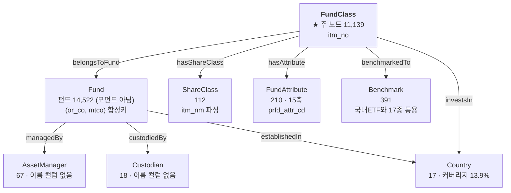

# 🧬 공모펀드 엔티티 구조도 — 컬럼 단위 배정표

> **자동 생성 문서입니다.** 근거: `ontology/enums/public_funds.yaml`(판정) + `ontology/enums/public_funds.auto.yaml`(사실) + DB 실측
>
> 테이블 `public_funds` · 23,676행 × 75컬럼 · 종목(`itm_no`) 23,676개

> 재생성: 이 문서를 만든 스크립트는 노트북 「🧬 엔티티 탐색」 절의 배정 검증 셀과 같은 로직을 씁니다.


---

## 1. 한눈에 — 무엇이 개체이고 무엇이 속성인가

```
                    ┌─────────────────┐
                    │  AssetManager   │ 67   운용사 (or_co_xtn_itt_cd)
                    │  Custodian      │ 18   수탁사 (trusc_xtn_itt_cd)
                    └────────▲────────┘
                             │ managedBy / custodiedBy
              ┌──────────────┴──────────────┐
              │           Fund              │ 14,522   펀드 = 운용 단위 (모펀드 아님)
              │  (or_co, mtco) 합성키        │          순자산 합계가 이 단위
              └──────────────▲──────────────┘
                             │ belongsToFund
              ┌──────────────┴──────────────┐
              │        FundClass            │ 11,139   ★ 주 노드 = 판매 단위
              │           itm_no            │          속성 44컬럼이 여기 붙음
              └───┬────────┬─────────┬──────┘
        hasShare  │        │         │  hasAttribute / investsIn / benchmarkedTo
          Class   ▼        ▼         ▼
      ┌───────────┐ ┌────────────┐ ┌──────────┐ ┌────────────┐
      │ShareClass │ │FundAttribute│ │ Country  │ │ Benchmark  │
      │   112     │ │   210 (15축)│ │    17    │ │    391     │
      │itm_nm 파싱│ │prfd_attr_cd │ │prfd_attr │ │  bmrk_nm   │
      └───────────┘ └────────────┘ └──────────┘ └────────────┘
                                                  🔵 국내ETF와 17종 통용

  ※ 행(95,619) = FundClass(11,139) × 그 종목의 태그 수(4~16, 평균 8.58)
     45컬럼 중 itm_no 안에서 갈리는 것은 prfd_attr_cd 하나뿐 → 나머지는 전부 FundClass 속성
  🔴 Fund 는 '모펀드' 가 아니다 — 클래스를 걷어낸 펀드 단위다. 모자형 모펀드는 이 테이블에 없다
     (모투자신탁·모투자회사 0건). mtco 단독 조인 금지 — 65종이 여러 운용사에 걸친다
```


### 관계도 (mermaid)




---

## 2. 엔티티 8종

| 엔티티 | 출처 컬럼 | 개수 | 레이블 | 관계 | 상태 |
| :--- | :--- | ---: | :--- | :--- | :--- |
| **FundClass** | `itm_no` | 23676 | `itm_nm` | — |  |
| **Fund** | `mtco_itm_no`, `or_co_xtn_itt_cd` | 14522 | 🔴 없음 | FundClass -belongsToFund→ Fund |  |
| **ShareClass** | `han_clas_nm`, `itm_nm` | 195 | 🔴 없음 | FundClass -hasShareClass→ ShareClass |  |
| **AssetManager** | `or_co_xtn_itt_cd` | 275 | 🔴 없음 | Fund -managedBy→ AssetManager  (FIBO hasManagementCompany) | 🔴 이름 컬럼 없음 |
| **Custodian** | `trusc_xtn_itt_cd` | 50 | 🔴 없음 | Fund -custodiedBy→ Custodian  (FIBO hasDepository) | 🔴 이름 컬럼 없음 |
| **Benchmark** | `bmrk_nm` | 389 | `bmrk_nm` | FundClass -benchmarkedTo→ Benchmark  (FIBO definesBenchmark) |  |
| **Country** | `fd_estb_ctry_cd`, `prfd_attr_cds` | 17 | 🔴 없음 | FundClass -investsIn→ Country · Fund -establishedIn→ Country | 커버리지 13.9% |
| **FundAttribute** | `prfd_attr_cds` | 210 | `zrin_attr_nms` | FundClass -hasAttribute→ FundAttribute | 🔶 의미 미해독 (12/15축 대응) |

> 🔴 **`AssetManager`·`Custodian` 은 코드만 있고 이름 컬럼이 없습니다.** 사용자가 *"미래에셋자산운용"* 이라고 물어도 이을 수 없습니다 (EDA_GUIDE §5-A 최우선 이슈).


---

## 3. 컬럼 45개 전수 배정

모든 컬럼이 **엔티티 출처 · 유도규칙 · 속성** 중 하나 이상에 배정돼 있습니다 (45/45).


### 3.0 엔티티·유도규칙에 직접 쓰이는 컬럼 (9)

| 컬럼 | 한글명 | 배정 | 종류 | distinct | 결측률 | 비고 |
| :--- | :--- | :--- | :-: | ---: | ---: | :--- |
| `bmrk_nm` | 벤치마크명 | **Benchmark** | text | 389 | 52.4% | 판정 `missing` · ⚠️ trap/정책 |
| `fd_estb_ctry_cd` | 펀드설립국가코드 | **Country** | text | 7 | 0.0% | 판정 `none` |
| `itm_nm` | 종목명 | **ShareClass** | text | 23,624 | 0.0% |  |
| `itm_no` | 종목번호 | **FundClass** | text | 23,676 | 0.0% |  |
| `mtco_itm_no` | 운용사종목번호 | **Fund** | text | 14,060 | 0.5% | 판정 `missing` · 근거 `C` · ⚠️ trap/정책 · 🔴 더미값 |
| `or_attr_desc` | 운용속성구분코드 설명 | rule:`assetClass` / rule:`isFundOfFunds` / rule:`usesDerivatives` | text | 14 | 0.0% | 판정 `none` |
| `or_co_xtn_itt_cd` | 운용회사대외기관코드 | **Fund** / **AssetManager** | text | 275 | 0.0% |  |
| `prfd_attr_cds` | 펀드별속성코드 목록(쉼표 구분) | **Country** / **FundAttribute** / rule:`prfdAttrTag` | text | 8,926 | 52.4% | 판정 `missing` · 근거 `B` · ⚠️ trap/정책 |
| `trusc_xtn_itt_cd` | 수탁회사대외기관코드 | **Custodian** | text | 50 | 0.2% | 🔴 더미값 |

### 3.1 속성 · 식별 (4)

| 컬럼 | 한글명 | 배정 | 종류 | distinct | 결측률 | 비고 |
| :--- | :--- | :--- | :-: | ---: | ---: | :--- |
| `fss_itm_no` | 금융감독원종목번호 | 속성:식별 | text | 11,970 | 0.2% | 판정 `unresolved` · 근거 `C` · ⚠️ trap/정책 · 🔴 더미값 |
| `ksd_itm_no` | 예탁원종목번호 | 속성:식별 | text | 21,290 | 10.0% | 판정 `unresolved` · 근거 `C` · ⚠️ trap/정책 · 🔴 더미값 |
| `rptt_ksd_itm_no` | 대표예탁원종목번호 | 속성:식별 | text | 6,885 | 0.5% | 판정 `unresolved` · 근거 `C` · ⚠️ trap/정책 · 🔴 더미값 |
| `std_itm_no` | 표준종목번호 | 속성:식별 | text | 18,947 | 18.4% | 판정 `missing` · 근거 `A` · 값단위 판정 · ⚠️ trap/정책 · 🔴 더미값 |

### 3.2 속성 · 이름 (4)

| 컬럼 | 한글명 | 배정 | 종류 | distinct | 결측률 | 비고 |
| :--- | :--- | :--- | :-: | ---: | ---: | :--- |
| `bmrk_eng_nm` | 벤치마크영문명 | 속성:이름 | text | 386 | 52.4% |  |
| `itm_abrv_nm` | 종목약어명 | 속성:이름 | text | 23,588 | 0.0% |  |
| `itm_eabrv_nm` | 종목영문약어명 | 속성:이름 | text | 143 | 99.4% | 판정 `missing` · 근거 `A` · ⚠️ trap/정책 |
| `itm_eng_nm` | 종목영문명 | 속성:이름 | text | 23,403 | 0.0% |  |

### 3.3 속성 · 성과 (9)

| 컬럼 | 한글명 | 배정 | 종류 | distinct | 결측률 | 비고 |
| :--- | :--- | :--- | :-: | ---: | ---: | :--- |
| `fd_mm18_ern_r` | 펀드 18개월수익률 | 속성:성과 | numeric | 4,645 | 70.9% |  |
| `fd_mm1_ern_r` | 펀드 1개월수익률 | 속성:성과 | numeric | 1,442 | 68.8% |  |
| `fd_mm3_ern_r` | 펀드 3개월수익률 | 속성:성과 | numeric | 2,123 | 69.1% |  |
| `fd_mm6_ern_r` | 펀드 6개월수익률 | 속성:성과 | numeric | 3,163 | 69.5% |  |
| `fd_wk1_ern_r` | 펀드 1주일수익률 | 속성:성과 | empty | 0 | 100.0% | 판정 `missing` · 근거 `A` · ⚠️ trap/정책 · 🔴 전결측 |
| `fd_yr1_ern_r` | 펀드 1년수익률 | 속성:성과 | numeric | 4,469 | 70.3% | 판정 `mixed` · 단위 `percent_cumulative` · ⚠️ trap/정책 |
| `fd_yr2_ern_r` | 펀드 2년수익률 | 속성:성과 | numeric | 4,952 | 71.5% |  |
| `fd_yr3_ern_r` | 펀드 3년수익률 | 속성:성과 | numeric | 5,110 | 72.6% | 단위 `percent_cumulative` · ⚠️ trap/정책 |
| `fd_yr5_ern_r` | 펀드 5년수익률 | 속성:성과 | numeric | 4,882 | 74.7% |  |

### 3.4 속성 · 규모가격 (5)

| 컬럼 | 한글명 | 배정 | 종류 | distinct | 결측률 | 비고 |
| :--- | :--- | :--- | :-: | ---: | ---: | :--- |
| `bns_bpr` | 매매기준가 | 속성:규모가격 | numeric | 9,074 | 60.2% | 판정 `missing` · 단위 `krw_per_1000units(추정 — 통상 1,000좌당 기준가. 외화 펀드는 curr_cd 통화)` · ⚠️ trap/정책 |
| `fd_daily_bas_dt` | 펀드데일리정보 기준일자 | 속성:규모가격 | numeric | 905 | 60.2% | 판정 `missing` · 단위 `yyyymmdd(REAL 저장)` · ⚠️ trap/정책 |
| `fd_nast_suma` | 펀드 순자산 | 속성:규모가격 | numeric | 9,409 | 60.2% | 판정 `missing` · 근거 `B` · 단위 `krw` · ⚠️ trap/정책 |
| `fd_price_bas_dt` | 펀드 기준가/수익률 기준일자 | 속성:규모가격 | numeric | 905 | 60.2% | 판정 `missing` |
| `fd_sbpr` | 시가평가금액 | 속성:규모가격 | numeric | 1,978 | 0.0% | 판정 `unresolved` · 근거 `C` · ⚠️ trap/정책 |

### 3.5 속성 · 위험 (2)

| 컬럼 | 한글명 | 배정 | 종류 | distinct | 결측률 | 비고 |
| :--- | :--- | :--- | :-: | ---: | ---: | :--- |
| `zrin_fd_ivst_risk_gcd` | 제로인펀드투자위험등급코드 | 속성:위험 | numeric | 6 | 63.3% | 판정 `missing` · 단위 `grade` · ⚠️ trap/정책 |
| `zrin_fd_ivst_risk_grd_nm` | 제로인펀드투자위험등급명 | 속성:위험 | text | 8 | 63.3% | 판정 `missing` · 근거 `A` · ⚠️ trap/정책 |

### 3.6 속성 · 보수 (5)

| 컬럼 | 한글명 | 배정 | 종류 | distinct | 결측률 | 비고 |
| :--- | :--- | :--- | :-: | ---: | ---: | :--- |
| `fd_prsv_r` | 보전율 | 속성:보수 | numeric | 790 | 0.0% | 판정 `unresolved` · 근거 `C` · ⚠️ trap/정책 |
| `ofwk_trus_rwrd_r` | 일반사무관리보수 | rule:`totalFeeApprox` / 속성:보수 | numeric | 70 | 0.0% | 판정 `none` · 단위 `‰ (값÷10 = %, or_co_rwrd_r 참조)` |
| `or_co_rwrd_r` | 집합투자업자보수 | rule:`totalFeeApprox` / 속성:보수 | numeric | 754 | 0.0% | 판정 `none` · 근거 `B` · 단위 `‰ (값÷10 = %) — ext_fund_page 8,925건 대조로 확정 (2026-08-25)` · ⚠️ trap/정책 |
| `sale_co_rwrd_r` | 판매회사보수 | rule:`totalFeeApprox` / 속성:보수 | numeric | 769 | 0.0% | 판정 `none` · 단위 `‰ (값÷10 = %, or_co_rwrd_r 참조)` |
| `trusc_rwrd_r` | 신탁업자보수 | rule:`totalFeeApprox` / 속성:보수 | numeric | 96 | 0.0% | 판정 `none` · 단위 `‰ (값÷10 = %, or_co_rwrd_r 참조)` |

### 3.7 속성 · 분배 (3)

| 컬럼 | 한글명 | 배정 | 종류 | distinct | 결측률 | 비고 |
| :--- | :--- | :--- | :-: | ---: | ---: | :--- |
| `fd_last_dstb_actg_bss_dt` | 최근 분배 회계기초일자 | 속성:분배 | numeric | 2,019 | 54.1% | 판정 `missing` · 단위 `yyyymmdd(REAL 저장)` |
| `fd_last_dstb_actg_eot_dt` | 최근 분배 회계기말일자 | 속성:분배 | numeric | 1,785 | 54.1% | 판정 `missing` |
| `fd_last_dstb_r` | 최근 분배율 | 속성:분배 | numeric | 4,243 | 54.1% | 판정 `mixed` · 단위 `percent(추정)` · ⚠️ trap/정책 |

### 3.8 속성 · 자산구성 (7)

| 컬럼 | 한글명 | 배정 | 종류 | distinct | 결측률 | 비고 |
| :--- | :--- | :--- | :-: | ---: | ---: | :--- |
| `zrin_dmst_bd_cmst_rt` | 제로인국내채권구성비율 | 속성:자산구성 | numeric | 283 | 60.2% | 판정 `missing` · 단위 `percent` |
| `zrin_dmst_stk_cmst_rt` | 제로인국내주식구성비율 | 속성:자산구성 | numeric | 336 | 60.2% | 판정 `missing` · 근거 `A` · 단위 `percent` · ⚠️ trap/정책 |
| `zrin_etc_ast_cmst_rt` | 제로인기타자산구성비율 | 속성:자산구성 | numeric | 917 | 60.2% | 판정 `missing` · 단위 `percent` |
| `zrin_fd_cmst_rt` | 제로인펀드구성비율 | rule:`isFundOfFunds` / 속성:자산구성 | numeric | 1,136 | 60.2% | 판정 `missing` · 단위 `percent` |
| `zrin_liqt_cmst_rt` | 제로인유동성구성비율 | 속성:자산구성 | numeric | 973 | 60.2% | 판정 `missing` · 단위 `percent` |
| `zrin_ovrs_bd_cmst_rt` | 제로인해외채권구성비율 | 속성:자산구성 | numeric | 15 | 60.2% | 판정 `missing` · 단위 `percent` |
| `zrin_ovrs_stk_cmst_rt` | 제로인해외주식구성비율 | 속성:자산구성 | numeric | 106 | 60.2% | 판정 `missing` · 단위 `percent` |

### 3.9 속성 · 유형 (12)

| 컬럼 | 한글명 | 배정 | 종류 | distinct | 결측률 | 비고 |
| :--- | :--- | :--- | :-: | ---: | ---: | :--- |
| `fd_ivst_rgn_desc` | 펀드투자지역구분코드 설명 | 속성:유형 | text | 9 | 0.0% |  |
| `fd_set_pcd` | 펀드설정유형코드 | 속성:유형 | text | 3 | 0.0% | 판정 `none` |
| `int_dvd_desc` | 이자배당구분코드 설명 | 속성:유형 | text | 3 | 0.0% | 판정 `none` |
| `kofia_fd_ccd` | 금융투자협회펀드분류코드 | 속성:유형 | text | 6,765 | 0.2% | 판정 `unresolved` · 근거 `C` · ⚠️ trap/정책 · 🔴 더미값 |
| `ovrs_fd_desc` | 해외펀드구분코드 설명 | 속성:유형 | text | 4 | 0.0% |  |
| `pers_corp_desc` | 개인법인구분코드 설명 | 속성:유형 | text | 3 | 0.0% | 값단위 판정 |
| `prvo_fd_desc` | 사모펀드구분코드 설명 | 속성:유형 | text | 4 | 0.0% | 값단위 판정 |
| `prvo_pbff_desc` | 사모/공모구분코드 설명 | 속성:유형 | text | 2 | 0.0% | 판정 `none` · 근거 `A` · ⚠️ trap/정책 |
| `zrin_btyp_cd` | 제로인대유형코드 | 속성:유형 | numeric | 18 | 52.4% | 판정 `missing` |
| `zrin_btyp_nm` | 제로인대유형명 | rule:`assetClass` / 속성:유형 | text | 18 | 52.4% | 판정 `missing` · 근거 `A` · ⚠️ trap/정책 |
| `zrin_pcd` | 제로인유형코드 | 속성:유형 | numeric | 104 | 52.4% | 판정 `missing` |
| `zrin_ptn_nm` | 제로인유형명 | 속성:유형 | text | 102 | 52.4% | 판정 `missing` · 근거 `A` · ⚠️ trap/정책 |

### 3.10 속성 · 속성태그 (3)

| 컬럼 | 한글명 | 배정 | 종류 | distinct | 결측률 | 비고 |
| :--- | :--- | :--- | :-: | ---: | ---: | :--- |
| `prfd_attr_cnt` | 펀드별속성 개수 | 속성:속성태그 | numeric | 14 | 0.0% | 판정 `none` |
| `prfd_attr_search_text` | 상품검색용 속성 코드/명칭 | 속성:속성태그 | text | 10,573 | 52.4% | 판정 `missing` |
| `zrin_attr_nms` | 제로인속성명 목록(쉼표 구분) | rule:`isFundOfFunds` / rule:`isMasterFeeder` / 속성:속성태그 | text | 10,577 | 52.4% | 판정 `missing` · ⚠️ trap/정책 |

### 3.11 속성 · 클래스 (4)

| 컬럼 | 한글명 | 배정 | 종류 | distinct | 결측률 | 비고 |
| :--- | :--- | :--- | :-: | ---: | ---: | :--- |
| `han_clas_fee_type` | 클래스 수수료 부과 유형 | 속성:클래스 | text | 3 | 59.3% | 판정 `missing` |
| `han_clas_nm` | 클래스 한글 표기 | **ShareClass** / 속성:클래스 | text | 195 | 59.3% | 판정 `missing` · 근거 `B` · ⚠️ trap/정책 |
| `han_clas_policies` | 클래스 부가 정책 | 속성:클래스 | text | 33 | 73.5% | 판정 `mixed` · ⚠️ trap/정책 |
| `han_clas_sales_channel` | 클래스 판매채널 | 속성:클래스 | text | 3 | 59.4% | 판정 `missing` |

### 3.12 속성 · 거래판매 (8)

| 컬럼 | 한글명 | 배정 | 종류 | distinct | 결측률 | 비고 |
| :--- | :--- | :--- | :-: | ---: | ---: | :--- |
| `curr_cd` | 통화코드 | 속성:거래판매 | text | 7 | 0.0% | 판정 `none` |
| `exchdg_yn` | 환헤지여부 | 속성:거래판매 | text | 2 | 70.5% | 판정 `not_applicable` · ⚠️ trap/정책 |
| `frc_bpr_itm_yn` | 외화기준가종목여부 | 속성:거래판매 | numeric | 2 | 0.0% | 판정 `none` |
| `hdge_fd_yn` | 헤지펀드여부 | 속성:거래판매 | numeric | 2 | 0.0% | 판정 `none` |
| `ofsfd_yn` | 역외펀드여부 | 속성:거래판매 | numeric | 2 | 0.0% | 판정 `none` |
| `pfiv_sale_cntl_tcd` | 전문투자자판매제어구분코드 | 속성:거래판매 | text | 4 | 0.0% | 판정 `none` |
| `sale_yn` | 판매여부 | 속성:거래판매 | text | 2 | 0.0% | 판정 `none` · 근거 `A` |
| `thco_sale_yn` | 당사판매여부 | 속성:거래판매 | text | 1 | 55.2% | 판정 `none` · 근거 `A` · ⚠️ trap/정책 |

> 📌 **`itm_nm` 은 두 역할을 합니다** — `FundClass` 의 **레이블**이면서 `ShareClass`(종류X/클래스X 파싱)와 `assetClass`(괄호 표기) 유도의 **출처**입니다.
>
> 📌 **성과 9컬럼은 판정을 공유합니다** — `fd_yr1_ern_r` 의 `missing_patterns`(접미결측/전무/구멍)이 `applies_to` 로 9개 전체에 적용됩니다. 표에는 대표 컬럼에만 표시됩니다.
>
> ⚠️ **`itm_abrv_nm` distinct 11,119 < `itm_no` 11,139** — 약어명 13종이 종목 여럿에 대응합니다. **이름은 유일키가 아닙니다** (노트 §D.11).


---

## 4. 클래스 계층 — 개체가 아니라 하위클래스

> FIBO 원칙: 펀드 **유형**은 `owl:Class` 하위클래스이지 개체가 아닙니다. 반면 **클래스(종류형)** 는 `FundShareClassUnit` 독립 개체입니다.

```
Fund
 ├─ SecuritiesFund
  │   ├─ EquityFund
  │   ├─ BondFund
  │   ├─ EquityMixedFund
  │   └─ BondMixedFund
 ├─ MoneyMarketFund
 ├─ MixedAssetsFund
 ├─ RealEstateFund
 └─ SpecialAssetsFund
```

**유도 규칙**

| 규칙 | 축 | 판정률/해당 |
| :--- | :--- | :--- |
| `assetClass` | 무엇에 투자하는가 (하위클래스 결정) | 미산출(2차) — zrin_btyp_nm 보유 11,281/23,676 · 판매중 8,551/10,962 |
| `isFundOfFunds` | 운용 구조 (자산군과 직교) |  |
| `usesDerivatives` | 파생 활용 (직교) | 2302 이상(or_attr_desc 기준) |
| `isMasterFeeder` | 모자형 구조 (직교) |  |
| `totalFeeApprox` | 총보수 근사 (%) |  |
| `prfdAttrTag` | prfd_attr_cds 한 컬럼에 2종류가 섞여 있음 — 형태로 갈라야 한다 | 태그 227종 = 17 + 210 (100%). 1차의 오염 '해외' 태그는 2차에 없음 |

---

## 5. 아직 못 붙인 것 — 워크샵 결정 필요

| # | 항목 | 상태 |
| :-: | :--- | :--- |
| 1 | **운용사·수탁사 이름** — 코드 67·18종만 있고 이름 컬럼 없음 | 외부 매핑 필요 (금투협 공시) |
| 2 | **`FundAttribute` 축 15개의 의미** — 12축이 기존 컬럼과 대응 확인 | 세분축 `W`·`T`·`N`·`S` 만 값어치. 원본 코드표 필요 |
| 3 | **상장지수 펀드 23종이 국내ETF와 중복** — ID 로는 0건 | 같은 개체로 병합할지 (§G.1) |
| 4 | **Benchmark 를 독립 개체로 세울지** — 국내ETF와 17종 통용 | 세우면 펀드↔ETF 교차 질의 가능 |
| 5 | **Custodian 채택 여부** — 공모펀드에만 있는 관계 | 다른 3개 테이블에 대응 컬럼 없음 |
| 6 | `axis_classDifferentiation` 축의 정의 | 🔴 정답 라벨이 같은 펀드 안에서 갈림 → 주최 측 확인 필요 (§7) |
| 7 | `axis_issuanceType` 유도 규칙 | `fd_set_pcd '20'` 혼재 · UnitType 표본 1건으로 판정 불가 (§7) |


---

## 6. 값 정규화 규칙 — 조회 전에 적용해야 하는 것

> 런타임 가드레일이 `normalization` 에서 읽습니다. **여기 없으면 적용되지 않습니다.**

`trim_columns` 9컬럼 (공백 제거)


### 6.1 `dummy_as_missing` — 더미를 결측으로

> 🔴 NULL 만 결측으로 보면 틀린다. 식별 코드의 결측 대부분이 0패딩 더미다. 정규화 없이 조인하면 '000000000000' 하나에 1만 행이 뭉치고, LLM 프롬프트에 원값이 닿으면 "등록번호는 000000000000입니다" 라고 답한다 — 환각 감점에 직결된다.

- **🔴_화이트리스트_필수**: patterns 를 columns 목록 **밖**의 컬럼에 적용하지 말 것. 고정 자리수 코드에서 '전부 0' 은 흔한 정상값이다 — fd_estb_ctry_cd '000' 23,055 · pfiv_sale_cntl_tcd '00' 22,263 · fd_set_pcd '00' 1,967 은 값이다.
- **patterns**: `^(KR)?0+$`, `^(.)\1+$`
- **columns**: `fss_itm_no`, `kofia_fd_ccd`, `rptt_ksd_itm_no`, `mtco_itm_no`, `ksd_itm_no`, `std_itm_no`
- **실측_2026-08-25**: fss_itm_no 더미 11,611 · kofia_fd_ccd 11,431 · rptt_ksd_itm_no(NULL+더미) 1,761 · mtco_itm_no 869 · ksd_itm_no 592 · std_itm_no 145(공백 패딩 '00000')
- **sql**: (C IS NULL OR trim(C)='' OR replace(replace(trim(C),'KR',''),'0','')=''
 OR (length(trim(C))>1 AND replace(trim(C), substr(trim(C),1,1), '')=''))
- **sql_주의**: 🔴 CAST(C AS INTEGER)=0 으로 판정하지 말 것 — '00AG530' 같은 값도 0 으로 읽힌다.


### 6.3 `numeric_string_columns` — 숫자형이 소수점 문자열로 저장됨

> REAL 저장(1.0~6.0 · 0.0/1.0). 비교 전 CAST(… AS INTEGER). 0패딩 코드(fd_set_pcd·pfiv_sale_cntl_tcd·fd_estb_ctry_cd·or_co·trusc·식별번호)는 build_db CODE_COLUMNS 로 문자열 보존됨.

- **columns**: `zrin_fd_ivst_risk_gcd`, `zrin_btyp_cd`, `zrin_pcd`, `frc_bpr_itm_yn`, `hdge_fd_yn`, `ofsfd_yn`
- **규칙**: 비교 전 CAST(컬럼 AS INTEGER)
- **날짜_REAL**: fd_daily_bas_dt · fd_price_bas_dt · fd_last_dstb_actg_bss_dt · fd_last_dstb_actg_eot_dt 는 yyyymmdd 가 REAL(20260821.0)로 저장 — CAST 후 문자열 비교.


### 6.4 `contaminated_rows` — 따옴표로 컬럼이 밀린 행

> ✅ 2026-08-25 — 감지 조건(mtco_itm_no LIKE '%"%' OR itm_no='"') 0행. 1차의 오염 66행/9종목·귀속표는 2차 데이터에 없다. 감지 조건은 재적재 시 재감지용으로 유지한다.

- **감지**: mtco_itm_no LIKE '%"%' OR itm_no = '"'
- **영향_2차**: 0


### 6.5 `value_variants` — 같은 뜻인데 표기가 갈리는 값

> 정확일치 조회 시 누락. 조회 전 정규화하거나 두 표기를 모두 허용할 것

- **zrin_fd_ivst_risk_grd_nm**:
    - `매우 높은 위험` ← —
    - `높은 위험` ← `높은위험`
    - `다소 높은 위험` ← —
    - `보통 위험` ← `보통위험`
    - `낮은 위험` ← —
    - `매우 낮은 위험` ← —


### 6.6 `invalid_values` — 도메인 범위를 벗어난 값

> 2차에서 1차의 오염 유래 이탈값 5종('20054.0'·'06'·'해외'·'00080008'·'KRZ50226929C') 전부 소멸. 현재 등재 0건.


### 6.7 `constant_columns` — 정보량이 0인 컬럼

> 2차에서 상수 컬럼 없음 — 1차의 hdge_fd_yn·ofsfd_yn 은 사모 유입으로 1 값이 생겼다(210·116행). 공모 한정 시 사실상 상수.


---

## 7. 주최 측 6축 매핑 — 확정된 것만

> 주최 측이 1차 schema.xlsx Sheet2_Sample 로 제시한 6축. 2차 schema 파일엔 샘플 시트가 없다 — 1차 정답 라벨 100건 기준 판정 유지. 🔴 derivation_rules.assetClass 와 층위가 다르다 — fundType 은 자본시장법 5분류, assetClass 는 실제 투자자산 축. 합치지 말 것.

| 축 | 출처 | 순도 | 근거등급 | 상태 |
| :--- | :--- | :--- | :-: | :--- |
| `axis_fundType` | or_attr_desc | — | A(1차 정답 100건) | ✅ 확정 |
| `axis_investorEligibility` | prvo_pbff_desc | — | A | ✅ 확정 |
| `axis_listingType` | itm_nm (종목명 파싱) | — | A | ✅ 확정 |
| `axis_redemptionType` | zrin_attr_nms | — | A(태그 보유분) | ✅ 확정 |
| `axis_issuanceType` | fd_set_pcd (+ zrin_attr_nms '추가'/'단위' 태그로 교차 검증 가능) | — | A | ✅ 확정 |

**`axis_fundType` 매핑표**

| 축값 | 컬럼값 |
| :--- | :--- |
| SecuritiesFund | `주식형`, `채권형`, `주식혼합`, `채권혼합`, `재간접`, `파생상품`, `NULL` |
| MoneyMarketFund | `MMF` |
| MixedAssetsFund | `혼합자산` |
| RealEstateFund | `임대형`, `대출형`, `개발형` |
| SpecialAssetsFund | `특별자산` |

> '파생상품' 은 1차의 '06'. '개발형'(88행)·'기타'(170)·'해당없음'(905) 은 2차 신규 값 — 개발형은 부동산 추정, 기타·해당없음은 미배정(모수에서 명시).


**`axis_investorEligibility` 매핑표**

| 축값 | 컬럼값 |
| :--- | :--- |
| PublicOffering | `공모` |
| PrivateOffering | `사모` |

**`axis_issuanceType` 매핑표**

| 축값 | 컬럼값 |
| :--- | :--- |
| AdditionalType | `10` |
| UnitType | `20` |

### 7.x 미확정 — 규칙을 만들기 전 단계

- **`axis_classDifferentiation`** — 1차 정답 라벨이 같은 펀드 안에서 갈렸던 축. 🆕 2차 han_clas_nm 이 있으므로 "han_clas_nm 보유 = MultiClass 후보" 로 재정의 가능 — 주최 정의 확인 전 보류.


---

## 8. 질의 규칙 — SQL 조각

**종목단위**

```sql
행 = itm_no (dedup 불필요 — 2차)
```

**펀드단위**

```sql
GROUP BY or_co_xtn_itt_cd,
         CASE WHEN length(mtco_itm_no) >= 7 THEN mtco_itm_no
              ELSE substr('0000000' || mtco_itm_no, -7) END
```
> GROUP BY mtco_itm_no 단독은 틀린 집계 — 운용사 내부 번호라 415종의 값이 2개 이상 운용사에 걸친다. 선행 0 손실로 길이 1~7 이 섞여 7자리 zero-pad 필요. 길이 8+ 값은 자르지 말 것.

> 2026-08-25 — 더미 배제(dummy_as_missing) 후 합성키 distinct 14,522(원값) · 판매중 4,342. 🔴 1차의 4,643 은 1차 모수 수치다. 12자리 더미 '000000000000' 은 배제 조건에 걸린다.


**판매중만**

```sql
sale_yn = '판매중'
```

**구매가능**

```sql
sale_yn = '판매중'
```

**공모만**

```sql
prvo_pbff_desc = '공모'
```

**기본모수**

```sql
sale_yn = '판매중' AND prvo_pbff_desc = '공모'
```

**집계_TopN_필수**

```sql
🔴 집계·Top-N 은 기본모수(판매중 AND 공모)로 한정한다 — 판매완료 12,714행은 평가 컬럼 99% 결측, 사모는 질의 대상 아님. 정렬 컬럼에 'IS NOT NULL AND <> 0'(zero_is_value 컬럼 제외) + 수익률정상. 결과에 모수·기준일(fd_daily_bas_dt) 병기.
```

**ETF제외**

```sql
itm_nm NOT LIKE '%상장지수%'
```

**수익률정상**

```sql
<질의 대상 기간 컬럼> IS NOT NULL AND <질의 대상 기간 컬럼> > -100
```

**자산군_주식형**

```sql
zrin_btyp_nm IN ('주식형','해외주식형') OR (zrin_btyp_nm IS NULL AND (trim(or_attr_desc)='주식형' OR (trim(or_attr_desc) IN ('재간접','파생상품') AND itm_nm LIKE '%(주식%')))
```

**태그필터**

```sql
',' || prfd_attr_cds || ',' LIKE '%,<코드>,%'  또는  ',' || zrin_attr_nms || ',' LIKE '%,<명칭>,%'
```

**연금가능**

```sql
han_clas_policies LIKE '%퇴직연금%' OR han_clas_policies LIKE '%개인연금%'  (결측 시 itm_nm LIKE '%연금%' 보조)
```
