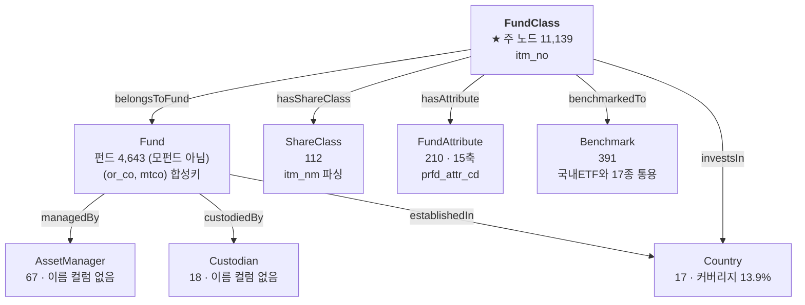

# 🧬 공모펀드 엔티티 구조도 — 컬럼 단위 배정표

> **자동 생성 문서입니다.** 근거: `ontology/enums/public_funds.yaml`(판정) + `ontology/enums/public_funds.auto.yaml`(사실) + DB 실측
>
> 테이블 `public_funds` · 95,619행 × 45컬럼 · 종목(`itm_no`) 11,139개

> 재생성: 이 문서를 만든 스크립트는 노트북 「🧬 엔티티 탐색」 절의 배정 검증 셀과 같은 로직을 씁니다.


---

## 1. 한눈에 — 무엇이 개체이고 무엇이 속성인가

```
                    ┌─────────────────┐
                    │  AssetManager   │ 67   운용사 (or_co_xtn_itt_cd)
                    │  Custodian      │ 18   수탁사 (trusc_xtn_itt_cd)
                    └────────▲────────┘
                             │ managedBy / custodiedBy
              ┌──────────────┴──────────────┐
              │           Fund              │ 4,643   펀드 = 운용 단위 (모펀드 아님)
              │  (or_co, mtco) 합성키        │          순자산 합계가 이 단위
              └──────────────▲──────────────┘
                             │ belongsToFund
              ┌──────────────┴──────────────┐
              │        FundClass            │ 11,139   ★ 주 노드 = 판매 단위
              │           itm_no            │          속성 44컬럼이 여기 붙음
              └───┬────────┬─────────┬──────┘
        hasShare  │        │         │  hasAttribute / investsIn / benchmarkedTo
          Class   ▼        ▼         ▼
      ┌───────────┐ ┌────────────┐ ┌──────────┐ ┌────────────┐
      │ShareClass │ │FundAttribute│ │ Country  │ │ Benchmark  │
      │   112     │ │   210 (15축)│ │    17    │ │    391     │
      │itm_nm 파싱│ │prfd_attr_cd │ │prfd_attr │ │  bmrk_nm   │
      └───────────┘ └────────────┘ └──────────┘ └────────────┘
                                                  🔵 국내ETF와 17종 통용

  ※ 행(95,619) = FundClass(11,139) × 그 종목의 태그 수(4~16, 평균 8.58)
     45컬럼 중 itm_no 안에서 갈리는 것은 prfd_attr_cd 하나뿐 → 나머지는 전부 FundClass 속성
  🔴 Fund 는 '모펀드' 가 아니다 — 클래스를 걷어낸 펀드 단위다. 모자형 모펀드는 이 테이블에 없다
     (모투자신탁·모투자회사 0건). mtco 단독 조인 금지 — 65종이 여러 운용사에 걸친다
```


### 관계도 (mermaid)




---

## 2. 엔티티 8종

| 엔티티 | 출처 컬럼 | 개수 | 레이블 | 관계 | 상태 |
| :--- | :--- | ---: | :--- | :--- | :--- |
| **FundClass** | `itm_no` | 11139 | `itm_nm` | — |  |
| **Fund** | `mtco_itm_no`, `or_co_xtn_itt_cd` | 4643 | 🔴 없음 | FundClass -belongsToFund→ Fund |  |
| **ShareClass** | `itm_nm` | 112 | 🔴 없음 | FundClass -hasShareClass→ ShareClass |  |
| **AssetManager** | `or_co_xtn_itt_cd` | 67 | 🔴 없음 | Fund -managedBy→ AssetManager  (FIBO hasManagementCompany) | 🔴 이름 컬럼 없음 |
| **Custodian** | `trusc_xtn_itt_cd` | 18 | 🔴 없음 | Fund -custodiedBy→ Custodian  (FIBO hasDepository) | 🔴 이름 컬럼 없음 |
| **Benchmark** | `bmrk_nm` | 391 | `bmrk_nm` | FundClass -benchmarkedTo→ Benchmark  (FIBO definesBenchmark) |  |
| **Country** | `fd_estb_ctry_cd`, `prfd_attr_cd` | 17 | 🔴 없음 | FundClass -investsIn→ Country · Fund -establishedIn→ Country | 커버리지 13.9% |
| **FundAttribute** | `prfd_attr_cd` | 210 | 🔴 없음 | FundClass -hasAttribute→ FundAttribute | 🔶 의미 미해독 (12/15축 대응) |

> 🔴 **`AssetManager`·`Custodian` 은 코드만 있고 이름 컬럼이 없습니다.** 사용자가 *"미래에셋자산운용"* 이라고 물어도 이을 수 없습니다 (EDA_GUIDE §5-A 최우선 이슈).


---

## 3. 컬럼 45개 전수 배정

모든 컬럼이 **엔티티 출처 · 유도규칙 · 속성** 중 하나 이상에 배정돼 있습니다 (45/45).


### 3.0 엔티티·유도규칙에 직접 쓰이는 컬럼 (9)

| 컬럼 | 한글명 | 배정 | 종류 | distinct | 결측률 | 비고 |
| :--- | :--- | :--- | :-: | ---: | ---: | :--- |
| `bmrk_nm` | 벤치마크명 | **Benchmark** | text | 391 | 0.0% |  |
| `fd_estb_ctry_cd` | 펀드설립국가코드 | **Country** | numeric | 2 | 0.1% |  |
| `itm_nm` | 종목명 | **ShareClass** | text | 11,139 | 0.0% |  |
| `itm_no` | 종목번호 | **FundClass** | text | 11,139 | 0.0% |  |
| `mtco_itm_no` | 운용사종목번호 | **Fund** | text | 4,660 | 0.0% | 판정 `missing` · 근거 `C` · ⚠️ trap/정책 · 🔴 더미값 |
| `or_attr_desc` | 운용속성구분코드 설명 | rule:`assetClass` / rule:`isFundOfFunds` / rule:`usesDerivatives` | text | 11 | 0.1% |  |
| `or_co_xtn_itt_cd` | 운용회사대외기관코드 | **Fund** / **AssetManager** | numeric | 67 | 0.1% |  |
| `prfd_attr_cd` | 펀드별속성코드 | **Country** / **FundAttribute** / rule:`prfdAttrTag` | text | 228 | 0.0% |  |
| `trusc_xtn_itt_cd` | 수탁회사대외기관코드 | **Custodian** | numeric | 18 | 0.1% |  |

### 3.1 속성 · 식별 (4)

| 컬럼 | 한글명 | 배정 | 종류 | distinct | 결측률 | 비고 |
| :--- | :--- | :--- | :-: | ---: | ---: | :--- |
| `fss_itm_no` | 금융감독원종목번호 | 속성:식별 | text | 8,086 | 0.0% | 판정 `unresolved` · 근거 `C` · ⚠️ trap/정책 · 🔴 더미값 |
| `ksd_itm_no` | 예탁원종목번호 | 속성:식별 | text | 11,092 | 0.3% |  |
| `rptt_ksd_itm_no` | 대표예탁원종목번호 | 속성:식별 | text | 2,628 | 0.1% | 판정 `unresolved` · 근거 `C` · ⚠️ trap/정책 · 🔴 더미값 |
| `std_itm_no` | 표준종목번호 | 속성:식별 | text | 11,127 | 0.1% | 판정 `broken` · 근거 `A` · ⚠️ trap/정책 |

### 3.2 속성 · 이름 (4)

| 컬럼 | 한글명 | 배정 | 종류 | distinct | 결측률 | 비고 |
| :--- | :--- | :--- | :-: | ---: | ---: | :--- |
| `bmrk_eng_nm` | 벤치마크영문명 | 속성:이름 | text | 388 | 0.0% |  |
| `itm_abrv_nm` | 종목약어명 | 속성:이름 | text | 11,119 | 0.0% |  |
| `itm_eabrv_nm` | 종목영문약어명 | 속성:이름 | text | 14 | 99.8% | 판정 `missing` · ⚠️ trap/정책 |
| `itm_eng_nm` | 종목영문명 | 속성:이름 | text | 10,971 | 0.0% |  |

### 3.3 속성 · 성과 (9)

| 컬럼 | 한글명 | 배정 | 종류 | distinct | 결측률 | 비고 |
| :--- | :--- | :--- | :-: | ---: | ---: | :--- |
| `fd_mm18_ern_r` | 펀드 18개월수익률 | 속성:성과 | numeric | 4,909 | 33.9% |  |
| `fd_mm1_ern_r` | 펀드 1개월수익률 | 속성:성과 | numeric | 1,550 | 27.6% |  |
| `fd_mm3_ern_r` | 펀드 3개월수익률 | 속성:성과 | numeric | 3,505 | 28.3% |  |
| `fd_mm6_ern_r` | 펀드 6개월수익률 | 속성:성과 | numeric | 4,177 | 29.8% |  |
| `fd_wk1_ern_r` | 펀드 1주일수익률 | 속성:성과 | numeric | 1,207 | 27.4% |  |
| `fd_yr1_ern_r` | 펀드 1년수익률 | 속성:성과 | numeric | 4,826 | 32.6% | 판정 `mixed` · 단위 `percent_cumulative` · ⚠️ trap/정책 |
| `fd_yr2_ern_r` | 펀드 2년수익률 | 속성:성과 | numeric | 4,777 | 39.2% |  |
| `fd_yr3_ern_r` | 펀드 3년수익률 | 속성:성과 | numeric | 4,925 | 41.6% | 단위 `percent_cumulative` · ⚠️ trap/정책 |
| `fd_yr5_ern_r` | 펀드 5년수익률 | 속성:성과 | numeric | 4,699 | 46.8% |  |

### 3.4 속성 · 규모 (1)

| 컬럼 | 한글명 | 배정 | 종류 | distinct | 결측률 | 비고 |
| :--- | :--- | :--- | :-: | ---: | ---: | :--- |
| `fd_nast_suma` | 펀드 순자산 | 속성:규모 | numeric | 2,682 | 13.1% | 판정 `missing` · ⚠️ trap/정책 |

### 3.5 속성 · 위험 (2)

| 컬럼 | 한글명 | 배정 | 종류 | distinct | 결측률 | 비고 |
| :--- | :--- | :--- | :-: | ---: | ---: | :--- |
| `zrin_fd_ivst_risk_gcd` | 제로인펀드투자위험등급코드 | 속성:위험 | numeric | 7 | 19.3% | 판정 `missing` · 근거 `C` · ⚠️ trap/정책 |
| `zrin_fd_ivst_risk_grd_nm` | 제로인펀드투자위험등급명 | 속성:위험 | text | 9 | 19.3% | 판정 `missing` · 근거 `A` · ⚠️ trap/정책 |

### 3.6 속성 · 분류 (8)

| 컬럼 | 한글명 | 배정 | 종류 | distinct | 결측률 | 비고 |
| :--- | :--- | :--- | :-: | ---: | ---: | :--- |
| `fd_ivst_rgn_desc` | 펀드투자지역구분코드 설명 | 속성:분류 | text | 7 | 0.1% |  |
| `fd_set_pcd` | 펀드설정유형코드 | 속성:분류 | numeric | 3 | 0.0% |  |
| `int_dvd_desc` | 이자배당구분코드 설명 | 속성:분류 | text | 2 | 0.1% |  |
| `kofia_fd_ccd` | 금융투자협회펀드분류코드 | 속성:분류 | text | 4,782 | 0.1% | 🔴 더미값 |
| `ovrs_fd_desc` | 해외펀드구분코드 설명 | 속성:분류 | text | 3 | 0.1% |  |
| `pers_corp_desc` | 개인법인구분코드 설명 | 속성:분류 | text | 3 | 0.1% | 값단위 판정 |
| `prvo_fd_desc` | 사모펀드구분코드 설명 | 속성:분류 | text | 2 | 0.1% | 값단위 판정 |
| `prvo_pbff_desc` | 사모/공모구분코드 설명 | 속성:분류 | text | 2 | 0.1% |  |

### 3.7 속성 · 거래판매 (8)

| 컬럼 | 한글명 | 배정 | 종류 | distinct | 결측률 | 비고 |
| :--- | :--- | :--- | :-: | ---: | ---: | :--- |
| `curr_cd` | 통화코드 | 속성:거래판매 | text | 2 | 0.0% |  |
| `exchdg_yn` | 환헤지여부 | 속성:거래판매 | text | 3 | 31.1% | 판정 `not_applicable` · ⚠️ trap/정책 |
| `frc_bpr_itm_yn` | 외화기준가종목여부 | 속성:거래판매 | numeric | 2 | 0.0% |  |
| `hdge_fd_yn` | 헤지펀드여부 | 속성:거래판매 | numeric | 1 | 0.1% |  |
| `ofsfd_yn` | 역외펀드여부 | 속성:거래판매 | numeric | 1 | 0.0% |  |
| `pfiv_sale_cntl_tcd` | 전문투자자판매제어구분코드 | 속성:거래판매 | numeric | 3 | 0.1% |  |
| `sale_yn` | 판매여부 | 속성:거래판매 | text | 2 | 0.0% |  |
| `thco_sale_yn` | 당사판매여부 | 속성:거래판매 | text | 2 | 4.2% |  |

> 📌 **`itm_nm` 은 두 역할을 합니다** — `FundClass` 의 **레이블**이면서 `ShareClass`(종류X/클래스X 파싱)와 `assetClass`(괄호 표기) 유도의 **출처**입니다.
>
> 📌 **성과 9컬럼은 판정을 공유합니다** — `fd_yr1_ern_r` 의 `missing_patterns`(접미결측/전무/구멍)이 `applies_to` 로 9개 전체에 적용됩니다. 표에는 대표 컬럼에만 표시됩니다.
>
> ⚠️ **`itm_abrv_nm` distinct 11,119 < `itm_no` 11,139** — 약어명 13종이 종목 여럿에 대응합니다. **이름은 유일키가 아닙니다** (노트 §D.11).


---

## 4. 클래스 계층 — 개체가 아니라 하위클래스

> FIBO 원칙: 펀드 **유형**은 `owl:Class` 하위클래스이지 개체가 아닙니다. 반면 **클래스(종류형)** 는 `FundShareClassUnit` 독립 개체입니다.

```
Fund
 ├─ SecuritiesFund
  │   ├─ EquityFund
  │   ├─ BondFund
  │   ├─ EquityMixedFund
  │   └─ BondMixedFund
 ├─ MoneyMarketFund
 ├─ MixedAssetsFund
 ├─ RealEstateFund
 └─ SpecialAssetsFund
```

**유도 규칙**

| 규칙 | 축 | 판정률/해당 |
| :--- | :--- | :--- |
| `assetClass` | 무엇에 투자하는가 (하위클래스 결정) | 94.3% (10,500/11,139) · 불명 639종목 |
| `isFundOfFunds` | 운용 구조 (자산군과 직교) | 3182 |
| `usesDerivatives` | 파생 활용 (직교) | 736 |
| `isMasterFeeder` | 모자형 구조 (직교) | 7237 |
| `prfdAttrTag` | prfd_attr_cd 한 컬럼에 3종류가 섞여 있음 — 형태로 갈라야 한다 | 국가 1,670행 + 코드형 93,948행 + 오염 1행 = 95,619 (100%) |

---

## 5. 아직 못 붙인 것 — 워크샵 결정 필요

| # | 항목 | 상태 |
| :-: | :--- | :--- |
| 1 | **운용사·수탁사 이름** — 코드 67·18종만 있고 이름 컬럼 없음 | 외부 매핑 필요 (금투협 공시) |
| 2 | **`FundAttribute` 축 15개의 의미** — 12축이 기존 컬럼과 대응 확인 | 세분축 `W`·`T`·`N`·`S` 만 값어치. 원본 코드표 필요 |
| 3 | **상장지수 펀드 23종이 국내ETF와 중복** — ID 로는 0건 | 같은 개체로 병합할지 (§G.1) |
| 4 | **Benchmark 를 독립 개체로 세울지** — 국내ETF와 17종 통용 | 세우면 펀드↔ETF 교차 질의 가능 |
| 5 | **Custodian 채택 여부** — 공모펀드에만 있는 관계 | 다른 3개 테이블에 대응 컬럼 없음 |
| 6 | `axis_classDifferentiation` 축의 정의 | 🔴 정답 라벨이 같은 펀드 안에서 갈림 → 주최 측 확인 필요 (§7) |
| 7 | `axis_issuanceType` 유도 규칙 | `fd_set_pcd '20'` 혼재 · UnitType 표본 1건으로 판정 불가 (§7) |


---

## 6. 값 정규화 규칙 — 조회 전에 적용해야 하는 것

> 런타임 가드레일이 `normalization` 에서 읽습니다. **여기 없으면 적용되지 않습니다.**

`trim_columns` 7컬럼 (공백 제거)


### 6.1 `dummy_as_missing` — 더미를 결측으로

> 🔴 NULL 만 결측으로 보면 틀린다. 이 컬럼들의 결측 중 98~99%가 NULL 이 아니라 0패딩 더미다. 정규화 없이 조인하면 '000000000000' 하나에 3,022종목이 뭉치고, LLM 프롬프트에 원값이 닿으면 "등록번호는 000000000000입니다" 라고 답한다 — 환각 감점에 직결된다. 노트북의 eff_empty() 작업 정의를 런타임으로 옮긴 것이다.

- **patterns**: `^(KR)?0+$`, `^(.)\1+$`
- **columns**: `fss_itm_no`, `kofia_fd_ccd`, `rptt_ksd_itm_no`, `mtco_itm_no`, `ksd_itm_no`, `std_itm_no`
- **실측**: fss_itm_no 결측 3,025 중 3,022 · kofia_fd_ccd 2,891 중 2,879 · rptt_ksd_itm_no 487 중 478 · mtco_itm_no 62 중 61 이 더미 (종목 11,139 기준)
- **sql**: (C IS NULL OR C='' OR replace(replace(C,'KR',''),'0','')=''
 OR (length(C)>1 AND replace(C, substr(C,1,1), '')=''))
- **sql_주의**: C 를 대상 컬럼명으로 치환해 쓴다. 🔴 CAST(C AS INTEGER)=0 으로 0패딩을 판정하지 말 것 — SQLite 가 '00AG530'·'00EP0094' 같은 값도 0 으로 읽어 920종목을 잘못 배제한다. 위 replace 표현은 노트북 eff_empty() 와 동일한 결과를 낸다 (2026-08-17 대조 검증).


### 6.2 `numeric_string_columns` — 숫자형이 소수점 문자열로 저장됨

> 🔴 DB 재구축(dtype=str)에서 문자열 컬럼은 선행 0 이 복구됐으나 숫자형은 '6.0' 형태로 남았다. 정확일치 조회가 0건이 된다. 비교 전 정규화 필수.

- **columns**: `zrin_fd_ivst_risk_gcd`, `frc_bpr_itm_yn`, `hdge_fd_yn`, `ofsfd_yn`
- **규칙**: 비교 전 CAST(컬럼 AS INTEGER) 로 맞출 것 (문자열 '6' 과 직접 비교 금지)
- **검증**: zrin_fd_ivst_risk_gcd = '6' → 0건  /  = '6.0' → 338건
- **대조**: fd_set_pcd('00','10','20') · pfiv_sale_cntl_tcd('00','01','02') · fd_estb_ctry_cd('000','410') 는 문자열 유지됨


### 6.3 `contaminated_rows` — 따옴표로 컬럼이 밀린 행

> 🔴 원본의 따옴표(")로 파싱이 밀려 이후 컬럼이 통째로 NULL 이 된 행. 적재 사고이며 판매상태와 무관하다. 깨진 행에서는 값이 옆 칸으로 밀린 흔적이 보인다 — itm_no='"' 행의 itm_nm='공모'(prvo_pbff 값), zrin_등급코드='20054.0'(수탁사 00020054), zrin_등급명='06'(or_attr_desc 값).

- **감지**: mtco_itm_no LIKE '%"%' OR itm_no = '"'
- **영향**: 행 66 · 종목 9 (미래에셋글로벌포커스4.0 계열 8 + 완전 파손 1)
- **결측기여**: std_itm_no·or_co_xtn_itt_cd·trusc_xtn_itt_cd 결측의 100% · ksd_itm_no 의 18.8%
- **처리**: 집계·조회에서 배제하고 모수에 밝힐 것. 값을 고쳐 채우지 말 것


### 6.4 `value_variants` — 같은 뜻인데 표기가 갈리는 값

> 정확일치 조회 시 누락이 발생한다. 조회 전 정규화하거나 두 표기를 모두 허용할 것

- **zrin_fd_ivst_risk_grd_nm**:
    - `매우 높은 위험` ← —
    - `높은 위험` ← `높은위험`
    - `다소 높은 위험` ← —
    - `보통 위험` ← `보통위험`
    - `낮은 위험` ← —
    - `매우 낮은 위험` ← —
- **설명**: 코드 7종 vs 명칭 9종의 차이는 공백 변형 2건 + 오염값 1건으로 전부 설명된다


### 6.5 `invalid_values` — 도메인 범위를 벗어난 값

> 배제 대상. 값을 고치지 말고 걸러낸다

- **zrin_fd_ivst_risk_gcd**: `20054.0`
- **prfd_attr_cd**: `해외`
- **설명**: zrin '20054' 는 등급 범위(1~6) 이탈 — 수탁사코드 00020054 가 밀려 들어온 값. prfd_attr_cd '해외' 1행은 ovrs_fd_desc 값이 밀려 들어온 것. 둘 다 contaminated_rows 와 같은 원인


### 6.6 `constant_columns` — 정보량이 0인 컬럼

> distinct 1. 필터 조건으로 쓰면 항상 전량 또는 0건이 된다. 온톨로지 속성으로 세우지 말 것

- **hdge_fd_yn**: '0.0' 11,130종목 — 헤지펀드 0건
- **ofsfd_yn**: '0.0' 전 종목 — 역외펀드 0건


---

## 7. 주최 측 6축 매핑 — 확정된 것만

> 주최 측이 제시한 6축 (1.금융상품/PRFD01N001_공모펀드마스터_schema.xlsx · Sheet2_Sample). 정답 라벨 100건(DB 와 100/100 매칭)과 대조해 **확정된 것만** 적는다. 🔴 derivation_rules.assetClass 와 층위가 다르다 — 여기 fundType 은 자본시장법 5분류이고 assetClass 는 실제 투자자산 축이다. 재간접 3,022종목은 fundType 으로는 SecuritiesFund 하나지만 assetClass 로는 1,604개가 주식형이다. **두 축을 합치지 말 것.**

| 축 | 출처 | 순도 | 근거등급 | 상태 |
| :--- | :--- | :--- | :-: | :--- |
| `axis_fundType` | or_attr_desc | 12/12 값이 단일 축값에 대응 (정답 100건) | A | ✅ 확정 |
| `axis_investorEligibility` | prvo_pbff_desc | 3/3 | A | ✅ 확정 |
| `axis_listingType` | itm_nm (종목명 파싱 — 코드가 아님) | 2/2 | A | ✅ 확정 |
| `axis_redemptionType` | — | — | A | 데이터_미제공 |

**`axis_fundType` 매핑표**

| 축값 | 컬럼값 |
| :--- | :--- |
| SecuritiesFund | `주식형`, `채권형`, `주식혼합`, `채권혼합`, `재간접`, `06`, `NULL` |
| MoneyMarketFund | `MMF` |
| MixedAssetsFund | `혼합자산` |
| RealEstateFund | `임대형`, `대출형` |
| SpecialAssetsFund | `특별자산` |

> 🔴 NULL 4건도 주최 측이 SecuritiesFund 로 라벨했다 — 결측을 배제하면 정답을 놓친다. '06' 은 도메인 문서가 "파생형 추정" 으로 적어둔 값인데 fundType 으로는 SecuritiesFund 다 (9건 전원).


**`axis_investorEligibility` 매핑표**

| 축값 | 컬럼값 |
| :--- | :--- |
| PublicOffering | `공모`, `NULL` |
| PrivateOffering | `사모` |

### 7.x 미확정 — 규칙을 만들기 전 단계

- **`axis_issuanceType`** — fd_set_pcd '10' → AdditionalType 93/93 이나 '20' 은 혼재(AdditionalType 6 : UnitType 1). UnitType 표본이 1건뿐이라 판정 불가.
- **`axis_classDifferentiation`** — 🔴 정답 라벨이 같은 펀드 안에서 갈린다 (40묶음 중 9개). 'C'=SingleClass 인데 'C-F'=MultiClass, 'C-E'/'C-e' 가 대소문자로 갈린다. 축 정의를 주최 측에 확인해야 한다 — 규칙을 만들기 전 단계다.


---

## 8. 질의 규칙 — SQL 조각

**종목단위**

```sql
GROUP BY itm_no
```

**펀드단위**

```sql
GROUP BY or_co_xtn_itt_cd,
         CASE WHEN length(mtco_itm_no) >= 7 THEN mtco_itm_no
              ELSE substr('0000000' || mtco_itm_no, -7) END
```
> 🔴 GROUP BY mtco_itm_no 단독은 틀린 집계다. mtco 는 운용사 내부 번호라 전역 유일이 아니며 65종의 값이 최대 3개 운용사에 걸친다 — 남의 운용사 펀드와 뭉친다. (단독 4,573 vs 합성 4,643). 또한 선행 0 손실로 길이가 4~8 로 섞여 있어 7자리 zero-pad 가 필요하다 — 안 하면 44개 펀드가 각각 두 키로 쪼개진다 (원값 4,687 vs pad 4,643).

> 위 표현 + dummy_as_missing.sql 필터로 종목 11,069 · 합성키 4,643 — 노트북 ④-A 와 일치 (2026-08-17 대조 검증). 🔴 substr('0000000'||m, -7) 단독은 쓰지 말 것 — 길이 8 값('"0466580' 등)의 앞 글자를 잘라 서로 다른 펀드를 합친다 (4,642 로 어긋남).


**판매중만**

```sql
sale_yn = '판매중'
```

**공모만**

```sql
prvo_pbff_desc = '공모'
```

**ETF제외**

```sql
itm_nm NOT LIKE '%상장지수%'
```

**수익률정상**

```sql
fd_yr1_ern_r > -100 AND fd_yr3_ern_r > -100
```

**자산군_주식형**

```sql
trim(or_attr_desc)='주식형' OR (trim(or_attr_desc) IN ('재간접','06') AND itm_nm LIKE '%(주식%')
```
