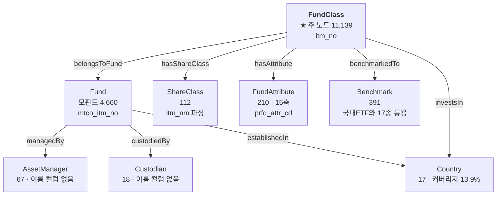

# 🧬 공모펀드 엔티티 구조도 — 컬럼 단위 배정표

> **자동 생성 문서입니다.** 근거: `ontology/enums/public_funds.yaml`(판정) + `ontology/enums/public_funds.auto.yaml`(사실) + DB 실측
>
> 테이블 `public_funds` · 95,619행 × 45컬럼 · 종목(`itm_no`) 11,139개

> 재생성: 이 문서를 만든 스크립트는 노트북 「🧬 엔티티 탐색」 절의 배정 검증 셀과 같은 로직을 씁니다.


---

## 1. 한눈에 — 무엇이 개체이고 무엇이 속성인가

```
                    ┌─────────────────┐
                    │  AssetManager   │ 67   운용사 (or_co_xtn_itt_cd)
                    │  Custodian      │ 18   수탁사 (trusc_xtn_itt_cd)
                    └────────▲────────┘
                             │ managedBy / custodiedBy
              ┌──────────────┴──────────────┐
              │           Fund              │  4,660   모펀드 = 운용 단위
              │        mtco_itm_no          │          순자산 합계가 이 단위
              └──────────────▲──────────────┘
                             │ belongsToFund
              ┌──────────────┴──────────────┐
              │        FundClass            │ 11,139   ★ 주 노드 = 판매 단위
              │           itm_no            │          속성 44컬럼이 여기 붙음
              └───┬────────┬─────────┬──────┘
        hasShare  │        │         │  hasAttribute / investsIn / benchmarkedTo
          Class   ▼        ▼         ▼
      ┌───────────┐ ┌────────────┐ ┌──────────┐ ┌────────────┐
      │ShareClass │ │FundAttribute│ │ Country  │ │ Benchmark  │
      │   112     │ │   210 (15축)│ │    17    │ │    391     │
      │itm_nm 파싱│ │prfd_attr_cd │ │prfd_attr │ │  bmrk_nm   │
      └───────────┘ └────────────┘ └──────────┘ └────────────┘
                                                  🔵 국내ETF와 17종 통용

  ※ 행(95,619) = FundClass(11,139) × 그 종목의 태그 수(4~16, 평균 8.58)
     45컬럼 중 itm_no 안에서 갈리는 것은 prfd_attr_cd 하나뿐 → 나머지는 전부 FundClass 속성
```


### 관계도 (mermaid)




---

## 2. 엔티티 8종

| 엔티티 | 출처 컬럼 | 개수 | 레이블 | 관계 | 상태 |
| :--- | :--- | ---: | :--- | :--- | :--- |
| **FundClass** | `itm_no` | 11139 | `itm_nm` | — |  |
| **Fund** | `mtco_itm_no` | 4660 | 🔴 없음 | FundClass -belongsToFund→ Fund |  |
| **ShareClass** | `itm_nm` | 112 | 🔴 없음 | FundClass -hasShareClass→ ShareClass |  |
| **AssetManager** | `or_co_xtn_itt_cd` | 67 | 🔴 없음 | Fund -managedBy→ AssetManager  (FIBO hasManagementCompany) | 🔴 이름 컬럼 없음 |
| **Custodian** | `trusc_xtn_itt_cd` | 18 | 🔴 없음 | Fund -custodiedBy→ Custodian  (FIBO hasDepository) | 🔴 이름 컬럼 없음 |
| **Benchmark** | `bmrk_nm` | 391 | `bmrk_nm` | FundClass -benchmarkedTo→ Benchmark  (FIBO definesBenchmark) |  |
| **Country** | `fd_estb_ctry_cd`, `prfd_attr_cd` | 17 | 🔴 없음 | FundClass -investsIn→ Country · Fund -establishedIn→ Country | 커버리지 13.9% |
| **FundAttribute** | `prfd_attr_cd` | 210 | 🔴 없음 | FundClass -hasAttribute→ FundAttribute | 🔶 의미 미해독 (12/15축 대응) |

> 🔴 **`AssetManager`·`Custodian` 은 코드만 있고 이름 컬럼이 없습니다.** 사용자가 *"미래에셋자산운용"* 이라고 물어도 이을 수 없습니다 (EDA_GUIDE §5-A 최우선 이슈).


---

## 3. 컬럼 45개 전수 배정

모든 컬럼이 **엔티티 출처 · 유도규칙 · 속성** 중 하나 이상에 배정돼 있습니다 (45/45).


### 3.0 엔티티·유도규칙에 직접 쓰이는 컬럼 (9)

| 컬럼 | 한글명 | 배정 | 종류 | distinct | 결측률 | 비고 |
| :--- | :--- | :--- | :-: | ---: | ---: | :--- |
| `bmrk_nm` | 벤치마크명 | **Benchmark** | text | 391 | 0.0% |  |
| `fd_estb_ctry_cd` | 펀드설립국가코드 | **Country** | numeric | 2 | 0.1% |  |
| `itm_nm` | 종목명 | **ShareClass** | text | 11,139 | 0.0% |  |
| `itm_no` | 종목번호 | **FundClass** | text | 11,139 | 0.0% |  |
| `mtco_itm_no` | 운용사종목번호 | **Fund** | text | 4,660 | 0.0% | 🔴 더미값 |
| `or_attr_desc` | 운용속성구분코드 설명 | rule:`assetClass` / rule:`isFundOfFunds` / rule:`usesDerivatives` | text | 11 | 0.1% |  |
| `or_co_xtn_itt_cd` | 운용회사대외기관코드 | **AssetManager** | numeric | 67 | 0.1% |  |
| `prfd_attr_cd` | 펀드별속성코드 | **Country** / **FundAttribute** / rule:`prfdAttrTag` | text | 228 | 0.0% |  |
| `trusc_xtn_itt_cd` | 수탁회사대외기관코드 | **Custodian** | numeric | 18 | 0.1% |  |

### 3.1 속성 · 식별 (4)

| 컬럼 | 한글명 | 배정 | 종류 | distinct | 결측률 | 비고 |
| :--- | :--- | :--- | :-: | ---: | ---: | :--- |
| `fss_itm_no` | 금융감독원종목번호 | 속성:식별 | text | 8,086 | 0.0% | 🔴 더미값 |
| `ksd_itm_no` | 예탁원종목번호 | 속성:식별 | text | 11,092 | 0.3% |  |
| `rptt_ksd_itm_no` | 대표예탁원종목번호 | 속성:식별 | text | 2,628 | 0.1% | 🔴 더미값 |
| `std_itm_no` | 표준종목번호 | 속성:식별 | text | 11,127 | 0.1% |  |

### 3.2 속성 · 이름 (4)

| 컬럼 | 한글명 | 배정 | 종류 | distinct | 결측률 | 비고 |
| :--- | :--- | :--- | :-: | ---: | ---: | :--- |
| `bmrk_eng_nm` | 벤치마크영문명 | 속성:이름 | text | 388 | 0.0% |  |
| `itm_abrv_nm` | 종목약어명 | 속성:이름 | text | 11,119 | 0.0% |  |
| `itm_eabrv_nm` | 종목영문약어명 | 속성:이름 | text | 14 | 99.8% | 판정 `missing` · ⚠️ trap/정책 |
| `itm_eng_nm` | 종목영문명 | 속성:이름 | text | 10,971 | 0.0% |  |

### 3.3 속성 · 성과 (9)

| 컬럼 | 한글명 | 배정 | 종류 | distinct | 결측률 | 비고 |
| :--- | :--- | :--- | :-: | ---: | ---: | :--- |
| `fd_mm18_ern_r` | 펀드 18개월수익률 | 속성:성과 | numeric | 4,909 | 33.9% |  |
| `fd_mm1_ern_r` | 펀드 1개월수익률 | 속성:성과 | numeric | 1,550 | 27.6% |  |
| `fd_mm3_ern_r` | 펀드 3개월수익률 | 속성:성과 | numeric | 3,505 | 28.3% |  |
| `fd_mm6_ern_r` | 펀드 6개월수익률 | 속성:성과 | numeric | 4,177 | 29.8% |  |
| `fd_wk1_ern_r` | 펀드 1주일수익률 | 속성:성과 | numeric | 1,207 | 27.4% |  |
| `fd_yr1_ern_r` | 펀드 1년수익률 | 속성:성과 | numeric | 4,826 | 32.6% | 판정 `mixed` · 단위 `percent_cumulative` · ⚠️ trap/정책 |
| `fd_yr2_ern_r` | 펀드 2년수익률 | 속성:성과 | numeric | 4,777 | 39.2% |  |
| `fd_yr3_ern_r` | 펀드 3년수익률 | 속성:성과 | numeric | 4,925 | 41.6% | 단위 `percent_cumulative` · ⚠️ trap/정책 |
| `fd_yr5_ern_r` | 펀드 5년수익률 | 속성:성과 | numeric | 4,699 | 46.8% |  |

### 3.4 속성 · 규모 (1)

| 컬럼 | 한글명 | 배정 | 종류 | distinct | 결측률 | 비고 |
| :--- | :--- | :--- | :-: | ---: | ---: | :--- |
| `fd_nast_suma` | 펀드 순자산 | 속성:규모 | numeric | 2,682 | 13.1% | 판정 `missing` · ⚠️ trap/정책 |

### 3.5 속성 · 위험 (2)

| 컬럼 | 한글명 | 배정 | 종류 | distinct | 결측률 | 비고 |
| :--- | :--- | :--- | :-: | ---: | ---: | :--- |
| `zrin_fd_ivst_risk_gcd` | 제로인펀드투자위험등급코드 | 속성:위험 | numeric | 7 | 19.3% | 판정 `missing` · ⚠️ trap/정책 |
| `zrin_fd_ivst_risk_grd_nm` | 제로인펀드투자위험등급명 | 속성:위험 | text | 9 | 19.3% |  |

### 3.6 속성 · 분류 (8)

| 컬럼 | 한글명 | 배정 | 종류 | distinct | 결측률 | 비고 |
| :--- | :--- | :--- | :-: | ---: | ---: | :--- |
| `fd_ivst_rgn_desc` | 펀드투자지역구분코드 설명 | 속성:분류 | text | 7 | 0.1% |  |
| `fd_set_pcd` | 펀드설정유형코드 | 속성:분류 | numeric | 3 | 0.0% |  |
| `int_dvd_desc` | 이자배당구분코드 설명 | 속성:분류 | text | 2 | 0.1% |  |
| `kofia_fd_ccd` | 금융투자협회펀드분류코드 | 속성:분류 | text | 4,782 | 0.1% | 🔴 더미값 |
| `ovrs_fd_desc` | 해외펀드구분코드 설명 | 속성:분류 | text | 3 | 0.1% |  |
| `pers_corp_desc` | 개인법인구분코드 설명 | 속성:분류 | text | 3 | 0.1% | 값단위 판정 |
| `prvo_fd_desc` | 사모펀드구분코드 설명 | 속성:분류 | text | 2 | 0.1% | 값단위 판정 |
| `prvo_pbff_desc` | 사모/공모구분코드 설명 | 속성:분류 | text | 2 | 0.1% |  |

### 3.7 속성 · 거래판매 (8)

| 컬럼 | 한글명 | 배정 | 종류 | distinct | 결측률 | 비고 |
| :--- | :--- | :--- | :-: | ---: | ---: | :--- |
| `curr_cd` | 통화코드 | 속성:거래판매 | text | 2 | 0.0% |  |
| `exchdg_yn` | 환헤지여부 | 속성:거래판매 | text | 3 | 31.1% | 판정 `not_applicable` · ⚠️ trap/정책 |
| `frc_bpr_itm_yn` | 외화기준가종목여부 | 속성:거래판매 | numeric | 2 | 0.0% |  |
| `hdge_fd_yn` | 헤지펀드여부 | 속성:거래판매 | numeric | 1 | 0.1% |  |
| `ofsfd_yn` | 역외펀드여부 | 속성:거래판매 | numeric | 1 | 0.0% |  |
| `pfiv_sale_cntl_tcd` | 전문투자자판매제어구분코드 | 속성:거래판매 | numeric | 3 | 0.1% |  |
| `sale_yn` | 판매여부 | 속성:거래판매 | text | 2 | 0.0% |  |
| `thco_sale_yn` | 당사판매여부 | 속성:거래판매 | text | 2 | 4.2% |  |

> 📌 **`itm_nm` 은 두 역할을 합니다** — `FundClass` 의 **레이블**이면서 `ShareClass`(종류X/클래스X 파싱)와 `assetClass`(괄호 표기) 유도의 **출처**입니다.
>
> 📌 **성과 9컬럼은 판정을 공유합니다** — `fd_yr1_ern_r` 의 `missing_patterns`(접미결측/전무/구멍)이 `applies_to` 로 9개 전체에 적용됩니다. 표에는 대표 컬럼에만 표시됩니다.
>
> ⚠️ **`itm_abrv_nm` distinct 11,119 < `itm_no` 11,139** — 약어명 13종이 종목 여럿에 대응합니다. **이름은 유일키가 아닙니다** (노트 §D.11).


---

## 4. 클래스 계층 — 개체가 아니라 하위클래스

> FIBO 원칙: 펀드 **유형**은 `owl:Class` 하위클래스이지 개체가 아닙니다. 반면 **클래스(종류형)** 는 `FundShareClassUnit` 독립 개체입니다.

```
Fund
 ├─ SecuritiesFund
  │   ├─ EquityFund
  │   ├─ BondFund
  │   ├─ EquityMixedFund
  │   └─ BondMixedFund
 ├─ MoneyMarketFund
 ├─ MixedAssetsFund
 ├─ RealEstateFund
 └─ SpecialAssetsFund
```

**유도 규칙**

| 규칙 | 축 | 판정률/해당 |
| :--- | :--- | :--- |
| `assetClass` | 무엇에 투자하는가 (하위클래스 결정) | 94.3% (10,500/11,139) · 불명 639종목 |
| `isFundOfFunds` | 운용 구조 (자산군과 직교) | 3182 |
| `usesDerivatives` | 파생 활용 (직교) | 736 |
| `isMasterFeeder` | 모자형 구조 (직교) | 7237 |
| `prfdAttrTag` | prfd_attr_cd 한 컬럼에 3종류가 섞여 있음 — 형태로 갈라야 한다 | 국가 1,670행 + 코드형 93,948행 + 오염 1행 = 95,619 (100%) |

---

## 5. 아직 못 붙인 것 — 워크샵 결정 필요

| # | 항목 | 상태 |
| :-: | :--- | :--- |
| 1 | **운용사·수탁사 이름** — 코드 67·18종만 있고 이름 컬럼 없음 | 외부 매핑 필요 (금투협 공시) |
| 2 | **`FundAttribute` 축 15개의 의미** — 12축이 기존 컬럼과 대응 확인 | 세분축 `W`·`T`·`N`·`S` 만 값어치. 원본 코드표 필요 |
| 3 | **상장지수 펀드 23종이 국내ETF와 중복** — ID 로는 0건 | 같은 개체로 병합할지 (§G.1) |
| 4 | **Benchmark 를 독립 개체로 세울지** — 국내ETF와 17종 통용 | 세우면 펀드↔ETF 교차 질의 가능 |
| 5 | **Custodian 채택 여부** — 공모펀드에만 있는 관계 | 다른 3개 테이블에 대응 컬럼 없음 |
| 6 | `axis_classDifferentiation` · `axis_redemptionType` 유도 규칙 | 미확정 (§B) |
