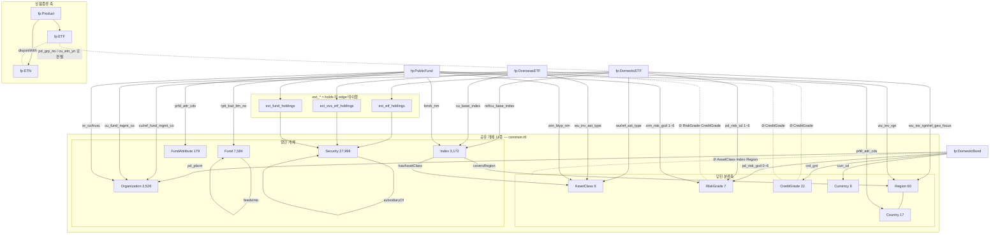

# 온톨로지 구성도 설계 — 도메인 3장이 공통 1장으로 합쳐지는 그림 (2026-09-02)

> 대상 절: 제안서 2.2.3(공통 스키마) · 2.2.6~2.2.8(도메인 절) · 2.2.9(교차 도메인 개체) · 부록 A.
> 원칙: **도메인 그림은 통합 그림의 스포크 하나를 확대한 것**이어야 한다. 같은 개체 순서, 같은 색, 같은 기호. 그래야 세 장을 넘기다 통합 그림으로 돌아왔을 때 "같은 것"으로 읽힌다.
> 아래 수치는 `data/financial_products.db` `kg_alias` 실측(2026-09-02). 제안서에 넣을 때는 NUMBERS 재생성본과 대조.

---

## 1. 그림 세트 구성 — 4장 + 표 1개

| 번호 | 제목 | 담당 | 무엇을 보여주나 |
| :-: | :-- | :-- | :-- |
| **그림 A** | 통합 온톨로지 — 공유 개체 허브와 4개 테이블 클래스 | 리드 | 가운데 공유 개체 11종, 바깥 4개 테이블, 연결선 = 컬럼, 끊긴 선 = ABSENT |
| **그림 B-1/2/3** | 도메인 구성표 — 채권 / ETF(국내+해외) / 펀드 | 각자 | A 의 스포크 하나를 확대: 내 테이블의 어느 컬럼이 어느 공유 개체에 닿는가 + 부재 선언 + 도메인 전용 규칙 |
| **표 C** | 도메인 × 공유 개체 연결 매트릭스 | 리드 | A 의 정답지. 셀 = 연결 컬럼(값 수) / ⊘ 부재 선언 / — 해당 없음 |

배치: 2.2.3 에 그림 A → 도메인 절마다 B → 2.2.9 에 표 C 로 닫는다. 심사자는 A 에서 전체를 보고, B 세 장에서 각 도메인을 보고, C 에서 "합쳐진다"를 확인한다.

---

## 2. 그림 A — 통합 온톨로지 (허브-스포크)

### 2-1. 레이어 3단

```
[상단 밴드]  fp:Product ─┬─ fp:ETF ⟂ fp:ETN   (상품종류 축 — disjointWith, pd_grp_no/cu_etn_yn 로 판별)
                         └─ (채권·펀드는 상품종류 축 없음)

[중단 허브]  공유 개체 11종 — 두 묶음으로 그린다
   ┌ 닫힌 분류축 (값이 유한, 계층 있음) ┐   ┌ 열린 개체 (수천~수만, 외부 수집·코드북) ┐
   │ AssetClass 9   RiskGrade 7         │   │ Organization 2,526   Index 3,172        │
   │ CreditGrade 22 (20등급+2밴드)      │   │ Security 27,996      Fund 7,584         │
   │ Currency 8     Region 60 ⊃ Country 17 │ │ FundAttribute 179                        │
   └────────────────────────────────────┘   └──────────────────────────────────────────┘

[하단 스포크] 테이블 클래스 4개 (= 데이터 출처 축)
   fp:DomesticBond   fp:DomesticETF   fp:OverseasETF   fp:PublicFund
   (각각 subClassOf fp:Product — ETF 하위가 아님)
```

### 2-2. 선의 문법 (B 에서도 동일하게)

| 기호 | 뜻 | 예 |
| :-- | :-- | :-- |
| 실선 + 컬럼명 | 테이블 컬럼 → 공유 개체 alias 연결 | `DomesticBond —pd_pbcm→ Organization` |
| 이중 실선 | 한 개체에 두 컬럼이 닿음(원천 이원화) | `DomesticETF ═wu_inv_rgn / ref_geo_focus═ Region` |
| 점선 + ⊘ | ABSENT 선언 (컬럼 자체가 없음, 게이트 기각 근거) | `OverseasETF ⊘ RiskGrade` |
| 굵은 회색 선 (ext_* 상자 경유) | `holds` 관계 — kg_edge 가 아니라 ext_* 테이블이 edge | `DomesticETF —ext_etf_holdings→ Security` |
| 허브 내부 화살표 | 개체 간 edge 4종 | `Index —hasAssetClass→ AssetClass` · `Index —coversRegion→ Region` · `Fund —feedsInto→ Fund(모)` · `Security —subsidiaryOf→ Security` |
| 양방향 표기 | inverseOf 3쌍 | `manages↔hasManager` · `issues↔hasIssuer` · `holds↔isHeldBy` |

### 2-3. 이 그림이 말해야 하는 것 3가지 (캡션)

1. **허브는 하나다.** Index 노드 하나(`Idx_MSCI_ACWI`)에 국내ETF·해외ETF·펀드 세 스포크가 닿는다 — 도메인 절이 셋이어도 온톨로지는 하나.
2. **테이블 축과 상품종류 축은 다르다.** 상단 밴드(ETF⟂ETN)와 하단 스포크(테이블 4개)가 분리돼 있다.
3. **부재도 그려져 있다.** 끊긴 선 14개가 답변불가 게이트의 근거다.

### 2-4. mermaid 초안 (조판 전 검토용)



---

## 3. 그림 B — 도메인 구성표 (3장, 같은 격자)

### 3-1. 격자 (세로 3열)

```
┌──────────────────┐   연결 컬럼 (값 수)     ┌──────────────────┐
│ fp:DomesticBond  │ ── pd_pbcm (1,817) ──▶ │ Organization     │  ← A 와 같은 순서·색
│  21,882행 / 58컬럼│ ── crd_grd (15) ─────▶ │ CreditGrade      │
│                  │ ── pd_risk_gcd (7) ──▶ │ RiskGrade  0~6   │  ← 범위 제약을 개체 옆에
│ 도메인 전용       │ ── curr_cd (1) ──────▶ │ Currency         │
│  query_rules 41  │ ┈┈ ⊘ ┈┈┈┈┈┈┈┈┈┈┈┈┈▶ │ AssetClass       │  ← 부재: "상품 자체가 채권"
│  clarify 3       │ ┈┈ ⊘ ┈┈┈┈┈┈┈┈┈┈┈┈┈▶ │ Index            │
│  ABSENT 4        │ ┈┈ ⊘ (KR 상수) ┈┈┈▶ │ Region           │
└──────────────────┘                        └──────────────────┘
  하단: 시계열 부재 — hasCreditGradeHistory ⊘
```

- **왼쪽 상자**: 테이블 클래스, 행·컬럼 수, 도메인 전용 규칙 수(query_rules·clarify·ABSENT).
- **가운데**: 컬럼명 + distinct 값 수. 두 컬럼이 한 개체에 닿으면 두 줄.
- **오른쪽 열**: 공유 개체를 **A 와 같은 순서로 전부** 그린다. 안 닿는 개체도 자리를 비워 두지 말고 ⊘ 또는 — 로 표기. 이래야 세 장이 겹쳐 보인다.
- **범위·서열 제약**은 개체 옆에 붙인다 (RiskGrade 0~6 / 1~6, CreditGrade rank 1~20).
- **하단**: 시계열·속성 부재(ABSENT 중 개체가 아닌 것).

### 3-2. 도메인별로 그릴 내용 (실측)

**B-1 채권** — 스포크 4개, 부재 3+1

| 연결 | 컬럼 | 값 수 | 비고 |
| :-- | :-- | --: | :-- |
| Organization | `pd_pbcm` | 1,817 | 발행사 (hasIssuer). DB distinct 1,818 → alias 1,817 → 노드 1,816 |
| CreditGrade | `crd_grd` | 15 | 코드북 표 21행 = 표준등급 20(`C0`/`C` 동일) · 선언 노드 22(20+밴드 2) 중 이 적재분 실재 15. `AA0`=AA alias |
| RiskGrade | `pd_risk_gcd` | 7 | **0~6** (0=미분류 19행) |
| Currency | `curr_cd` | 1 | KRW 상수 |
| ⊘ AssetClass · Index · Region | — | — | 상품 자체가 채권 / 지수 추종 아님 / 발행국 KR 21,881/21,882 |

> 🔴 **채권 값 수는 층을 밝혀 적는다** (2026-09-04 실측) — 발행사는 **DB distinct `TRIM(pd_pbcm)` 1,818 → KG alias 1,817**(종류명 `'국고채권'` 이 든 1행은 발행사가 아니라 등재 제외) **→ 노드 1,816**(표기 변형 2 alias 가 한 법인으로 병합). 위 표와 격자는 **alias 수(1,817)** 를 쓴다 — 실제로 개체에 닿는 선의 수이기 때문이다. `CreditGrade` 도 마찬가지로 **선언 노드 22**(표준등급 20 + 밴드 2)와 **이 적재분 실재 15**가 다른 층이다. 근거: `채권_회신_2026-09-03.md` §6.1·§6.4 #23·#30.
| ⊘ hasCreditGradeHistory | — | — | 등급 이력 없음 |

**B-2 ETF (국내+해외를 한 장에, 좌우 대칭)** — 국내 스포크 5, 해외 4. 비대칭이 곧 서술 포인트.

| 연결 | 국내 컬럼 (값 수) | 해외 컬럼 (값 수) | 비고 |
| :-- | :-- | :-- | :-- |
| Organization | `cu_fund_mgmt_co` 99 / `ref_fund_mgmt_co` 29 | `cu_fund_mgmt_co` 382 | 운용사 (hasManager) |
| Index | `ref_base_index` 904 / `cu_base_index` 19 | `cu_base_index` 1,848 | 지수 변형 → 정본 closure |
| Region | `wu_inv_rgn` 11 / `ref_geo_focus` 23 | `wu_inv_rgn` 59 | 한글·영문 이원화 → Region 계층으로 통합 |
| AssetClass | `wu_inv_ast_type` 9 / `ref_ast_type` 7 | `wu_inv_ast_type` 6 | |
| RiskGrade | `pd_risk_cd` / `pd_risk_nm` 6 (**1~6**) | **⊘** | 해외 컬럼 자체 없음 → 게이트 |
| Currency | `pd_curr_cd` 1 | `pd_trd_ccy` 1 | |
| Security (ext 경유) | `ext_etf_holdings` 10,154 | `ext_ovs_etf_holdings` 31,117 | holds = ext 테이블 |
| ⊘ CreditGrade | ⊘ | ⊘ | ETF 는 발행사 신용등급 없음 |
| ⊘ 시계열 | hasHoldingsHistory · hasNavHistory | (동일) | 스냅샷 1시점 |
| 상품종류 축 | `pd_grp_no` → ETF 1,235 / ETN 545 | `cu_etn_yn` → ETF 5,972 / ETN 65 | 상단 밴드 연결 |

**B-3 펀드** — 스포크가 가장 많다(9). 펀드만 닿는 개체 3종(Fund·FundAttribute·Country)이 있다.

| 연결 | 컬럼 | 값 수 | 비고 |
| :-- | :-- | --: | :-- |
| Organization | `or_co_xtn_itt_cd` / `trusc_xtn_itt_cd` | 274 / 48 | 운용사·수탁사 코드 → 코드북으로 이름 |
| Fund | `rptt_ksd_itm_no` | 6,867 | 클래스→펀드 묶음. + MotherFund 717 (`feedsInto` 1,704) |
| FundAttribute | `prfd_attr_cds` | 179 | 콤마 다중값 → `token` alias |
| Country | `prfd_attr_cds` | 17 | 같은 컬럼의 국가 태그 |
| Index | `bmrk_nm` | 389 | 벤치마크 |
| AssetClass | `zrin_btyp_nm` | 18 | |
| Region | `fd_ivst_rgn_desc` | 7 | |
| RiskGrade | `zrin_fd_ivst_risk_gcd` / `_grd_nm` | 6 / 8 | **1~6**, NULL≠0, 띄어쓰기 변형 alias |
| Currency | `curr_cd` | 7 | |
| Security (ext 경유) | `ext_fund_holdings` | 11,971 | |
| ⊘ CreditGrade | — | — | 채권형 펀드도 등급은 구성종목 단위 |
| ⊘ 속성 | hasUnitsOutstanding · hasFundManager | — | 좌수·운용역 없음 |
| ⊘ 시계열 | hasNavHistory · hasHoldingsHistory | — | |
| 펀드 단위 키 | `(or_co_xtn_itt_cd, mtco_itm_no)` | 14,467 | 그림 하단 주석: KG Fund 노드(rptt)와 다른 뜻 |

---

## 4. 표 C — 도메인 × 공유 개체 연결 매트릭스 (그림 A 의 정답지)

셀: 연결 컬럼(값 수) / **⊘** 부재 선언(ttl ABSENT, 게이트 근거) / — 해당 없음(컬럼도 선언도 없음)

| 공유 개체 | 채권 | 국내ETF | 해외ETF | 펀드 |
| :-- | :-- | :-- | :-- | :-- |
| Organization 2,526 | pd_pbcm 1,817 (노드 1,816) | cu/ref_fund_mgmt_co 99/29 | cu_fund_mgmt_co 382 | or_co 274 · trusc 48 |
| CreditGrade 22 | crd_grd 15 | ⊘ | ⊘ | ⊘ |
| RiskGrade 7 | pd_risk_gcd 7 (0~6) | pd_risk_cd 6 (1~6) | **⊘** | zrin_risk_gcd 6 (1~6) |
| AssetClass 9 | ⊘ | wu/ref_ast_type 9/7 | wu_inv_ast_type 6 | zrin_btyp_nm 18 |
| Index 3,172 | ⊘ | ref/cu_base_index 904/19 | cu_base_index 1,848 | bmrk_nm 389 |
| Region 60 | ⊘ (KR 상수) | wu_inv_rgn/ref_geo_focus 11/23 | wu_inv_rgn 59 | fd_ivst_rgn_desc 7 |
| Country 17 | — | — | — | prfd_attr_cds 17 |
| Currency 8 | curr_cd 1 | pd_curr_cd 1 | pd_trd_ccy 1 | curr_cd 7 |
| Security 27,996 | — | ext_etf_holdings 10,154 | ext_ovs_etf_holdings 31,117 | ext_fund_holdings 11,971 |
| Fund 7,584 | — | — | — | rptt_ksd_itm_no 6,867 |
| FundAttribute 179 | — | — | — | prfd_attr_cds 179 |
| 시계열·속성 ⊘ | CreditGradeHistory | HoldingsHistory · NavHistory | (CreditGrade) | UnitsOutstanding · FundManager · NavHistory · HoldingsHistory |
| 상품종류 축 | — | pd_grp_no (ETF/ETN) | cu_etn_yn (ETF/ETN) | — |

읽는 법(캡션): 열을 세로로 읽으면 도메인 그림 B 가 되고, 행을 가로로 읽으면 "한 개체를 몇 도메인이 공유하는가"가 된다. Organization·Currency 는 4개 전부, Index·Region·AssetClass 는 3개, Fund·FundAttribute·Country 는 펀드만. 이 표가 "온톨로지가 하나"라는 주장의 증거다.

---

## 5. 작성 규칙

1. **개체 순서·색 고정**: Organization → CreditGrade → RiskGrade → AssetClass → Index → Region → Country → Currency → Security → Fund → FundAttribute. A·B·C 전부 이 순서.
2. **B 에서 안 닿는 개체도 자리를 남긴다.** 빈 자리 없이 그리면 세 장이 다른 그림으로 보인다.
3. **범위·서열은 개체 옆**(RiskGrade 0~6/1~6, CreditGrade rank), **컬럼명은 선 위**, **부재 사유는 선 옆 짧게**.
4. **ext_* 는 개체가 아니라 edge 테이블**로 그린다 (상자 모양을 다르게). `holds` 를 kg_edge 에 넣지 않은 결정이 그림에서 보여야 한다.
5. 수치는 조판 직전 `gen_proposal_numbers.py` 재생성본으로 교체. 위 표의 값 수는 kg_alias distinct 실측이라 NUMBERS 에 없는 항목이 있다 — 필요하면 생성기에 "테이블×개체 매트릭스" 절을 추가한다.
