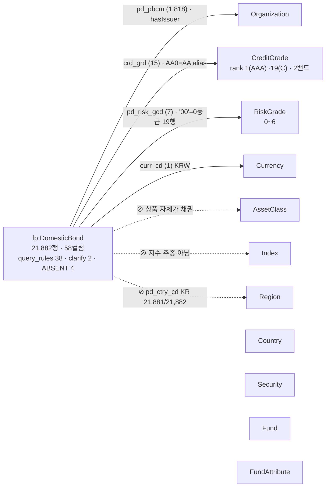

# 도메인 원고 템플릿 — 국내채권 (담당: 채권)

> **이 파일이 곧 제안서의 채권 몫이다.** 아래 §A~§E 를 채우면 리드가 절 번호 그대로 전체 보고서에 이어 붙인다.
> `▶` 표시가 채울 곳. 이미 적힌 수치·문장은 실측(2026-09-02)이라 그대로 써도 되지만, 조판 전 `../proposal/NUMBERS.md` 재생성본과 대조한다.
> 규칙: ① 수치는 NUMBERS 만 ② "무엇을 만들었다"가 아니라 **"데이터가 이래서 이렇게 선언했다"** ③ Federated·그래프 탐색·추론 이라는 말 금지 ④ 공유 개체(Organization·CreditGrade…)는 리드의 2.2.1 이 정의하므로 여기서 다시 정의하지 않는다.
> 마감: 초안 9/3, 완성 9/4.

| 이 파일의 절 | 전체 보고서 위치 | 분량 |
| :-- | :-- | :-- |
| §A | 2.1.1 데이터 단락 중 채권 | 반 쪽 |
| §B | **2.2.2 채권** | 2.5쪽 |
| §C | 4.1 흐름도 채권 | 1쪽 |
| §D | 5.2 현업 적용 지점 채권 | 1단락 |
| §E | 부록 A·B·C 채권분 | 별도 |

---

## §A. 데이터 (→ 2.1.1) — 반 쪽

**예시 문장 (그대로 다듬어 쓴다):**

> 국내채권 마스터는 21,882행 × 58컬럼으로, 4개 상품군 중 유일하게 **외부 수집 데이터가 없다.** 구성종목·설명서가 없는 상품이기 때문이다. 대신 마스터에 없는 지식 하나를 코드북으로 들여왔다 — **신용등급 서열표**(한국기업평가 21등급, 투자/투기 2밴드, `credit_grade_scale.csv`, as_of ≤ 2026-08-24). 등급 문자열 `AA-`·`BBB+` 는 데이터에 있지만 "AA- 이상"이 어느 등급들인지는 데이터 어디에도 없어서다.
> 정제에서 값을 고친 것은 없다. 대신 판정했다: 한 종목이 장내·장외 2~4행으로 중복되는 1,078종목(대표행 규칙), 할인채 689행이 표면금리 란에 할인율을 적은 것, 위험등급 `'00'`(미분류) 19행, 신용등급 결측 41.1%(국공채는 등급이 없는 것이 정상).

▶ 채울 것: 신용등급 결측률 41.1% 가 2차 데이터 기준인지 NUMBERS 에서 확인. 장내·장외 중복 종목 수 1,078 재확인.

---

## §B. 온톨로지 엔지니어링 — 채권 (→ 2.2.2) — 2.5쪽

### B.0 도입 (3줄)

> 채권은 공유 개체 11종 중 **4종에만 닿고 3종을 부재로 선언**한다. 스포크가 가장 적은 도메인이지만, 유일하게 **서열이 있는 닫힌 축(CreditGrade)** 을 쓰는 도메인이라 "AA- 이상" 같은 순서 질의가 온톨로지 없이는 풀리지 않는다.

### B.1 구조도 (그림 B-1)

격자는 `03_구성도_설계.md` §3-1. 오른쪽 열은 공유 개체 11종을 **통합 그림 A 와 같은 순서로 전부** 그린다.



하단 주석: `⊘ hasCreditGradeHistory` — 등급 이력 없음(기준일 현재 등급만).

| 연결 | 컬럼 | 값 수 | 비고 |
| :-- | :-- | --: | :-- |
| Organization | `pd_pbcm` | 1,818 | 발행사. `organization_issuer_auto.yaml` 자동 노드 |
| CreditGrade | `crd_grd` | 15 | 표준표 21 중 데이터 실재 15. `AA0`→AA alias |
| RiskGrade | `pd_risk_gcd` | 7 | `'11'~'16'` + `'00'`. 범위 **0~6** |
| Currency | `curr_cd` | 1 | KRW 상수 |
| ⊘ AssetClass · Index · Region | — | — | ttl ABSENT 3건 |
| ⊘ hasCreditGradeHistory | — | — | 시계열 부재 |

### B.2 결함 → 선언 (5~6건). 본문 채택 순서: 공식 예시에 걸리는 것 → 게이트 근거 → 나머지

**템플릿 (건마다 이 다섯 줄):**
```
#### B.2-k. [결함 한 줄] → [선언 한 줄]
데이터가 이랬다 : 실측 수치 1~2줄
그래서 이렇게   : ttl / yaml / 코드북 중 무엇에, 어느 층(1 값사전 · 2 규칙문서 · 3 게이트)
런타임에서      : Route / Ground / Gate / Plan / 검증 / 조립 중 어디가 읽는가
실측 사례       : 공식 예시 또는 probe 문항 ID + 기대 응답 한 줄
안 지키면       : 어떤 오답이 나는가 (있으면 서버 실측 날짜)
```

**완성 예시 — B.2-1 (이 톤으로 나머지를 쓴다):**

#### B.2-1. 신용등급의 서열이 데이터에 없다 → 표준표 21노드 2밴드 + `skos:broader` closure (1층)

- **데이터가 이랬다**: `crd_grd` 는 `AAA`·`AA0`·`AA-`… 문자열 15종이다. "AA- 이상"이 `{AAA, AA+, AA0, AA-}` 라는 사실은 어느 컬럼에도 없다. 결측 41.1% 는 대부분 국공채로, 등급이 없는 것이 정상이다.
- **그래서 이렇게**: `shared/credit_grade.yaml` 에 한국기업평가 21등급을 rank 1(AAA)~19(C) 로 선언하고, 투자등급(`CG_Investment`, rank 1~10)·투기등급(`CG_Speculative`, 11~19) 두 밴드를 `skos:broader` 상위로 두었다. 빌드가 `kg_closure` 로 전개하므로 런타임 비용은 0이다. DB 의 `AA0` 표기는 alias 로 흡수한다.
- **런타임에서**: Ground 가 "AA-" 를 CreditGrade 노드로 접지하고, Plan 이 규칙 `등급서열`(이상·이하가 붙으면 `TRIM(crd_grd) IN (서열 확장 목록)`)을 주입한다. 검증기가 IN 목록의 리터럴을 값 사전과 대조한다.
- **실측 사례**: 공식 예시 #1 "판매 가능한 원화채권 중 AA- 이상" → `crd_grd IN ('AAA','AA+','AA0','AA-')` + 구매가능 조건. ▶ probe ID 와 응답 요지 채우기.
- **안 지키면**: 2026-08-31 서버 실측 — "A등급 이상 회사채 표면금리 5% 초과" 가 `crd_grd='A-'` 단일 등급으로 나가 모수 599종목 중 49행만 조회됐다. 서열 규칙 도입 후 닫힘.

**소재 (B.2-2 ~ B.2-6, 각자 다섯 줄로 채운다):**

| # | 결함 | 선언 | 층 | 실측 사례 후보 |
| :-: | :-- | :-- | :-: | :-- |
| 2 | 위험등급 `'00'`(미분류) 19행 실재, 6등급이 8,929행(40.8%) | `range_by_table` 로 채권만 **0~6**. ttl `riskGradeValue_DomesticBond` 제약과 게이트 상수가 같은 선언에서 생성 | 3 | "위험등급 7등급 채권" → 게이트 기각. "1등급 채권" 이 가장 위험(역방향) |
| 3 | `pd_ctry_cd` 21,881/21,882 = KR | `hasRegion` ABSENT → "해외채권" 질의 기각 근거 | 3 | "해외 채권 알려줘" → 데이터 범위 밖 안내 |
| 4 | 할인채 689행이 `srfc_irt` 에 할인율 / 영구채 266행은 `mat_dt` 가 콜 개시일이라 dur 이론위반 | `couponRate` 주석 명시 + dur 정렬 시 영구채 제외 규칙 | 2 | "표면금리 높은 채권" 에 할인채가 섞일 때 답변에 종류 병기 |
| 5 | "가장 위험한 채권" 이 세 축(투자위험등급 / 신용등급 / 금리위험=듀레이션)으로 갈리고 ②③은 정반대 | `clarify.다의어.위험` — 기본값 금지, 축 단서 없으면 되묻기 | 2 | 2026-09-02 실측: 단정 답변(1등급+수익률 정렬, 신보 유동화 728%) → 되묻기로 교정 |
| 6 | 판매가능 정의 — `buyable_quantity` 무효(주최 확정) | `구매가능: curr_cd='KRW' AND mat_dt >= 20260824` (21,814행), 판정 기준일 8/24 는 as-of 8/22 와 다름을 명시 | 2 | 공식 예시 #1 의 "판매 가능" 절 |
| 7 | 한 종목이 장내·장외 2~4행 (1,078종목) | 대표행 규칙 — 종목 수는 `COUNT(DISTINCT pd_no)`, 속성이 다르면 두 줄 병기 | 2 | "AA- 이상 채권 몇 개" 가 행 수로 부풀지 않음 |
| 8 | "수익률" 다의어 (표면금리/민평 YTM/매수/세후/예금환산) | `clarify` — 기본값 개인 세후 + 명시, 투자 주체 미상이면 되묻기 | 2 | — |

▶ 5~6건 고르기. 권장: 1·2·3·5·6 (+4). 7·8 은 부록 B yaml 발췌로.

### B.3 한계 (정직하게, 3줄)

▶ 채울 것. 후보: ① 신용등급 결측 41.1% 는 보완 불가(외부 원천 없음) — "없다"고 답하는 것이 정답 ② `maturityClass`·`collateralType`·`issuerCategory` 축은 `axis_derivation.pending_workshop` 에 미확정으로 남김 ③ 등급 이력·발행 후 등급 변동은 답할 수 없음.

---

## §C. 기능 흐름도 — 채권 (→ 4.1) — 1쪽

**질의**: 공식 예시 #1 *"현재 판매 가능한 원화채권 중 AA- 이상 종목 알려줘"*

**실측 확보 방법** (서버 응답의 `think_trace` 를 그대로 붙인다):
```bash
# eval/probe_bond_flow.txt 에 한 줄:  BOND-FLOW-1<TAB>현재 판매 가능한 원화채권 중 AA- 이상 종목 알려줘
export PYTHONIOENCODING=utf-8
./.venv/Scripts/python.exe eval/probe_server.py eval/probe_bond_flow.txt -o eval/probe_bond_flow.json
```

**흐름도 형식 (세로 7단, 오른쪽 주석 = 온톨로지 요소)** — 리드 4.4 와 같은 형식이어야 한다.

| 단계 | 이 질의에서 일어나는 일 | 읽는 온톨로지 요소 |
| :-- | :-- | :-- |
| Route | "채권" 머리명사 → `domestic_bonds` 단일 테이블 | 라우팅 어휘(kg_alias raw + 범주값) |
| Ground | "AA-" → `CG_AA-` 노드, closure 로 상위 등급 3개 전개 | 1층 CreditGrade closure |
| Gate | 등급 토큰 `AA-` = 표준표 `ok` → 통과 | 3층 등급 표준표 4분기 |
| Plan | 규칙 주입: `구매가능`·`등급서열`·`등급정규화`·`대표행`(always_on) | 2층 query_rules |
| 검증 | `IN ('AAA','AA+','AA0','AA-')` 리터럴 ↔ 값 사전 대조, LIMIT·허용 테이블 | 3층 값 검사기 |
| 실행 | 21,814행 모수에서 조회, `COUNT(DISTINCT pd_no)` | — |
| 조립 | 목록 기계 조립 + "판정 기준일 2026-08-24" + 등급 결측 모수 병기 | answer_rules |

▶ 채울 것: 실제 `think_trace` 원문(코드 블록), 응답 `answer` 첫 3줄, 응답 시간.

---

## §D. 현업 적용 지점 (→ 5.2) — 1단락

**예시 문장:**
> 등급 서열이 코드북 한 장(`credit_grade_scale.csv`)이므로 신용평가사 교체·등급 체계 개편은 파일 교체로 끝난다. 결측 등급 41% 를 유추하지 않고 "등급 없음"으로 답하는 것은 판매 현장의 설명의무 관점에서 그 자체가 가치다 — 없는 등급을 만들어 내는 챗봇은 쓸 수 없다.

▶ 한 문장 더: 채권 데스크에서 이 구조가 실제로 어디에 붙는지 (예: 고객 적합성 확인 시 위험등급·신용등급 두 축 병기).

---

## §E. 부록 채권분

### E.1 `ontology/bond_kr.ttl` 원문 (부록 A) — 그대로 수록

```turtle
fp:DomesticBond rdfs:subClassOf fp:Product ; rdfs:comment "SQLite 테이블 domestic_bonds"@ko .

fp:couponRate a owl:DatatypeProperty ;
    rdfs:domain fp:DomesticBond ; rdfs:range xsd:decimal ;
    rdfs:comment "표면금리(%) — 컬럼 srfc_irt. 할인채(bd_intp_tcd='할인채', 2차 689행)는 이 란에 할인율이 기재됨"@ko .
fp:duration a owl:DatatypeProperty ;
    rdfs:domain fp:DomesticBond ; rdfs:range xsd:decimal ;
    rdfs:comment "듀레이션(년) — 컬럼 dur. 2차: 0 표기 52행·NULL 16행/21,882행"@ko .

fp:riskGradeValue_DomesticBond rdfs:subPropertyOf fp:riskGradeValue ;
    rdfs:domain fp:DomesticBond ;
    rdfs:range [ a rdfs:Datatype ; owl:onDatatype xsd:integer ;
                 owl:withRestrictions ( [ xsd:minInclusive 0 ] [ xsd:maxInclusive 6 ] ) ] ;
    rdfs:comment "0(매우높은위험)~6(매우낮은위험) — 0 = 미분류 코드 '00' 19건 실재 — 답변 가능"@ko .
```

### E.2 ABSENT 표 (부록 A)

| 속성 | 사유 | 대체 안내 |
| :-- | :-- | :-- |
| `hasAssetClass` | 자산군 컬럼 없음 — 상품 자체가 채권 | 클래스 계층으로 처리 |
| `tracksIndex` | 기초지수 컬럼 없음 — 지수 추종 상품 아님 | "지수 추종 채권" 질의 기각 |
| `hasRegion` | `pd_ctry_cd` 21,881/21,882 = KR | "해외채권" 질의 기각 |
| `hasCreditGradeHistory` | 기준일 현재 등급만 수록 | 등급 추이 질의 기각 |

### E.3 `enums/domestic_bonds.yaml` 발췌 (부록 B) — query_rules 38 중 대표 4 + clarify 1

```yaml
query_rules:
  구매가능: buyable_quantity 는 무효. '살 수 있나' = curr_cd='KRW' AND mat_dt >= 20260824 (21,814행). 판정 기준일 2026-08-24
  등급서열: 등급 낱말에 이상·이하가 붙으면 crd_grd 조건은 반드시 TRIM(crd_grd) IN (서열 확장 목록) — '=' 단일 등급은 오답
  등급정규화: crd_grd 조회 시 'AA'→'AA0' 접미사 변환 후 비교. 국공채는 등급 없음 = 정상
  위험등급방향: pd_risk_gcd '11'~'16'·'00' — 뒷자리가 등급, 숫자가 클수록 안전. 최상급·안정형은 '16' 단독
clarify:
  다의어:
    위험: 기본값 금지·되묻기 — ① 투자위험등급 / ② 신용등급 / ③ 금리위험(듀레이션) — ②와 ③은 정반대
```

▶ 채울 것: `answer_rules` 대표 1건(모수·기준일 병기 문구).

### E.4 값 수 표 (부록 C, 매트릭스 채권 열)

Organization 1,818 · CreditGrade 15 · RiskGrade 7 · Currency 1 · 나머지 ⊘/— . ▶ 조판 직전 재실측.

---

## 제출 전 체크

- [ ] §B.2 가 5~6건이고 각 건이 다섯 줄 템플릿을 지켰다
- [ ] 수치가 NUMBERS 와 같다 (특히 41.1% · 1,818 · 19행 · 21,814)
- [ ] "Federated / 그래프 탐색 / 추론" 0건
- [ ] 공유 개체를 다시 정의하지 않았다 (리드 2.2.1 참조로 대체)
- [ ] §C 에 실제 think_trace 원문이 붙어 있다
- [ ] 그림 B-1 의 개체 순서가 그림 A 와 같다
