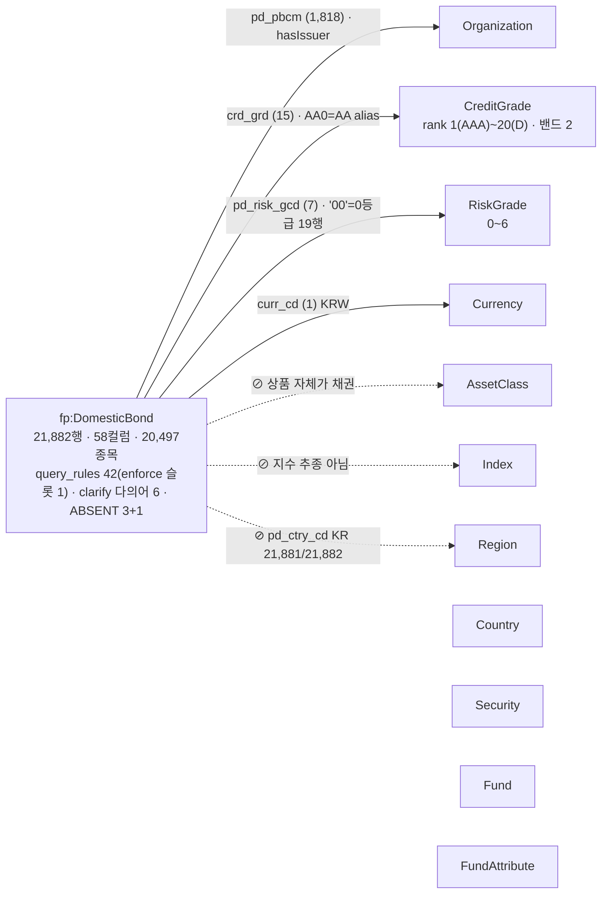

# 도메인 원고 — 국내채권 (담당: 채권) — 1차 완료 2026-09-03

> **이 파일이 곧 제안서의 채권 몫이다.** §A~§E 를 리드가 절 번호 그대로 전체 보고서에 이어 붙인다.
> 수치는 2026-09-03 `data/financial_products.db` 전수 실측(재현 SQL 은 §F). 채권 세부 수치는 같은 날 `scripts/gen_proposal_numbers.py` 에 **`§1 국내채권 기본모수 · 등급 · 판정 컬럼`** 절로 편입해 `../proposal/NUMBERS.md` 와 전건 일치한다 — 이제 NUMBERS 만 인용한다.
> 규칙: ① "무엇을 만들었다"가 아니라 **"데이터가 이래서 이렇게 선언했다"** ② Federated·그래프 탐색·추론 이라는 말 금지 ③ 공유 개체(Organization·CreditGrade…)는 리드의 2.2.1 이 정의하므로 여기서 다시 정의하지 않는다 ④ 층 표기: 1 값 사전(KG) · 2 규칙 문서(yaml) · 3 게이트.
>
> 🔴 **템플릿 대비 정정 3건** (조판자·리드 확인): ⓐ 신용등급 결측률 **41.1% → 18.4%** (41.1%·41.6% 는 1차 데이터 수치. 2차는 4,020/21,882행) ⓑ 도메인 규칙 수 **query_rules 42** (2026-09-04 기준 — 템플릿의 38 이 맞았고 9/3 `무이자질의`·`영구채필터`, 9/4 `정렬축`·`기본모수` 추가. 03_구성도 의 25 는 구본. 오전에 적은 39 는 주석 줄을 센 오기) ⓒ 표준표는 "21등급"이 아니라 **21행 · 표준등급 20(AAA~D, C0/C 동일 등급)** 이고 KG 노드 **22 = 등급 20 + 밴드 2**. (2026-09-04 정정: D 는 2차 0건이지만 노드를 둔다 — 표준 체계는 적재분과 무관하게 완전해야 새 데이터의 D 등급을 알아본다. 실재 여부는 값 사전이 판정하고 alias 는 `status: pending`.)

| 이 파일의 절 | 전체 보고서 위치 | 분량 |
| :-- | :-- | :-- |
| §A | 2.1.1 데이터 단락 중 채권 | 3/4쪽 (결측 판정 프로세스 포함) |
| §B | **2.2.2 채권** | 2.5쪽 |
| §C | 4.1 흐름도 채권 | 1쪽 |
| §D | 5.2 현업 적용 지점 채권 | 1단락 |
| §E | 부록 A·B·C 채권분 | 별도 |
| §F | (제안서 미수록) 수치 재현 SQL | — |

---

## §A. 데이터 (→ 2.1.1) — 3/4쪽

국내채권 마스터는 21,882행 × 58컬럼으로, 4개 상품군 중 유일하게 **외부 수집 데이터가 없다.** 구성종목도 설명서도 없는 상품이기 때문이다. 대신 마스터에 없는 지식 하나를 코드북으로 들여왔다. **신용등급 서열표**(`credit_grade_scale.csv`, 한국기업평가 등급정의, as_of 2026-08-20 · D 등급 행 2026-08-30 추가)다. 등급 문자열 `AA-`·`BBB+` 는 데이터에 있지만, "AA- 이상"이 어느 등급들인지, `BBB-` 와 `BB+` 사이가 투자/투기 경계라는 사실은 데이터 어디에도 없어서다.

정제에서 값을 고친 것은 없다. 대신 **판정**했다.

| 데이터가 이랬다 | 판정 | 어디에 |
| :-- | :-- | :-- |
| 한 종목(`pd_no`)이 장내·장외 2~4행 — 1,078종목 (21,882행 / 20,497종목) | 행 ≠ 종목. 종목 수는 `COUNT(DISTINCT pd_no)` | `row_grain` · 규칙 4 |
| 할인채 689행이 표면금리 란에 발행 할인율 (668행 > 0) | 이표금리와 한 축에 놓지 않는다 | `srfc_irt.trap` · 규칙 7 |
| 위험등급 `'00'`(해당없음) 19행 실재 · 6등급 8,929행(40.8%) | 범위 0~6, 0 은 결측이 아니라 값 | `range_by_table` · 규칙 10 |
| 신용등급 결측 4,020행(18.4%) = 국공채 2,840 + 특수채 254 + 회사채 926 | 국공채는 "미부여"(정상), 나머지 1,180행은 "미수록" — 둘 다 낮은 등급이 아니다 | `crd_grd.answer_policy` · 규칙 2 |
| `pd_ctry_cd` 21,881/21,882 = KR · `curr_cd` 21,881 = KRW (나머지 1행은 오염값 `'000'`) | 상수 컬럼 — 지역·통화 축 없음 | `kg_entity: null` · ABSENT |
| `buyable_quantity` >0 296 · =0 338 | 주최 공지(8/24)로 무효 — 판매 가능 = 만기 미경과 | 규칙 `구매가능` · 규칙 5 |
| 판매정보 **13컬럼이 같은 21,248행에서 통째로** NULL — 값 있는 634행은 전부 장외 LOT | 컬럼 13개의 결측이 아니라 사실 하나 — "지금 파는 물건이 아니다". 판매 축 질의는 모수 634/21,882 를 밝힌다 | 규칙 `판매행` · `answer_rules` 모수 고지 |
| 평가정보 **8컬럼이 같은 16행에서 통째로** NULL — 전부 장외(만기는 미래, 만기 경과 67행과 교집합 0) | 만기 경과가 아니라 장외 평가정보 미수록. 정렬·비교에서 제외 | 규칙 `듀레이션정상` · `row_grain.대표행` |

✅ 수치 검증 (2026-09-03 `gen_proposal_numbers.py` 재생성분과 대조) — 21,882 / 20,497 / 1,078 / 4,020(18.4%) / 2,840·254·926 / 689·668 / 19 / 8,929(40.8%) / 1,818 / 21,814·20,431 / 15,792 / **블록 13컬럼·21,248·634 · 8컬럼·16·교집합 0**(09-04 편입) 전부 NUMBERS `§1 국내채권` 일치.

### A.1 결측은 채우지 않고 유형으로 판정했다

이 테이블에서 "값이 비어 있다" 는 일곱 가지 다른 뜻이었다(2차에서는 여섯). 일반 EDA 의 대치(평균·최빈값)는 여기서 곧 환각이라 처음부터 금지했고(EDA 가이드 §3 "결측 판정 — 채우지 말고 분류하세요"), 대신 58컬럼을 프로파일러로 전수 훑은 뒤 컬럼마다 "무슨 뜻으로 비어 있나" 를 판정해 `enums/domestic_bonds.yaml` 에 `missing_reason`·`missing_semantics`·`zero_as_missing`·`answer_policy` 로 선언했다. 1차 데이터(7/11, 42,394행)에서 일곱 유형을 세웠고, 2차(8/24, 21,882행)가 오자 같은 조건식을 다시 돌려 유형표를 갱신했다. 수치는 NUMBERS §1 "국내채권 결측 유형 표".

| # | 유형 | 2차 실측 | 선언 자리 |
| :-: | :-- | :-- | :-- |
| ① | 구조적 부재 — 국공채 신용등급 | 국공채 2,840행 중 2,840 결측 (완벽 대응) | `crd_grd.missing_reason: not_applicable` |
| ①′ | 같은 컬럼의 미수록 — 특수채·회사채 | 254 + 926 = 1,180 | `answer_policy` "등급 미수록" |
| ② | 상태 표현 — 판매정보 **13컬럼이 한 덩어리로** 없음 | 13컬럼 동시 NULL 21,248 = 하나라도 NULL 21,248 · 있음 634(전부 장외) | 규칙 `구매가능` 은 판매 조건이 아니라 만기로 판정 · 규칙 `판매행` |
| ③ | 미산출 — 평가정보 **8컬럼이 한 덩어리로** 없음 | 8컬럼 동시 NULL 16(전부 장외 · 8행은 중복종목의 장외행) · **만기 경과와 교집합 0** (만기 경과 67행은 별건) | 규칙 `듀레이션정상` — 1차 유형명 '만기 경과분' 은 2차에 맞지 않아 09-04 정정 |
| ④ | 복구 가능 — 평가사 등급 컬럼 병합 | 컬럼 없음 → **소멸** | 2차 스키마에서 유형 자체가 사라짐 |
| ⑤ | 센티넬·위장 결측 | 세후평균수익률 전량 0 · 통화 `'000'` 1 · `dur`≥90 3 | `zero_as_missing` 11컬럼 · 게이트 `curr_cd` 상수 |
| ⑥ | 복사 위장 — `dirty` = `eval_price` | 21,655 / 21,866 | 금지 컬럼 (조립기 숨김) |
| ⑦ | 정상값 오해 — 비어 보이지만 값 | `srfc_irt`=0 579 · `pd_risk_gcd`='00' 19 | 규칙 `무이자질의` · `range_by_table` 0~6 |

판정 순서는 ⑦ 정상값인가 → ⑤⑥ 위장인가 → ④ 복구 가능한가 → ①②③ 어떤 부재인가 다. `IS NULL` 로만 세면 ⑤⑥⑦ 을 통째로 놓친다. **그리고 컬럼별로만 세면 ②③ 의 실체를 놓친다** — 이 둘은 컬럼 21개의 결측이 아니라 행 단위로 정보 묶음이 통째로 빠진 것이고(판매정보 13컬럼 21,248행 · 평가정보 8컬럼 16행, 양쪽 다 '동시 NULL = 하나라도 NULL' 로 검증), 그래서 답변 정책도 컬럼 21개가 아니라 블록 2개에 하나씩 붙는다. 2차 재실측에서 ③ 의 1차 유형명('만기 경과분 미산출')이 틀렸음도 여기서 드러났다 — 그 16행은 만기가 2027~2056년이고 만기 경과 67행과 한 행도 겹치지 않는다(09-04 정정). 2차에서 ④ 가 소멸한 것은 판정이 틀린 게 아니라 데이터가 바뀐 것이다 — 선언한 조건식이 2차에서도 같은 행을 잡는지 전수 재검증했고(8/26 검토표 C-4-01, `zero_as_missing` 11컬럼 건수 전부 일치), 1차 수치가 남아 있던 자리 셋(결측률 41.6% · `AA+`/`AA-` 행 뒤바뀜 · 표준등급 수)을 정정했다.

### A.2 한 줄기 — 신용등급 결측 4,020행은 두 뜻이다

- **발견**: `crd_grd` NULL 4,020행(18.4%). 프로파일러는 결측률만 준다 — 이 숫자만으로는 "등급 데이터가 부실하다" 로 읽힌다.
- **교차**: 대분류(`std_pd_mcls_nm`)로 나누니 국공채 2,840행 중 2,840 이 결측이다. 완벽 대응이면 결측이 아니라 속성이다 — 국채·지방채는 신용평가 대상이 아니다. 나머지 특수채 254·회사채 926 은 등급이 있어야 할 상품인데 없다. **같은 NULL 이 "해당없음" 과 "미수록" 으로 갈린다.**
- **기각한 대안 셋**: ⓐ 최빈값이나 같은 발행사의 다른 채권 등급으로 대치 — 값을 만드는 순간 환각이고, 주최 8/24 답변("0·결측은 의도된 내용")과 충돌. ⓑ "확인할 수 없습니다" 일괄 — 국공채엔 오답이다. 08-30 서버 실측(오답기록 #10)이 정확히 이 오답을 냈다: 판매 LOT 상위 국고채 답변에 "신용등급 정보 없음". ⓒ 등급 조건 질의에서 결측 행을 조용히 제외 — 모수 고지 없이 "전체 중" 으로 말하면 오답.
- **선언**: `enums/domestic_bonds.yaml` `crd_grd` 에 `missing_reason: not_applicable` · `answerable_n: 17862` · `answer_policy` "국채·지방채는 신용등급이 부여되지 않습니다 / 회사채·특수채 결측 1,180 은 등급 미수록 / 등급 조건 질의는 모수 17,862/21,882 명시". 답변층엔 `answer_rules` 를 08-30 에 신설했고(`cdf09f6`), 규칙 `등급서열` 마지막 줄이 "결측을 낮은 등급으로 취급하지 않는다" 를 SQL 생성기에 싣는다.
- **재검증**: 1차 41.6% 는 평가사 등급 컬럼 병합 전 값이었고, 2차엔 그 컬럼이 없어 유형 ④ 가 소멸하며 18.4% 가 됐다. 템플릿에 남아 있던 41.1% 를 정정하고 수치를 생성기로 옮겼다(회신 §2).
- **런타임**: "신용등급이 없는 채권은?" (BND-D-024) → "신용등급이 없는 채권은 주로 국공채입니다. … 국가나 지방자치단체가 발행하는 채권으로 신용등급이 부여되지 않습니다" (`eval/paired_result_v2.json`). 등급 조건 질의는 서열 확장(§B.2-1)에서 무등급을 모수 밖으로 둔다.
- **남은 것**: 공식 예시 #1 답변이 "무등급 4,020행은 모수 밖" 을 아직 고지하지 않는다(g1~g5 🟡, 처방 G-C′ 미집행 — §B.3-1, 회신 §4).

---

## §B. 온톨로지 엔지니어링 — 채권 (→ 2.2.2) — 2.5쪽

### B.0 도입 (3줄)

채권은 공유 개체 11종 중 **4종에만 닿고 3종을 부재로 선언**한다(속성 부재 1건 추가). 스포크가 가장 적은 도메인이지만, 4도메인 중 유일하게 **서열이 있는 닫힌 축(CreditGrade)** 을 쓰는 도메인이라 "AA- 이상" 같은 순서 질의가 온톨로지 없이는 풀리지 않는다. 그리고 유일하게 **결정층 되묻기(`clarify`)** 를 갖는 도메인이다. "위험한 채권"·"싼 채권"이 데이터 안에서 정반대의 두 축으로 갈리기 때문이다.

### B.1 구조도 (그림 B-1)

격자는 `03_구성도_설계.md` §3-1. 오른쪽 열은 공유 개체 11종을 **통합 그림 A 와 같은 순서로 전부** 그린다.



하단 주석: `⊘ hasCreditGradeHistory` — 등급 이력 없음(기준일 현재 등급만).

| 연결 | 컬럼 | 값 수 | 비고 |
| :-- | :-- | --: | :-- |
| Organization | `pd_pbcm` | 1,818 | 발행사(hasIssuer). TRIM 후 DB distinct 1,818(raw 1,837 — `(주)` 위치·꼬리 공백) → **KG alias 1,817**(종류명 `'국고채권'` 1건 등재 제외) → **노드 1,816**(표기 변형 2 alias 가 한 법인으로 병합) |
| CreditGrade | `crd_grd` | 15 | 표준등급 20 중 2차 데이터 실재 15. `AA0`→AA 는 codebook alias |
| RiskGrade | `pd_risk_gcd` | 7 | `'11'~'16'` + `'00'`. 범위 **0~6** (`range_by_table`) |
| Currency | `curr_cd` | 1 | KRW 상수 (`'000'` 1행은 enum 등재 금지) |
| ⊘ AssetClass · Index · Region | — | — | ttl ABSENT 3건 |
| ⊘ hasCreditGradeHistory | — | — | `absent_properties` 1건 — 시계열 부재 |

**KG 는 손으로 그리지 않았다.** 위 표의 노드는 전부 빌드 산출물이다. 발행사는 `scripts/gen_shared_auto.py` 가 `pd_pbcm` DB distinct 1,818 중 종류명 `'국고채권'` 1건을 뺀 alias 1,817 을 `(주)`·`주식회사`·공백을 뗀 법인 키로 병합해 노드 1,816 을 만들고(표기 변형 1건 병합), 신용등급은 코드북 `credit_grade_scale.csv` 의 rank 열이 **노드 20 + 밴드 2**(= 22)와 `skos:broader` closure 20 이 된다. 사람이 쓴 것은 yaml 의 "어느 컬럼 값이 이 개체인가" 한 줄과 코드북뿐이다. 빌드 검증 7종이 산출물을 거부한다 — V1 죽은 alias(DB distinct 에 없는 값) · V2 한 raw 값이 두 노드에 매달림 · V3 `kg_entity` 포인터 미완 · V4 코드북 출처·as_of ≤ 기준일 · V5 테이블·컬럼 실존 · V6 ABSENT 선언인데 컬럼 실재 · V7 alias 확장 대상 없음. 그래서 `XS` 를 국가로, `'000'` 을 통화로 등재하는 실수는 yaml 에 적는 순간이 아니라 빌드에서 막힌다.

### B.2 결함 → 선언 (5건 + 보조 1건)

채택 기준: 공식 예시 질의에 직접 걸리는 것(1·5) > 답변불가 게이트 근거(2·3) > 되묻기(4). 6은 보조로 짧게.

**선언이 붙은 데이터 결함은 이 6건이 전부가 아니다** — 채권 하나에 `query_rules` 42(그중 `enforce` 슬롯 1) · `answer_rules` 21 · 결정층 가드 21이 붙어 있고, 그중 아래 6건이 이야기하는 것은 가드 3개다. 나머지는 자리를 아껴 부록·발췌로 보냈고, 무엇을 왜 뺐는지 여기 밝힌다(전수 대조 2026-09-04).

| 채택하지 않은 결함 부류 | 선언 | 층 | 어디로 |
| :-- | :-- | :-: | :-- |
| 행 ≠ 종목 — 1,078종목이 2~4행, 장외행은 종류·등급·발행사·듀레이션 NULL | `row_grain` · 규칙 `대표행`·`시장집계금지` | 2 | §A 표 · §E.3 |
| 적재 형식 — 날짜가 REAL(`2029-08-22` 무따옴표는 뺄셈 1999) · 고정폭 패딩 7컬럼 | 규칙 `날짜표기`·`문자열비교` · `trim_columns` + 가드 `normalize_date_literals`·`_cell`·`ensure_trimmed_compare` | 2+3 | §B.2-5 "안 지키면" · 부록 |
| NULL 이 논리식을 삼킨다 — `NOT(a OR b)` 가 등급 NULL 국공채 2,840행을 통째로 떨어뜨림 | 규칙 `고위험제외` 의 `COALESCE`+AND 확정식 + 가드 `ensure_reco_exclusions` | 2+3 | 부록 |
| 값이 통칭과 다르다 — 통안'증권'의 실값은 통화안정채권 · STRIPS 21행은 `bd_knd` 결측 | 규칙 `종류필터` 확정식 3종 · `bd_knd_alias` · 동의어 + 가드 `ensure_ktb_kind` | 2+3 | 부록 |
| 표기가 컬럼에 없다 — '정부 보증'·ESG·특수구조는 종목명에만 | 규칙 `신용보강`(A~D 층)·`ESG라벨`·`공모사모판정`·`구조표시` · `name_encoding` + 가드 `ensure_credit_backstop` | 2+3 | §E.3 |
| 컬럼이 정보를 안 담는다 — `dirty`=`eval_price` 99.0% · 장내 종가 0=거래없음 16,476 · 판매 13·평가 8컬럼 블록 | 규칙 `더티금지`·`장내종가`·`판매행` · `answer_rules` 모수 고지 | 2 | §A 표 · §A.1 |
| 다의어 '싸다' — 가격 낮음 / 수익률 높음 | `clarify.다의어` + 결정층 `price_ambiguity_clarify` | 2+결정층 | §B.0 한 마디 |


#### B.2-1. 신용등급의 서열이 데이터에 없다 → 표준표 코드북 + rank·밴드 노드 + `skos:broader` closure (1층) + 규칙 `등급서열` (2층) + 서열 확장 가드 (3층)

- **데이터가 이랬다**: `crd_grd` 는 `AAA`·`AA0`·`AA-`… 문자열 15종이다. "AA- 이상" = `{AAA, AA+, AA0, AA-}` 라는 사실도, `BBB-`/`BB+` 가 투자/투기 경계라는 사실도 어느 컬럼에도 없다. 게다가 사용자가 말하는 `AA` 는 DB 에 0건이고 `AA0` 로 적혀 있다(1,241행). 결측 4,020행(18.4%)의 70%는 국공채로, 등급이 없는 것이 정상이다.
- **그래서 이렇게**: `shared/credit_grade.yaml` 에 한국기업평가 표준표를 rank 1(AAA)~20(D) 노드로 선언하고, 투자등급(`CG_Investment`, rank 1~10)·투기등급(`CG_Speculative`, 11~20) 두 밴드를 `skos:broader` 상위로 두었다. 빌드가 밴드→등급을 `kg_closure` 로 펼친다(투자등급 후손 10). DB 표기 `AA0` 는 `CG_AA` 의 codebook alias 로 흡수한다(1층). `enums/domestic_bonds.yaml` 의 `등급서열`·`등급정규화` 규칙이 "이상·이하가 붙으면 `TRIM(crd_grd) IN (서열 확장 목록)`, `=` 단일 등급은 오답" 을 SQL 생성기에 싣는다(2층).
- **기각한 대안**: 서열을 규칙 문서 텍스트로만 싣고 HCX 가 목록을 만들게 두는 안 — 8/31 밤 불완전 `IN` 실측이 그 결과다. 반대로 코드에 목록 상수만 두는 안 — 코드북 교체마다 코드를 고쳐야 하고 "값 사전 = 값 검사기" 원칙에 어긋난다(3층 가드가 아직 그 잔재다, §B.3-2).
- **런타임에서**: Ground 가 "AA-" 를 `CG_AAm` 으로 접지하고(`crd_grd='AA-'`), Plan 이 규칙을 주입하고, 생성 뒤 가드 `expand_grade_comparison` 이 SQL 의 `crd_grd = 'AA-'` 나 불완전한 `IN` 목록을 서열 확장식으로 통째로 교체한다. 검증기가 `IN` 의 리터럴을 값 사전과 대조한다.
- **실측 사례**: 공식 예시 #1 `OFFICIAL-001` "현재 판매 가능한 원화채권 중 AA- 이상 종목 알려줘" → `TRIM(crd_grd) IN ('AAA','AA+','AA0','AA-') AND curr_cd='KRW' AND mat_dt >= 20260824` → "전체 15,792종목, 기준일 2026-08-24" + 30행 (2026-09-03 r15, 2.4초, §C).
- **안 지키면**: 2026-08-31 서버 실측 — "A등급 이상 회사채 표면금리 5% 초과" 가 `crd_grd='A-'` 단일 등급으로 나가 모수 599종목 중 49행만 조회됐다. 같은 날 밤 재실측에서는 `IN ('AA-','AA0',…)` 불완전 목록으로 상위 209종목이 누락됐다(1위 우리금융캐피탈458 7.5% 대신 SC은행 5.2%). 가드가 `=` 만 잡던 사각을 `IN` 대조까지 넓힌 뒤 닫힘.

#### B.2-2. 위험등급 `'00'` 19행이 실재하고 6등급이 40.8% → 채권만 범위 **0~6**, ttl 제약과 게이트 상수를 한 선언에서 생성 (3층)

- **데이터가 이랬다**: `pd_risk_gcd` 는 문자열 `'11'~'16'` + `'00'`. 뒷자리가 등급이고 **숫자가 클수록 안전**하다(6등급 8,929행 = 국공채 2,839 + 특수채 6,090). `'00'`(pd_risk_nm '해당없음') 19행은 결측이 아니라 값이다 — 외평채 1·특수채 12·회사채 6. 반면 펀드는 등급 없는 클래스가 NULL 이고 0 이 아니다.
- **그래서 이렇게**: `shared/risk_grade.yaml` `range_by_table` 에 `domestic_bonds: {min: 0, max: 6, unclassified: 0}`, 펀드·국내ETF 는 `1~6` 으로 선언했다. 빌드가 이 한 줄에서 `bond_kr.ttl` 의 `fp:riskGradeValue_DomesticBond` (`xsd:minInclusive 0 · maxInclusive 6`) 와 게이트의 범위 상수를 함께 생성한다. 코드에 `0~6` 상수를 두지 않는다(2026-09-02 KG-013/014: 공용 상수가 펀드 0등급을 정의역으로 허용한 사고 뒤 테이블별 선언으로 교체).
- **기각한 대안**: `'00'` 을 적재 때 NULL 로 바꾸는 안 — 값 고치기 금지 위반이고 "0등급 채권 있어?" 에 19종목을 답할 수 없게 된다. 4테이블 공용 상수 `1~6` 을 코드에 두는 안 — 9/2 KG-013/014 사고가 그 결과다.
- **런타임에서**: Gate 가 질문의 "N등급" 을 라우팅된 테이블의 선언 범위와 대조해 밖이면 HCX 0회로 기각한다. 규칙 `위험등급방향`·`등급별집계` 가 "1~6등급 합 20,486 ≠ 전체 20,497 이면 `'00'` 19종목을 빠뜨린 것" 을 SQL 생성기에 싣는다.
- **실측 사례**: "위험등급 7등급 채권 알려줘" → `[Gate] 기각 — 위험등급 7 는 정의 범위(0~6, 테이블별 선언 range_by_table)를 벗어남` → "국내채권 위험등급은 0(매우높은위험)~6(매우낮은위험) 범위로 정의되어 있어 7등급은 없습니다. (0 = 미분류 코드 '00' 19건 실재 — 답변 가능)" (오프라인 파이프라인 2026-09-03 · `tests/test_guard_v2.py::test_risk_grade_range_by_table`). "위험등급 0등급 채권" 은 통과한다. ▶ 서버 원문은 `probe_bond_recheck` BR-X01.
- **안 지키면**: 범위를 1~5 로 두면 정상 데이터 8,929행(6등급)과 19행(0등급)이 차단된다. 방향을 잘못 읽으면 "낮은 위험등급" 이 "위험이 낮다" 로 뒤집힌다(1등급 1,441행 중 AAA 는 1행뿐, 921행이 무등급).

#### B.2-3. 발행국·통화가 상수다 → `hasRegion` ABSENT + 규칙 `외화채없음` — "해외·외화 채권" 은 없다고 답한다 (3층 + 2층)

- **데이터가 이랬다**: `pd_ctry_cd` 21,881/21,882 = KR(나머지 1행은 국제예탁기구 코드 `XS`, 국가가 아니다). `curr_cd` 21,881 = KRW, 1행은 오염값 `'000'`. 1차의 외화채 21건(USD 19·JPY 1·EUR 1)은 2차에서 전부 소멸했다. 투자지역 컬럼 자체는 없다.
- **그래서 이렇게**: `enums` 에 `pd_ctry_cd.kg_entity: null` 로 판정하고 `bond_kr.ttl` 에 `hasRegion` ABSENT 를 선언했다(3층 — 게이트 어휘 '투자지역'). 통화는 `Currency` 개체에 KRW 하나만 alias 로 잇고, 규칙 `외화채없음` 이 "모든 채권 질의에 `curr_cd='KRW'` 기본, `USD`·`XS` 등 다른 값을 쓰지 않는다, 외화·해외 채권은 '수록 없음'(해외ETF 유도 금지)" 을 싣는다(2층).
- **기각한 대안**: `pd_ctry_cd` 를 Country 개체로 등재해 '투자지역' 질의에 발행국을 대신 답하는 안 — 발행국 ≠ 투자지역이고, 상수 컬럼을 축으로 올리면 '미국 채권' 이 `XS` 1행에 접지된다. 규칙 문서만으로 막는 안 — 9/3 `'000'` 실측이 반례다.
- **런타임에서**: '투자지역' 어휘는 Gate 가 ABSENT 로 HCX 0회 기각. '달러·외화·해외 채권' 은 **`gate_constants curr_cd`(상수 컬럼 게이트, 2026-09-03 추가)** 가 HCX 0회로 "원화 채권만 수록" 을 답한다. 어휘를 비켜 간 SQL 이 오염값 `curr_cd='000'` 을 쓰면 값 검사 옆의 `forbidden_literal_use` 가 기각한다.
- **실측 사례**: "투자지역이 미국인 채권 알려줘" → `[Gate] 기각 — 온톨로지상 domestic_bonds 클래스에 hasRegion 속성이 정의되어 있지 않음 — 투자지역 컬럼 없음 — pd_ctry_cd(발행국)는 2차 21,881/21,882 행이 KR` (오프라인 2026-09-03 · `tests/test_runtime.py::test_absent_bond_index` 와 같은 경로). ▶ 서버 원문은 `probe_bond_recheck` BR-X02(투자지역)·BR-P04(달러 채권, 8/31 밤 프로브 #4 미실측 잔류).
- **안 지키면**: 2026-08-31 서버 실측 — "달러 채권" 에 HCX 가 `curr_cd='XS'` 를 지어냈다(값 사전 등재로 차단). 2026-09-03 서버 실측 — 같은 질문에 이번엔 값 사전에 **실재하는 오염값 `'000'`** 을 골라 통화 미수록 BAC 1행을 "1종목" 으로 답했다(오답기록 §2-12). 상수 컬럼은 값 사전만으로 부족하고 **어휘 게이트가 있어야** 닫힌다 — 그래서 3층 선언이다.

#### B.2-4. "위험한 채권" 이 데이터 안에서 세 축으로 갈리고 둘은 정반대다 → `clarify.다의어.위험` 기본값 금지 + 결정층 되묻기 `risk_ambiguity_clarify` (2층 + 결정층)

- **데이터가 이랬다**: 위험은 ① 투자위험등급(`pd_risk_gcd`, 1등급이 가장 위험 — 구매가능 1,394종목) ② 신용등급(`crd_grd`, C0 최하위 103종목 — 부도위험) ③ 금리위험(듀레이션·잔존만기 — 국공채 장기물이 최고)의 세 축이다. ②와 ③은 정반대다(국공채 평균 dur 3.97년 > 회사채 1.99년). ①과 ②는 겹치지만(C0 103종목은 전부 1등급) 1등급 안의 순서까지 정하면 임의가 된다.
- **그래서 이렇게**: `enums/domestic_bonds.yaml` `clarify.다의어.위험` 에 "기본값 금지·되묻기, 세 축, ②③ 정반대" 를 선언했다(2층). 그러나 프롬프트 층만으로는 되묻기가 재현되지 않아 결정층 가드 `pipeline.risk_ambiguity_clarify` 를 두었다 — '가장/제일 위험한·위험 높은 순' 표현에 축 단서(위험등급·신용등급·수익률·듀레이션·부도 …)가 없으면 HCX 호출 전에 되묻고, 축별 규모는 DB 실측으로 채운다(리드 결정 2026-09-02 · 주최 8/25 "되묻기는 유효 답변"). '싸다'(가격 낮음 / 수익률 높음) 도 같은 층의 `price_ambiguity_clarify` 다.
- **기각한 대안**: 기본 축(투자위험등급)으로 단정하는 안 — 9/2 실측의 728% 오답이 그 결과다. 세 축을 전부 조회해 한 답에 싣는 안 — 쿼리 3회에 60초 경계를 넘고, 질문이 고르지 않은 축을 대신 골라 주는 것은 여전히 단정이다(리드 결정 9/2: 되묻기).
- **런타임에서**: Route → Ground → Gate 통과 후 `[Clarify] 되묻기(결정층)`. 단서 낱말이 있으면 되묻지 않고 그 축으로 답한다.
- **실측 사례**: "가장 위험한 채권 뭐야?" → "'위험한 채권'은 데이터에서 세 가지 기준으로 해석될 수 있어 확인이 필요합니다 (기준일 2026-08-24). ① 투자위험등급 기준 — 1등급 채권 1,394종목. ② 신용등급 기준 — 최하위 C0 등급 채권 103종목(부도 위험). ③ 금리위험 기준 — 듀레이션·잔존만기가 긴 채권 … 어느 기준으로 찾아드릴까요?" (**서버 실측 2026-09-03 오후, 0.3초, HCX 0회** — BR-X03 · `tests/test_runtime.py::test_risk_ambiguity_clarify`). 답변의 1,394·103 은 DB 재실측 일치. 🟡 "①·②는 겹치지만 목록이 다르다" 는 C0 103종목이 전부 1등급이라 "②는 ①의 부분집합" 이 정확한 표현(오답기록 §2-8).
- **안 지키면**: 2026-09-02 서버 실측 — 같은 질문에 HCX 가 1등급 필터 + 수익률 내림차순으로 단정해 신보 유동화 후순위 5종목(최고 728.524%, C0)을 답했다. 수익률이 좋은 것이 아니라 평가가가 액면의 27~45% 인 원금 손실 위험이 가격에 반영된 것인데, 그것을 "가장 위험한 채권의 답" 으로 내놓는 순간 근거 없는 단정이 된다.

#### B.2-5. "판매 가능" 의 정의가 데이터에 없다 → `buyable_quantity` 무효, 구매가능 = `curr_cd='KRW' AND mat_dt >= 20260824`, 판정 기준일 8/24 를 답변에 병기 (2층 + 가드)

- **데이터가 이랬다**: `buyable_quantity` 는 >0 296행·=0 338행이지만 주최 공지(8/24)로 "값 무효, 상폐·리스팅종료 제외 전부 구매가능 가정" 이 확정됐다. 판매 조건(`buy_yield` 등)이 있는 행은 634행(전부 장외 LOT)뿐이라 "판매 가능" 을 판매 조건 유무로 읽으면 97.1% 가 사라진다. 만기 경과 여부만이 남는데, 데이터 as-of 는 8/22(토)이고 실제 결제 가능일은 8/24(월)이다. 8/22·8/23 만기 14종목은 as-of 로는 살아 있지만 8/24 엔 만기 경과다. 8/24 당일 만기 20종목은 모수에 든다(`>=`).
- **그래서 이렇게**: 규칙 `구매가능` — "`buyable_quantity` 사용 금지. 살 수 있나 = `curr_cd='KRW' AND mat_dt >= 20260824` (21,814행 / 20,431종목). 판정 기준일 2026-08-24 는 as-of 8/22 와 다르다"(리드 결정 2026-09-02). 기준일 상수는 `gate.BUYABLE_CUTOFF`·`DATA_CUTOFF` 한 곳.
- **여기서 한 번 더 갈렸다 (2026-09-04)**: 이 선언이 **'살 수 있나' 라는 문형 어휘에 걸려 있어서**, 같은 모수를 써야 할 순수 개수 질의("복리채 몇 종목"·"국공채 몇 종목"·발행사 랭킹)에는 아무 모수도 안 붙었다. 서버 실측 5문항 중 하한이 붙은 것은 '매수할 수 있는' 한 문항뿐이었고, 나머지는 만기 경과 65종목(2026년 경과 61 + 만기일 0값 4)을 세면서 답변엔 "(기준일 2026-08-24)" 를 달았다 — **표기와 모수의 불일치**다(오답기록 #64). 리드 결정으로 **기준일 8/24 로 통일**하고, 채권 첫 `enforce` 슬롯 `기본모수`(mark `BONDPOP`)가 집계·랭킹 SQL 에 모수를 주입한다. 규칙을 프롬프트로 미는 대신 **실행 계층에서 강제**한 자리이고(펀드 `BASEPOP` 과 같은 규격), 대응 코드 가드가 없는 첫 슬롯이다. 값 영향은 전수 대조했다 — 채권 gold 51문항 중 6문항(국공채 1,775→1,774 · 은행채 695→688 등)만 바뀐다. 규칙 `날짜표기`·`만기윈도우` 가 날짜 리터럴을 정수 `YYYYMMDD` 로 강제한다.
- **기각한 대안**: `buyable_quantity > 0` 으로 판정하는 안 — 296행뿐이고 주최 공지로 값 자체가 무효다. as-of 8/22 를 판정일로 쓰는 안 — 토요일이라 결제 불가일이고 8/22·8/23 만기 14종목이 살아남는다(리드 결정 9/2: 8/24).
- **런타임에서**: Plan 이 규칙을 주입하고, 가드가 `2029-08-22` 같은 무따옴표 날짜(SQLite 에서는 뺄셈 = 1999)와 8/22 리터럴을 8/24 로 교정한다. 조립기가 "(기준일 2026-08-24)" 를 머리줄에 붙인다.
- **실측 사례**: `OFFICIAL-001` 의 "판매 가능" 절이 `mat_dt >= 20260824` 로 나갔다(§C). gold `questions_official_sample.jsonl` 은 8/22 판정 15,806종목에서 8/24 판정 **15,792종목** 으로 재실행·재검증(2026-09-02).
- **안 지키면**: 2026-08-31 서버 실측 — "3년 안에 만기" 질의가 `mat_dt <= 2029-08-22` (무따옴표) 로 나가 `mat_dt <= 1999` 가 되어 만기일 미수록 0값 4행만 통과했다. 날짜를 문자열로 쓰면 REAL < TEXT 타입 비교로 전 행이 참이 된다.

#### B.2-6 (보조). 할인채·영구채는 컬럼 의미가 다르다 → `couponRate` 주석 + 규칙 `이자유형분리`·`정렬축`·`듀레이션정상` (2층 + 가드)

- **데이터가 이랬다**: 할인채 689행(`bd_intp_tcd='할인채'`)은 `srfc_irt` 에 지급 이자율이 아니라 발행 할인율을 적었다(668행 > 0). 영구채 266행/237종목(종목명 `신종|영구`)은 `mat_dt` 가 1차 콜행사개시일이라 잔존이 짧게 잡혀 듀레이션 이론위반 198행 중 101행이 영구채다.
- **그래서 이렇게**: `bond_kr.ttl` `fp:couponRate` 주석에 할인채 689행 사실을 명시하고, 규칙 `이자유형분리`(표면금리 정렬은 할인채·변동금리·`srfc_irt=0` 을 고정 이표채와 한 축에 놓지 않는다)·`듀레이션정상`(`dur` 0·99 제외, 잔존 > 0)·`answer_rules` "영구채는 '만기일 = 콜 개시일' 병기" 를 두었다. 종류 판정은 이름 파싱이 아니라 2차 전용 컬럼 `bd_intp_tcd` 다.
- **런타임에서**: 표면금리(`srfc_irt`)와 수익률(`applied_yield`)은 이름이 비슷해 생성기가 축을 바꿔 쓴다. 규칙 `정렬축`이 "질문의 금리 낱말 → 정렬 컬럼"을 고정하고(표면금리·쿠폰 = `srfc_irt` · 수익률 = `applied_yield`, 단독 '금리'는 다의라 단정 금지), 가드 `expand_grade_comparison`·`ensure_reco_exclusions` 뒤에서 `ensure_sort_axis` 가 축을 교정한다. 이어 `ensure_coupon_type_split` 이 **추천·랭킹에서만** 고정금리 이표채 절을 넣고 답변에 그 사실을 밝힌다 — 조건검색에 넣으면 모수가 599→497종목으로 줄어 오답이다(gold BND-D-012 는 분리 O, BND-D-028 은 분리 X).
- **안 지키면**: "표면금리 높은 채권" 에 할인율과 이표금리가 뒤섞인 순위가 나온다(규칙 7 문서 §5). 2026-09-04 서버 실측 — "A등급 이상 회사채 중 표면금리 높은 순으로 5개" 가 `ORDER BY MAX(applied_yield)` 로 나가 답변까지 "수익률 높은 순"으로 **축을 바꿔 적었다**. 등급 서열·회사채 필터·고위험제외·기준일은 모두 맞았고 정렬 축 하나가 틀렸는데, 실린 1·2위(스탠다드차타드 15-07·15-06)의 표면금리는 7.1%·3.0% 로 상위권이 아니다(정답 1위 우리금융캐피탈458 AA- 7.5%). 값이 전부 실제 행이라 환각 검사에 걸리지 않는 **축 치환**이다.

### B.3 한계 (정직하게)

1. **신용등급 결측 18.4% 는 보완 불가**다. 외부 원천이 없다. 국공채 2,840행은 "미부여", 회사채·특수채 1,180행은 "미수록(미평가)" 으로 답하는 것이 정답이고, 유추하지 않는다. 다만 등급 조건 질의의 답변이 "무등급 4,020행은 모수 밖" 을 아직 고지하지 않는다 — 공식 예시 #1 이 g1~g5 내내 🟡 인 사유이고, 처방(G-C′, `_bond_list_answer` 에 정렬축·무등급 문장 병기)은 리드 파이프라인 몫이라 미집행이다(회신 §4).
2. ~~등급 서열 확장 가드의 목록이 값 사전과 이원화~~ → **2026-09-04 수리 완료.** 3층 가드의 `_GRADE_SCALE` 코드 상수를 없애고 `loader.grade_scale()` 이 **표준표 rank 순서 ∩ 값 사전 실재**로 서열을 만든다 — 순서·경계는 코드북(`credit_grade_scale.csv` = `shared/credit_grade.yaml` 노드), 실재 여부는 값 사전(`crd_grd.value_semantics`)이 답한다. 같은 맥락으로 표준표는 **전 등급(AAA~D 20)** 을 노드로 두고 이 적재분에 없는 등급의 alias 는 `status: pending` 으로 표시한다(빌드가 `[V1p] 선언된 부재` 로 구분해 보고한다) — 표준 체계를 데이터에 맞춰 잘라내면 새 데이터의 `CCC`·`D` 를 조용히 못 알아본다. `BB+` 처럼 표준등급이나 2차 0건인 토큰은 게이트가 `no_data` 즉답으로 먼저 받는다.
3. **축 4종이 미확정**이다 — `issuerType`, `maturityClass`(단·중·장기 경계), `collateralType`, `issuerCategory` 는 `axis_derivation.pending_workshop` 에 남겨 두었다. 등급 이력(`hasCreditGradeHistory`)·발행사 재무·계열 정보는 데이터에 없어 답하지 않는다.

---

## §C. 기능 흐름도 — 채권 (→ 4.1) — 1쪽

**질의**: 공식 예시 #1 *"현재 판매 가능한 원화채권 중 AA- 이상 종목 알려줘"* (`OFFICIAL-001`)
**실측**: 서버 프로브 2026-09-03 r15 (`eval/probe_all_2026-09-03_r15_gold.json`) · HTTP 200 · **2.4초** · HCX 호출 1회(SQL 생성만, 답변 조립은 기계).

**흐름도 (세로 7단, 오른쪽 주석 = 온톨로지 요소)** — 리드 4.4 와 같은 형식.

| 단계 | 이 질의에서 일어난 일 (think_trace 요지) | 읽는 온톨로지 요소 |
| :-- | :-- | :-- |
| Route | "채권" 머리명사 → `domestic_bonds` 단일 테이블 · 값 `['AA-']` | 라우팅 어휘(kg_alias raw + 범주값) |
| Ground | `'AA-' → CG_AAm (CreditGrade) → crd_grd='AA-'` · `'원화' → Curr_KRW → curr_cd='KRW'` | 1층 CreditGrade·Currency alias |
| Gate | 등급 토큰 `AA-` = 표준표 `ok` · 대상 테이블 `['domestic_bonds']` → 통과 | 3층 등급 표준표 4분기 |
| Plan | 근거문서 22,594자 = KG 개체 매핑 + 도메인 규칙(`구매가능`·`등급서열`·`등급정규화`·`대표행` …) + 되묻기·답변불가 규칙 + 스키마 | 2층 query_rules · clarify |
| 가드 | `등급 서열 확장` — 단일 등급 비교를 `TRIM(crd_grd) IN (서열 목록)` 으로 | 3층 서열 확장 가드 (B.2-1) |
| 검증 | SELECT 단일문 · 테이블 화이트리스트 · LIMIT · **WHERE 값 사전 대조** 통과 | 3층 값 검사기 |
| 실행·조립 | 30행 조회(상한 30) → 채권 목록 **기계 조립, HCX 0회** — 전체 종목 수·기준일 머리줄 | answer_rules |

**think_trace 원문**

```
1. [Normalize] 질의 정규화 — 길이 30
2. [Route] 상품군 — domestic_bonds · 근거: 머리명사 채권 · 값 ['AA-']
3. [Ground] KG 개체 매핑 — 'AA-' → CG_AAm (CreditGrade) → domestic_bonds.crd_grd='AA-' / '원화' → Curr_KRW (Currency) → domestic_bonds.curr_cd='KRW'
4. [Gate] 통과 — 대상 테이블 ['domestic_bonds']
5. [Plan] 근거문서 조립 — 대상 domestic_bonds · 22,594자 · 구성: KG 개체 매핑 + 도메인 규칙 + 되묻기 규칙 + 답변불가 규칙 + 스키마
6. [Guard] 등급 서열 확장 — 질문의 '이상/이하' 등급 조건이 단일 등급 비교로 좁혀져 TRIM(crd_grd) IN (서열 목록) 으로 확장 (2026-08-31 'A등급 이상'→crd_grd='A-' 실측)
7. [Plan] SQL 생성 — 아래 문장을 실행합니다
SELECT DISTINCT pd_no, pd_nm, crd_grd FROM domestic_bonds WHERE TRIM(crd_grd) IN ('AAA', 'AA+', 'AA0', 'AA-') AND curr_cd = 'KRW' AND mat_dt >= 20260824 LIMIT 30
8. [Guard] SQL 검사 통과 (SELECT 단일문 · 테이블 화이트리스트 · LIMIT · WHERE 값 사전 대조)
9. [Execute] 30행 조회 (상한 30)
10. [Answer] 채권 목록 답변 기계 조립 — 결과 행 전부 + 커버리지·정렬축 머리줄 + 조건부 주의 문구, HCX 0회
```

**응답 `answer` 첫 4줄**

```
조건에 해당하는 채권은 전체 15,792종목이며, 그중 30개는 다음과 같습니다 (기준일 2026-08-24).

1. 한국수출입금융 2602차-할인-181 — 신용등급 AAA
2. 산업금융채권 22신이0400-0824-1 — 신용등급 AAA
3. 아이엠캐피탈 104-2 — 신용등급 AA-
```

캡션에 적을 것: 전체 종목 수 15,792 는 `COUNT(DISTINCT pd_no)` 로 별도 집계한 값이라 LIMIT 30 과 무관하다(규칙 `대표행`·`개수질문`). 등급 결측 4,020행은 모수 밖이며 "AA- 미만" 이 아니다.

▶ 조판 전 재배포 후 같은 프로브를 한 번 더 돌려 시간·종목 수 갱신 (`eval/probe_server.py`).

---

## §D. 현업 적용 지점 (→ 5.2) — 1단락

등급 서열이 코드북 한 장(`credit_grade_scale.csv`, 행마다 `source_url`·`as_of` 를 단다)이므로 신용평가사 교체나 등급 체계 개편은 파일 교체와 빌드 한 번으로 끝난다 — 빌드 검증 V1 이 죽은 alias 를 잡는다(현재 경고 **9건** = 2차에 없는 등급 표기 6 + 외화 3 — 전부 `V1p` '선언된 부재'). 기준일 위반 검사(V4)는 `ontology/codebooks/` 를 순회하므로 `data/external/lookups/` 에 있는 이 파일은 아직 자동 검사 대상이 아니다(09-04 확인 · 회신 §3-1 ⑭). 결측 등급 18.4% 를 유추하지 않고 "국공채는 미부여 · 회사채는 미수록" 으로 구분해 답하는 것은 판매 현장의 설명의무 관점에서 그 자체가 가치다. 없는 등급을 만들어 내는 챗봇은 창구에서 쓸 수 없다. 채권 데스크에서 이 구조가 붙는 자리는 **고객 적합성 확인**이다. 투자위험등급(금리위험 포함, 0~6)과 신용등급(부도위험, AAA~C)이 별개 축임을 답변이 항상 병기하고, 추천·랭킹에서는 1등급·C0·사모를 뺀 뒤 "제외했다" 고 밝히며, 수익률 6% 초과나 2·3등급이 목록에 실리면 원금 주의 문구를 조건부로 붙인다(`answer_rules`). 즉 규제 문구가 코드가 아니라 온톨로지 파일에 있어 컴플라이언스가 문구를 직접 고칠 수 있다.

---

## §E. 부록 채권분

### E.1 `ontology/bond_kr.ttl` 원문 (부록 A) — 생성물 36줄(NUMBERS §3), 그대로 수록

```turtle
# GENERATED by scripts/build_ontology.py — DO NOT EDIT
# 원천: ontology/enums/*.yaml + ontology/shared/*.yaml — 고칠 것은 yaml 이다
# bond_kr.ttl — 국내채권 (SQLite domestic_bonds)
@prefix fp:   <http://mafest.ai/product#> .
@prefix owl:  <http://www.w3.org/2002/07/owl#> .
@prefix rdfs: <http://www.w3.org/2000/01/rdf-schema#> .
@prefix skos: <http://www.w3.org/2004/02/skos/core#> .
@prefix xsd:  <http://www.w3.org/2001/XMLSchema#> .

fp:DomesticBond rdfs:subClassOf fp:Product ; rdfs:comment "SQLite 테이블 domestic_bonds"@ko .

fp:couponRate a owl:DatatypeProperty ;
    rdfs:domain fp:DomesticBond ;
    rdfs:range  xsd:decimal ;
    rdfs:comment "표면금리(%) — 컬럼 srfc_irt. 할인채(bd_intp_tcd='할인채', 2차 689행)는 이 란에 할인율이 기재됨(검토 B6 — 1차 172건)"@ko .
fp:duration a owl:DatatypeProperty ;
    rdfs:domain fp:DomesticBond ;
    rdfs:range  xsd:decimal ;
    rdfs:comment "듀레이션(년) — 컬럼 dur. 2차: 0 표기 52행·NULL 16행/21,882행 — 콜·조기상환 2,683행 중 0 은 4행뿐(1차 검토 B5 '조기상환권부 98.0% 가 0' 은 2차에 해당 없음)"@ko .

# ABSENT: fp:DomesticBond 에는 fp:hasAssetClass 없음 — 자산군 컬럼 없음 — 상품 자체가 채권. 클래스 계층(DomesticBond ⊂ Bond)으로 처리
fp:DomesticBond rdfs:comment "hasAssetClass 속성 없음: 자산군 컬럼 없음 — 상품 자체가 채권. 클래스 계층(DomesticBond ⊂ Bond)으로 처리"@ko .
# ABSENT: fp:DomesticBond 에는 fp:tracksIndex 없음 — 기초지수 컬럼 없음 — 채권은 지수 추종 상품이 아님. '지수 추종 채권' 질의는 기각
fp:DomesticBond rdfs:comment "tracksIndex 속성 없음: 기초지수 컬럼 없음 — 채권은 지수 추종 상품이 아님. '지수 추종 채권' 질의는 기각"@ko .
# ABSENT: fp:DomesticBond 에는 fp:hasRegion 없음 — 투자지역 컬럼 없음 — pd_ctry_cd(발행국)는 2차 21,881/21,882 행이 KR(XS 1행)인 사실상 상수 (1차 42,393/42,394 · enums 판정: kg_entity null)
fp:DomesticBond rdfs:comment "hasRegion 속성 없음: 투자지역 컬럼 없음 — pd_ctry_cd(발행국)는 2차 21,881/21,882 행이 KR(XS 1행)인 사실상 상수 (1차 42,393/42,394 · enums 판정: kg_entity null)"@ko .
# 값 범위 — fp:DomesticBond 의 fp:riskGradeValue 는 0~6 (0 = 미분류 코드 '00'(pd_risk_gcd) 19건 실재 — 답변 가능)
fp:riskGradeValue_DomesticBond rdfs:subPropertyOf fp:riskGradeValue ;
    rdfs:domain fp:DomesticBond ;
    rdfs:range [ a rdfs:Datatype ; owl:onDatatype xsd:integer ;
                 owl:withRestrictions ( [ xsd:minInclusive 0 ] [ xsd:maxInclusive 6 ] ) ] ;
    rdfs:comment "0(매우높은위험)~6(매우낮은위험) — 0 = 미분류 코드 '00'(pd_risk_gcd) 19건 실재 — 답변 가능"@ko .

# ABSENT: fp:DomesticBond 에는 fp:hasCreditGradeHistory 없음 — 채권 신용등급은 기준일 현재 등급(crd_grd)만 있고 등급 추이·변동 이력(상향·하향)은 수록되어 있지 않습니다.
fp:DomesticBond rdfs:comment "hasCreditGradeHistory 속성 없음: 채권 신용등급은 기준일 현재 등급(crd_grd)만 있고 등급 추이·변동 이력(상향·하향)은 수록되어 있지 않습니다."@ko .
```

### E.2 ABSENT 표 (부록 A) — 채권 4건

| 속성 | 사유 (데이터 실측) | 선언 위치 | 게이트 어휘 → 대체 안내 |
| :-- | :-- | :-- | :-- |
| `hasAssetClass` | 자산군 컬럼 없음 — 상품 자체가 채권 | `shared/asset_class.yaml absent_in` | '자산군' → 클래스 계층으로 처리 |
| `tracksIndex` | 기초지수 컬럼 없음 — 지수 추종 상품 아님 | `shared/index.yaml absent_in` | '기초지수·벤치마크·추종' → "지수 추종 채권" 기각 |
| `hasRegion` | `pd_ctry_cd` 21,881/21,882 = KR (XS 1행) | `shared/region.yaml absent_in` | '투자지역' → 기각. '해외·외화 채권' 은 규칙 `외화채없음` |
| `hasCreditGradeHistory` | 기준일 현재 등급만 수록 (등급일의 78%가 발행일과 같다 — 13,957/17,810) | `enums/domestic_bonds.yaml absent_properties` | 등급 + 오른·올라간·떨어진·강등·상향·하향·변동·추이·이력 (명사형·동사형 모두) → "이력 미수록" + 현재 등급·최근 발행 조회 안내 |

실측(오프라인 파이프라인 2026-09-03): "기초지수를 추종하는 채권 알려줘" → `[Gate] 기각 — tracksIndex 속성이 정의되어 있지 않음` / "한국전력 채권 신용등급 추이 알려줘" → `[Gate] 기각 — 온톨로지 ABSENT — hasCreditGradeHistory` · 모두 HCX 0회.

🔴 **선언이 있어도 어휘가 문형을 못 덮으면 게이트는 열린다** — 2026-09-04 밤 서버 실측에서 "최근 6개월 사이에 **신용등급이 오른** 채권들 정리해줘" 가 이 선언을 통과했고, HCX 는 없는 축을 있는 컬럼(`crd_grd_dt`)으로 갈아끼워 679종목 목록을 냈다(그중 640종목이 7월 이후 발행분). 옛 어휘는 '신용등급'+명사 인접형만 잡아 구어 동사형을 놓쳤다. 어휘를 조사·부사만 잇는 형으로 교체했다(`c83f4f1` — 이력 문형 14/14 매칭 · 오폭 후보 19/19 통과 · 기존 266문항 전수 대조 신규 기각 0건). 코드는 한 줄도 고치지 않았다 — 결함은 메커니즘이 아니라 선언에 있었다(`채권_오답기록` §2-17).

### E.3 `enums/domestic_bonds.yaml` 발췌 (부록 B) — query_rules 42 중 대표 5 + clarify 1 + answer_rules 2 · **축약본**

> 🔴 규칙 문장은 원문의 핵심 절만 남긴 **축약**이다(원문은 규칙당 165~1,619자 — 실측 사례·반례·가드 이름까지 실려 있다. `등급정규화` 만 원문 그대로). 제안서엔 이 축약본을 싣고 "원문은 레포 `ontology/enums/domestic_bonds.yaml`" 을 각주로 단다. 원문과 글자 단위로 대조하지 말 것 — 2026-09-03 밤 기계 대조에서 4/5 가 불일치로 잡힌 이유.

```yaml
query_rules:
  구매가능:    "buyable_quantity 는 무효(사용 금지). '살 수 있나' = curr_cd='KRW' AND mat_dt >= 20260824 (21,814행) 면 구매가능.
               구매가능 판정 기준일은 2026-08-24(월) — 데이터 as-of(8/22 토)와 다르다(리드 결정 2026-09-02)"
  등급서열:    "등급 낱말에 이상·이하가 붙으면 crd_grd 조건은 반드시 TRIM(crd_grd) IN (서열 확장 목록) 으로 쓴다 — '=' 단일 등급은 오답
               (2026-08-31 서버 실측: 'A등급 이상 회사채 표면금리 5% 초과' 가 crd_grd='A-' 로 나가 모수 599종목 중 49행만 조회)"
  등급정규화:   "crd_grd 조회 시 'AA'→'AA0' 등 접미사 변환 후 비교. 국공채는 등급 없음 = 정상"
  위험등급방향:  "pd_risk_gcd 는 문자열 '11'~'16'·'00'. 뒷자리가 등급이며 숫자가 클수록 안전 — 최상급·안정형은 '16' 단독"
  대표행:     "종목 수 집계는 COUNT(DISTINCT pd_no) 또는 GROUP BY pd_no — 1,078종목이 장내·장외 2~4행.
               값이 다르면 두 줄을 병기(같으면 한 번), 장외 가격엔 '액면가 수준' 단서. 결측을 옆 줄 값으로 채우지 않는다"
clarify:
  다의어:
    위험: "기본값 금지·되묻기 — ① 투자위험등급(pd_risk_gcd, 1등급이 가장 위험) / ② 신용등급(crd_grd, C0 최하위 — 부도위험) /
           ③ 금리위험(듀레이션·잔존만기): ②와 ③은 정반대. 축 단서가 있으면 그 축으로 답한다"
answer_rules:
  - "국공채(대분류 '국공채')는 신용등급이 부여되지 않는다. crd_grd 가 비어 있어도 '등급 없음·신뢰도 낮음' 이라 말하지 않는다 — '국공채는 신용등급 미부여' 로 말한다."
  - "수익률·가격·잔존일수는 기준일 2026-08-24 시점 값이다(스냅샷 info_base_dt 8/21 · 리드 결정 09-02 표기 통일)."
```

거절 5사유와 `_refusal.yaml` 은 리드 부록분. 채권의 게이트 4분기(`classify_grade_token`)는 목록이 아니라 표준표의 **형태** `^([A-D])\1{0,3}[+\-0]?$` 에서 온 규칙이다 — `not_grade`(CB·DC 같은 섞인 글자는 등급이 아님) / `unknown`(AAAA — 모양은 맞지만 표에 없음) / `no_data`(BB+ — 표준등급이나 2차 0건, 즉답) / `ok`. 서버 실측 `OFFICIAL-NA-001` "신용등급 AAAA인 채권 찾아줘" → `[Gate] 기각 — 'AAAA' 는 신용등급 표준표(20종)에 없음` → "'AAAA'는 존재하지 않는 신용등급이라 확인할 수 없습니다. 유효 등급은 AAA~C 체계입니다." (2026-09-03 r15, HCX 0회).

### E.4 값 수 표 (부록 C, 매트릭스 채권 열) — 2026-09-03 `kg_alias` 실측

| 공유 개체 | 채권 열 |
| :-- | :-- |
| Organization | `pd_pbcm` DB distinct 1,818 / alias 1,817 / 노드 1,816 |
| CreditGrade | `crd_grd` 15 (표준등급 20 · 노드 **22 = 등급 20 + 밴드 2** — 2026-09-04 D 등급 노드 추가) |
| RiskGrade | `pd_risk_gcd` 7 (0~6) |
| Currency | `curr_cd` 1 |
| AssetClass · Index · Region | ⊘ |
| Country · Security · Fund · FundAttribute | — |
| 시계열·속성 ⊘ | CreditGradeHistory |

✅ 2026-09-04 NUMBERS 재생성분과 일치(CreditGrade 선언 노드 **22** · RiskGrade 7 · 발행사 DB distinct **1,818** → KG alias **1,817** → 노드 **1,816**). 조판 직전 재생성 한 번 더.

---

## §F. 수치 재현 SQL (제안서 미수록 — 검수용)

```sql
-- 행·종목·중복
SELECT COUNT(*), COUNT(DISTINCT pd_no) FROM domestic_bonds;                              -- 21,882 · 20,497
SELECT COUNT(*) FROM (SELECT pd_no FROM domestic_bonds GROUP BY pd_no HAVING COUNT(*)>=2); -- 1,078
-- 신용등급 결측·분포
SELECT SUM(crd_grd IS NULL OR TRIM(crd_grd)=''), COUNT(*) FROM domestic_bonds;           -- 4,020 / 21,882 (18.4%)
SELECT std_pd_mcls_nm, COUNT(*) FROM domestic_bonds WHERE crd_grd IS NULL OR TRIM(crd_grd)='' GROUP BY 1; -- 국공채 2,840 · 특수채 254 · 회사채 926
SELECT COUNT(DISTINCT TRIM(crd_grd)) FROM domestic_bonds WHERE TRIM(crd_grd)<>'';         -- 15
-- 위험등급
SELECT pd_risk_gcd, COUNT(*) FROM domestic_bonds GROUP BY 1;                             -- '00' 19 · '16' 8,929
-- 상수 컬럼
SELECT pd_ctry_cd, COUNT(*) FROM domestic_bonds GROUP BY 1;                              -- KR 21,881 · XS 1
SELECT curr_cd, COUNT(*) FROM domestic_bonds GROUP BY 1;                                 -- KRW 21,881 · '000' 1
-- 발행사
SELECT COUNT(DISTINCT TRIM(pd_pbcm)) FROM domestic_bonds WHERE TRIM(pd_pbcm)<>'';         -- 1,818
-- 구매가능·공식 예시 #1 모수
SELECT COUNT(*), COUNT(DISTINCT pd_no) FROM domestic_bonds WHERE curr_cd='KRW' AND mat_dt>=20260824;   -- 21,814 · 20,431
SELECT COUNT(DISTINCT pd_no) FROM domestic_bonds WHERE curr_cd='KRW' AND mat_dt>=20260824
   AND TRIM(crd_grd) IN ('AAA','AA+','AA0','AA-');                                        -- 15,792 (8/22 판정이면 15,806)
SELECT COUNT(DISTINCT pd_no) FROM domestic_bonds WHERE mat_dt IN (20260822,20260823);    -- 14
SELECT COUNT(DISTINCT pd_no) FROM domestic_bonds WHERE mat_dt=20260824;                  -- 20
-- 할인채·영구채·듀레이션
SELECT COUNT(*) FROM domestic_bonds WHERE bd_intp_tcd='할인채';                            -- 689 (srfc_irt>0 668)
SELECT COUNT(*), COUNT(DISTINCT pd_no) FROM domestic_bonds WHERE pd_nm LIKE '%신종%' OR pd_nm LIKE '%영구%'; -- 266 · 237
SELECT COUNT(*) FROM domestic_bonds WHERE dur NOT IN (0,99) AND dur IS NOT NULL AND dur > remaining_days/365.0+0.1; -- 198 (영구채 101)
-- 되묻기 규모
SELECT COUNT(DISTINCT pd_no) FROM domestic_bonds WHERE pd_risk_gcd='11' AND mat_dt>=20260824;          -- 1,394
SELECT COUNT(DISTINCT pd_no) FROM domestic_bonds WHERE TRIM(crd_grd)='C0' AND mat_dt>=20260824;         -- 103
-- KG
SELECT COUNT(*) FROM kg_node WHERE node_type='CreditGrade';                              -- 21
SELECT COUNT(*) FROM kg_closure WHERE ancestor_id='CG_Investment';                        -- 10
SELECT n.node_type, COUNT(DISTINCT n.node_id) FROM kg_alias a JOIN kg_node n ON a.node_id=n.node_id
 WHERE a.table_name='domestic_bonds' GROUP BY 1;                                          -- CreditGrade 15 · Currency 1 · Organization 1,817 · RiskGrade 7
```

---

## 제출 전 체크

- [x] §B.2 가 5건(+보조 1)이고 각 건이 다섯 줄 템플릿을 지켰다
- [x] 수치가 NUMBERS `§1 국내채권` 과 같다 (18.4% · 1,818 · 19행 · 21,814 · 15,792) — 생성기 편입 2026-09-03
- [x] §A.1 결측 유형 표 · §A.2 한 줄기의 수치가 NUMBERS "국내채권 결측 유형 표(2차 재실측)" 와 같다 (2,840/2,840 · 1,180 · 21,248/634 · 16·67 · 21,882·1·3 · 21,655/21,866 · 579·19 · 17,862) — 09-03 밤 기계 대조
- [x] "Federated / 그래프 탐색 / 추론" 0건
- [x] 공유 개체를 다시 정의하지 않았다 (리드 2.2.1 참조로 대체)
- [x] §C 에 실제 think_trace 원문이 붙어 있다 (서버 r15)
- [x] 그림 B-1 의 개체 순서가 그림 A 와 같다
- [ ] ▶ 재배포 후 서버 재실측 — `eval/probe_bond_recheck.txt` 29문항 = BR-P 11 · BR-X 11 · BND-S 7 (BR-X01~04 가 §B.2-2·2-3·2-4 의 서버 근거, 나머지는 8/31 체크리스트). 지금 §B 의 7등급·투자지역은 오프라인 파이프라인 실측(가장 위험한 채권은 09-03 서버 실측 완료)
- [ ] ▶ 리드 확인: `_GRADE_SCALE` 코드 상수 → KG rank 로드 (B.3-2) 를 프리즈 전 수리 목록에 넣을지
