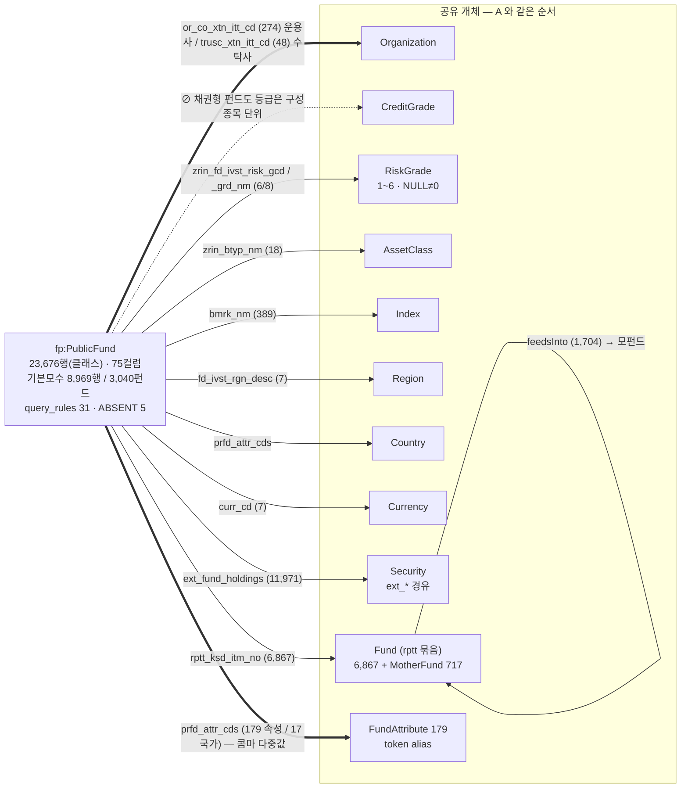

# 도메인 원고 템플릿 — 공모펀드 (담당: 리드)

> **이 파일이 곧 제안서의 펀드 몫이다.** §A~§E 를 채우면 절 번호 그대로 이어 붙인다.
> 펀드는 결함 밀도가 가장 높고(소재 10건), 펀드만 닿는 공유 개체가 3종(Fund·FundAttribute·Country)이라 스포크가 가장 많다. 본문은 6건으로 압축하고 나머지는 부록.
> `▶` 가 채울 곳. 규칙: ① 수치는 NUMBERS ② 결함→선언 인과 ③ Federated·그래프 탐색·추론 금지 ④ "펀드"라는 말은 **운용단위 `(or_co, mtco)`** 인지 **KG Fund 노드(`rptt` 묶음)** 인지 절마다 표기.
> 마감: 초안 9/3, 완성 9/4.

| 이 파일의 절 | 전체 보고서 위치 | 분량 |
| :-- | :-- | :-- |
| §A | 2.1.1 데이터 단락 중 펀드 | 반 쪽 |
| §B | **2.2.4 공모펀드** | 3쪽 |
| §C | 4.3 흐름도 펀드 | 1쪽 |
| §D | 5.2 현업 적용 지점 펀드 | 1단락 |
| §E | 부록 A·B·C 펀드분 | 별도 |

---

## §A. 데이터 (→ 2.1.1) — 반 쪽

**예시 문장:**

> 공모펀드 마스터는 23,676행 × 75컬럼이며 **행 단위가 펀드가 아니라 클래스**다. 2차 데이터에는 사모 8,960행이 섞여 들어와(1차 168행) 기본 모수를 `sale_yn='판매중' AND prvo_pbff_desc='공모'` 로 못 박았다 — 8,969행 / 3,040펀드. 모든 답변이 이 모수를 명시한다.
> 마스터에 없는 것 둘을 외부에서 보강했다. 투자설명서 구성종목 59,206행(`ext_fund_holdings`)과 펀드 페이지 10,565행(`ext_fund_page`: 설정일·환매조건 등). 조인 키는 `(or_co_xtn_itt_cd, mtco_itm_no)` 복합키다 — `mtco_itm_no` 단독은 운용사 내에서만 유일해서, 단독 조인 시 179,333쌍 중 5,099쌍(2.84%)이 남의 펀드에 붙었다.
> 정제에서 값을 고치지 않고 판정한 것: `rptt_ksd_itm_no` 더미 6,970행(`KR0000000000` 5,308), `fss_itm_no` 더미 11,611행(49.2%), `std_itm_no` 위장 결측 `'00000       '` 145행. 더미를 값으로 취급하면 조인 시 한 값에 1만 행이 뭉친다.

▶ 채울 것: 8,969/3,040 · 5,099/179,333 · 49.2% 가 NUMBERS 와 일치하는지. `ext_fund_page` 수집 출처(미래에셋 웹 등) 1줄.

---

## §B. 온톨로지 엔지니어링 — 공모펀드 (→ 2.2.4) — 3쪽

### B.0 도입 (3줄)

> 공모펀드는 공유 개체 11종 중 **9종에 닿는** 도메인이고, 셋(Fund·FundAttribute·Country)은 펀드만 쓴다. 결함의 성격도 다르다 — 채권·ETF 가 "값이 없다/틀리다"라면 펀드는 **"행이 펀드가 아니다"**. 클래스 도배·더미 키·클래스별 중복 기재가 전부 여기서 나온다. 그래서 펀드 온톨로지의 첫 결정은 개체가 아니라 **grain(행 단위)** 이었다.

### B.1 구조도 (그림 B-3)



하단 주석 두 줄: ① `⊘` 속성·시계열 부재 5건 — `hasUnitsOutstanding`(좌수) · `hasFundManager`(운용역) · `hasNavHistory` · `hasHoldingsHistory` · `hasCreditGrade`. ② **펀드 단위 키 `(or_co_xtn_itt_cd, mtco_itm_no)` 14,467 은 KG Fund 노드(rptt 6,867)와 다른 뜻** — 집계·순자산은 복합키, 개체 조회는 rptt.

| 연결 | 컬럼 | 값 수 | 비고 |
| :-- | :-- | --: | :-- |
| Organization | `or_co_xtn_itt_cd` / `trusc_xtn_itt_cd` | 274 / 48 | 코드 → 코드북 `asset_manager.csv`(275)·`trustee.csv`(50). `label_official` 슬롯 |
| Fund | `rptt_ksd_itm_no` | 6,867 | 클래스→펀드 묶음. MotherFund 717, `feedsInto` 1,704 |
| FundAttribute | `prfd_attr_cds` | 179 | 210종 15축, `match_kind='token'` 196 alias |
| Country | `prfd_attr_cds` | 17 | 같은 컬럼의 국가 태그 |
| Index | `bmrk_nm` | 389 | 벤치마크 |
| AssetClass | `zrin_btyp_nm` | 18 | |
| Region | `fd_ivst_rgn_desc` | 7 | 해외 여부는 `ovrs_fd_desc` 별도 |
| RiskGrade | `zrin_fd_ivst_risk_gcd` / `_grd_nm` | 6 / 8 | **1~6**, NULL 14,987 ≠ 0, 띄어쓰기 변형 2종 alias |
| Currency | `curr_cd` | 7 | |
| Security | `ext_fund_holdings` | 11,971 | |
| ⊘ CreditGrade | — | — | |

### B.2 결함 → 선언 (6건 채택) — 템플릿은 `04_도메인_채권.md` §B.2

**완성 예시 — B.2-1:**

#### B.2-1. 행이 펀드가 아니라 클래스이고, 묶음 키로 보이는 `std_itm_no` 는 묶음 키가 아니다 → grain 선언 + 복합키 (2층)

- **데이터가 이랬다**: 23,676행은 클래스 단위다. 펀드 묶음 키처럼 보이는 `std_itm_no` 는 distinct 18,948 중 18,909가 `itm_no` 와 1:1 이고, 2개 이상을 가리키는 값이 39개뿐이다. 결측 515 + 12자 패딩 위장결측 145 = 660행은 전부 판매완료. 즉 이 컬럼으로는 클래스를 묶을 수 없다.
- **그래서 이렇게**: `row_grain` 을 "행 = 클래스"로 선언하고, 펀드 단위 집계 키를 `(or_co_xtn_itt_cd, mtco_itm_no)` 복합키로 못 박았다(`query_rules.펀드단위`, zero-pad 7자 정본). `mtco` 단독은 415종이 2개 이상 운용사에 걸친다. 순자산 `fd_nast_suma` 는 클래스별 중복 기재라 **SUM 금지·펀드 단위 MAX**(`fp:navTotal` 주석).
- **런타임에서**: Plan 이 `펀드단위` GROUP BY 템플릿을 always_on 으로 주입, 가드가 클래스 종속 값의 단일 MAX 를 금지(6R F2), 조립이 "펀드 N개 / 클래스 M개" 를 병기.
- **실측 사례**: "순자산 큰 펀드 TOP 5" — 클래스 행으로 세면 같은 펀드가 5자리를 도배. ▶ probe ID·응답 채우기.
- **안 지키면**: `GROUP BY mtco_itm_no` 단독 → `grp='00'` 이 운용사 34곳에 걸려 남남 펀드가 한 펀드로 합산.

**소재 (B.2-2 ~ B.2-6 채택, 7~10 은 부록):**

| # | 결함 | 선언 | 층 | 실측 사례 후보 |
| :-: | :-- | :-- | :-: | :-- |
| 2 | 사모 8,960행 혼입 | 기본모수 `판매중 AND 공모` 강제, 답변 모수 명시 | 2 | 모수 없이 "펀드 몇 개" → 2.6배 부풀림 |
| 3 | 더미 키(`KR0000000000` 5,308 · fss 49.2%) | `normalization.dummy_as_missing` — 조인·개체 키에서 제외 | 2 | 더미를 rptt 묶음으로 쓰면 5,308 클래스가 한 펀드 |
| 4 | `prfd_attr_cds` 콤마 다중값 210종 15축, `or_attr_desc` 는 3축 압축 | `match_kind='token'` alias + 확정식 `','||col||',' LIKE '%,raw,%'`, `axis_mapping` 분리, `class_hierarchy`(펀드유형은 하위클래스이지 개체가 아님) | 1·선언 | "ESG 펀드", "연금저축 펀드" 태그 질의 |
| 5 | 좌수·운용역·시계열 없음 | ABSENT 5건 → Gate 즉시 기각 + 대체 안내(`fd_nast_suma`·`bns_bpr`) | 3 | KG-027: 설정유형코드 '10'을 "10좌"로 6펀드 단언한 사고 → ABSENT 도입 |
| 6 | 운용사·수탁사가 코드뿐, 약칭 라벨('삼성' 2자)이 매칭 하한에 걸림 | 코드북 275·50종 + `label_official` 슬롯 분리 | 1 | FND-034 "삼성자산운용 펀드" Ground 0 → 복구 |
| 7 | 위험등급 NULL 14,987, 이름 띄어쓰기 변형('높은위험' 20행) | NULL≠0 → `range_by_table` 1~6, 변형 alias | 3 | 부록 |
| 8 | 자펀드→모펀드 구조 | `feedsInto` 1,704 edge, MotherFund 717 노드 | 1 | 공식 예시 #2 국민성장펀드 구조 |
| 9 | 헤지펀드 플래그가 사모 등록분만 표시 | `hdge_fd_yn` 금지, 사모투자재간접 공모펀드 형태로 판정 | 2 | 부록 |
| 10 | 1주 수익률 전건 결측 등 | `schema_exclude` 4컬럼 — 스키마 프롬프트에서 제거 | 2 | 부록 |

권장 채택: 1·2·3·4·5·6 (8 은 §C 흐름도에서 다룸).

### B.3 한계 (3줄)

▶ 채울 것. 후보: ① **Fund 두 뜻**을 분리하지 않았다 — ttl 클래스명·도해가 함께 바뀌는데 현재 오답을 만들지 않아서. FundClass 노드 0·`belongsToFund` edge 0 은 결함이 아니라 컬럼이 담고 있어 중복 생성을 피한 설계 ② 비정형 설명서 파싱은 구성종목·페이지 항목까지만 — "투자전략 동향" 류 서술은 범위 밖 ③ 위험등급 NULL 63% 는 보완 불가.

---

## §C. 기능 흐름도 — 펀드 (→ 4.3) — 1쪽

**질의**: 공식 예시 #2 *"국민성장펀드의 구조와 투자전략 동향 등 찾아서 알려줘"*

```bash
# eval/probe_fund_flow.txt:  FUND-FLOW-1<TAB>국민성장펀드의 구조와 투자전략 동향 등 찾아서 알려줘
export PYTHONIOENCODING=utf-8
./.venv/Scripts/python.exe eval/probe_server.py eval/probe_fund_flow.txt -o eval/probe_fund_flow.json
```

| 단계 | 이 질의에서 일어나는 일 | 읽는 온톨로지 요소 |
| :-- | :-- | :-- |
| Route | "펀드" 머리명사 → `public_funds` | 라우팅 어휘 |
| Ground | "국민성장펀드" → Fund 노드(rptt 묶음) + 상품 고유명 슬롯(residual_name_token), 모펀드면 `feedsInto` 후손 | 1층 Fund · edge feedsInto |
| Gate | "구조·투자전략 동향" 중 ABSENT 해당 항목(운용역 등) 판정 → 있는 것만 진행 | 3층 ABSENT 5 |
| Plan | `펀드단위` 복합키 GROUP BY, `설명서항목` 규칙 → `ext_fund_page` JOIN(`itm_no`, 컬럼 전부 한정), 기본모수 | 2층 + 조인키 |
| 검증 | JOIN 템플릿·별칭 한정 검사, 값 사전 대조 | 3층 |
| 실행 | 클래스 목록 → 펀드 단위 요약 + 설정일·환매조건 | — |
| 조립 | 구조(모/자·클래스 수·운용사·수탁사) + 페이지 항목 + **"투자전략 동향은 제공 데이터에 없음"** 명시 | answer_rules · ABSENT 안내 |

▶ 채울 것: 실제 think_trace 원문, answer 첫 3줄. "동향"을 지어내지 않고 범위를 밝힌 부분을 강조.

---

## §D. 현업 적용 지점 (→ 5.2) — 1단락

**예시 문장:**
> 클래스 도배와 더미 키를 판정 규칙으로 격리했기 때문에 "펀드 단위 순자산·클래스 수·운용사별 집계"가 현업 보고서와 같은 기준으로 나온다. 속성 태그 15축(`prfd_attr_cds`)을 token alias 로 열어 두어 "연금저축 가능한 ESG 해외 펀드" 같은 다축 필터가 상품명 검색 없이 성립한다.

▶ 한 문장 더: 판매 현장(적합성·설명의무)에서 위험등급 NULL 을 "없음"으로 답하는 것의 의미.

---

## §E. 부록 펀드분

### E.1 `ontology/fund_pub.ttl` 원문 (부록 A)

```turtle
fp:PublicFund rdfs:subClassOf fp:Product ; rdfs:comment "SQLite 테이블 public_funds"@ko .
fp:navTotal a owl:DatatypeProperty ; rdfs:domain fp:PublicFund ; rdfs:range xsd:decimal ;
    rdfs:comment "순자산 — fd_nast_suma. 클래스별 중복 기재라 SUM 금지, 펀드 단위 MAX 집계"@ko .
fp:riskGradeValue_PublicFund rdfs:subPropertyOf fp:riskGradeValue ; rdfs:domain fp:PublicFund ;
    rdfs:range [ a rdfs:Datatype ; owl:onDatatype xsd:integer ;
                 owl:withRestrictions ( [ xsd:minInclusive 1 ] [ xsd:maxInclusive 6 ] ) ] ;
    rdfs:comment "1~6 — 0등급 없음 — 등급 미수록 클래스는 NULL(0 아님)"@ko .
```

### E.2 ABSENT 표 (부록 A)

| 속성 | 사유 | 대체 |
| :-- | :-- | :-- |
| `hasCreditGrade` | 채권형 펀드도 등급은 구성종목 단위(미수록) | — |
| `hasUnitsOutstanding` | 좌수 컬럼이 마스터·설명서 어디에도 없음 | `fd_nast_suma`·`bns_bpr` |
| `hasFundManager` | 운용역 정보 없음 | `or_co_xtn_itt_cd`(운용사) |
| `hasNavHistory` | 기준가 단일 스냅샷 | `bns_bpr` |
| `hasHoldingsHistory` | 보유 종목 1시점 | `ext_fund_holdings` |

### E.3 `enums/public_funds.yaml` 발췌 (부록 B) — query_rules 31 중 대표 4 + clarify 1

```yaml
row_grain: 행 = itm_no (클래스)
query_rules:
  펀드단위: GROUP BY or_co_xtn_itt_cd, zero-pad(mtco_itm_no, 7) — mtco 단독은 415종이 2개 이상 운용사에 걸침
  개인법인: pers_corp_desc '해당없음'(6,864행)은 결측이 아니라 일반 펀드 — '개인 가입 가능' = IN ('개인','해당없음')
  해외구분: ovrs_fd_desc('해외' 4,483 · '국내외혼합' 878 · '국내' 3,498) — '해외 투자 펀드' 는 IN ('해외','국내외혼합') 이 기본, 혼합 포함을 답에 밝힘
  설명서항목: 마스터에 없는 항목은 ext_fund_page JOIN (itm_no) — 두 테이블 모두 itm_no 라 별칭·컬럼 전부 한정
clarify:
  다의어:
    수익률: 기간 8종 — 미지정이면 되묻지 말고 1년 기본값 + 명시 (리드 결정 08-31)
    보수: 운용·판매·수탁·사무관리 4항목 / 총보수 — 미지정이면 총보수 + 항목별 병기
```

▶ 채울 것: `entities.Fund` 원문(운용단위 정의), `class_hierarchy` 발췌, `attributes` 15축 목록.

### E.4 값 수 표 (부록 C, 매트릭스 펀드 열) — §B.1 표 그대로. ▶ 조판 직전 재실측.

---

## 제출 전 체크

- [ ] §B.2 6건, 각 건 다섯 줄 템플릿
- [ ] "펀드"가 나올 때마다 운용단위/KG 노드 중 어느 뜻인지 표기됐다
- [ ] 수치가 NUMBERS 와 같다 (8,969/3,040 · 5,099/179,333 · 6,867 · 717 · 179)
- [ ] "Federated / 그래프 탐색 / 추론" 0건
- [ ] §C 에 실제 think_trace 원문, "동향 없음" 명시 부분 강조
- [ ] 그림 B-3 개체 순서가 그림 A 와 같다
