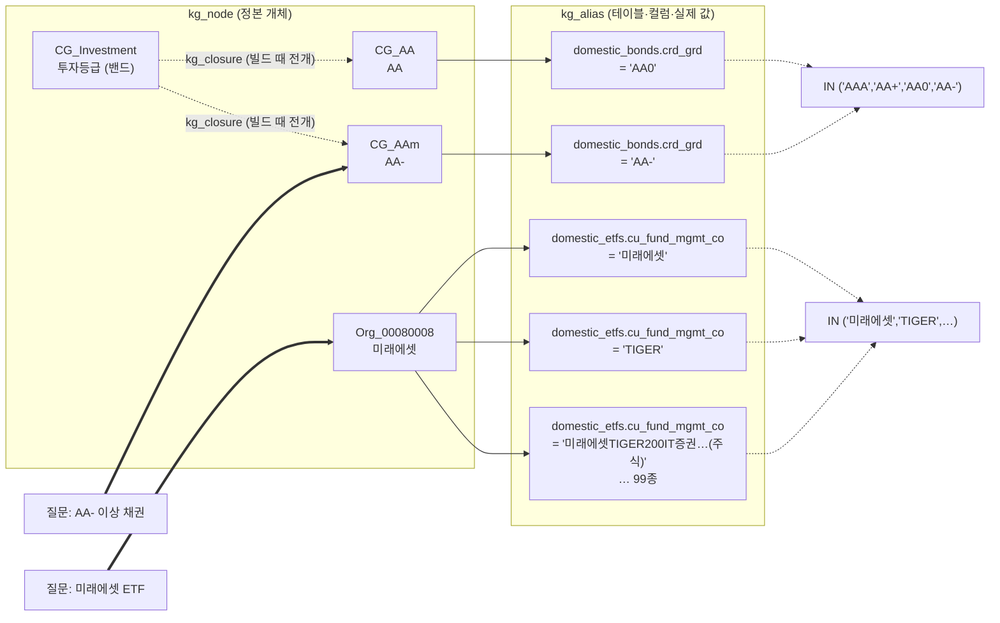
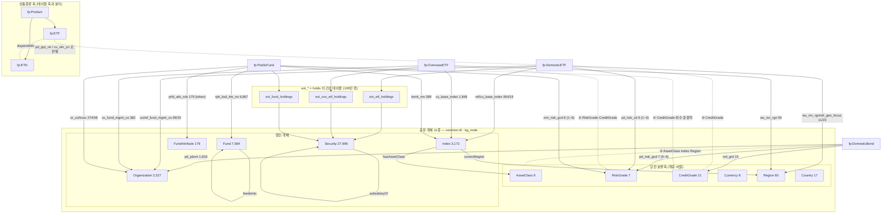
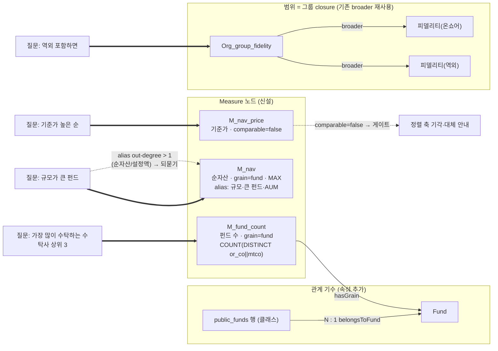
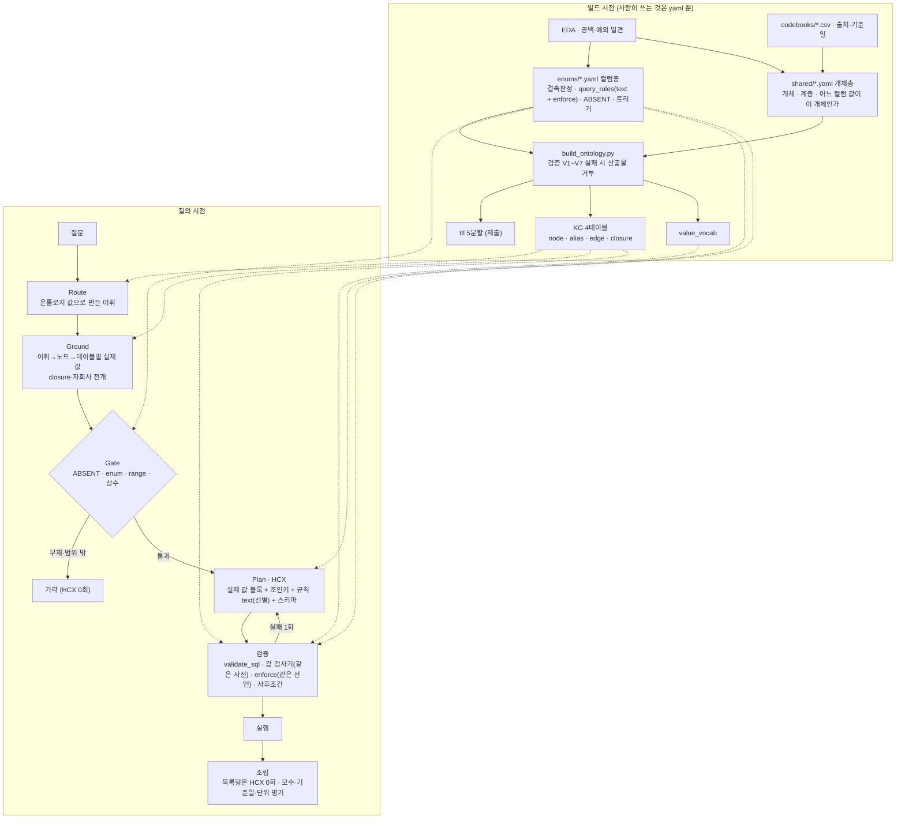

# 설계 철학 — 선행연구 반영 확정본 (2026-09-03 저녁)

> 제안서 0·01·2.2.1·2.3·5.3 이 공유하는 서사. 도메인 절(04~06)은 이 파일을 참조만 한다.
> 선행연구 등급은 `docs/research/개선_구현_및_기대효과_2026-08-30.md` §8 기준 — **A** 논문이 그 방법을 실험해 단독 수치 · **B** 방법 일부이거나 총량 효과 · **C** 제안·관찰만 · **D** 우리 실측 산물. 카드 없는 논문은 `[미등급]` — 제안서 본문 인용 금지.
> 적용 상태: ✅ 구현·실측 · 🔶 진행 중(9/3~9/5) · ⬜ 프리즈 후.
> 수치는 `../proposal/NUMBERS.md` 재생성본으로 조판 직전 교체. 아래 수치는 9/2~9/3 실측.

---

## 1. 한 문장

**KG는 상품이 아니라 상품을 고르는 조건의 값을 담는다. 질문의 어휘를 값으로 접지하는 일은 그래프가, 그 값으로 행을 고르는 일은 SQL이 한다. 데이터에 대한 사실은 선언에, 선언을 다루는 방법은 코드에 둔다. 모델이 하는 일은 복사뿐이다.**

편입 기준은 한 줄이다 — **"질문의 어휘가 값·지표·단위·범위로 이어지는가."** (9/3 이전엔 "값"뿐이었다. §3-2.)

---

## 2. 문제 정의 — LLM이 테이블을 조회할 때 틀리는 곳

선행연구의 관찰과 우리 실측이 같은 곳을 가리킨다.

| 간극 | 모델이 혼자서는 못 하는 것 | 선행연구 관찰 | 우리 실측 사고 |
| :-- | :-- | :-- | :-- |
| ① 어디를 볼지 | 어휘 → 테이블·컬럼 | JAMIA-1: 스키마만 주면 10%, 스키마 축소도 10% (Table 3) · SCH-1: 링킹은 병목 아님(oracle 과 1.5pp) | "채권형 ETF"→채권 테이블, 섹터 질의→`pd_sect_cd` |
| ② 무슨 값으로 | 어휘 → DB 실재 리터럴 | **ENT-1: 실패의 54.6% 가 WHERE/enum 값 오류** (Fig. 4, C) · KGG-1: verbatim 제약 전 정답 0% → 82% (§5, B) | `AA`(DB는 `AA0`), "삼성"이 삼성전기까지, 운용사 컬럼에 펀드명 99종 |
| ③ 데이터 관행 | 0의 뜻, 행 단위, 단위, 기준일, 서열 | SL-1 §5.4: 이득이 몰린 5범주 = 테이블 선택·스냅샷 합산·지표 공식·센티넬·시간 앵커 (B) | 총보수 0이 "가장 저렴", 클래스 행을 펀드 수로, "AA- 이상"→`= 'AA-'` |
| ④ 없는 것 | 컬럼·개체·enum 의 부재 | REF-1 §3.1: 답변가능성 = 스키마 요소 부재·개체 부재·범위 밖·모호 (A, 정식화) | AAAA 등급, 해외ETF 위험등급, '10'을 "10좌" |
| ⑤ **축** (9/3 추가) | 무엇을 세고, 어느 단위로, 어디까지 | SL-1 §6.4: 잔여 실패는 "named measure 를 더 적어라" (B) · SL-1 runtime form 정의(§3) | 15R ❌30 중 16 = 펀드↔클래스·개수↔금액·포함/제외 |

**결론**: 실패는 "어느 행"이 아니라 "무슨 값·무슨 축"에서 난다. 행 선택은 SQL이 원래 잘한다. 그러니 그래프는 값과 축의 사전이면 충분하고, 레코드는 관계형 그대로 둔다. 이것이 "값 사전 KG를 SQLite 매핑 테이블로 둔 Hybrid"(주최 정의: Hybrid = 한 소스 내 결합)의 뜻이다.

---

## 3. 원칙 다섯

### 3-1. 값은 사전에서 온다 ✅
- **실체**: `kg_node` 정본 개체 · `kg_alias` **(노드, 테이블, 컬럼, 실제 값, 매칭식)** · `kg_closure` 계층 전개. alias 66,592건 중 65,941건이 컬럼 distinct 전체를 규칙으로 돌린 `source=rule` — 예시가 아니라 **전수**라서 "사전에 없다 = DB에 없다"가 성립한다(`crd_grd` 15/15 · `cu_fund_mgmt_co` 99/100).
- **런타임**: Ground 가 어휘→노드, `expand_node` 가 closure 후손(+자회사 1단), 대상 테이블의 alias 값만 컬럼당 ≤60 프롬프트에. 노드 ID는 넘기지 않는다.
- **근거**: KGG-1 verbatim 제약(B) · KGQA-1 링킹 산출물 다변화 +4~9 (Table 3, B) · ENT-1 값 오류 54.6%(C, 착안).
- **우리 증거**: 미래에셋 노드 하나에 오염 표기 99종 → IN 목록. 8/31 "A등급 이상"이 `= 'A-'`로 나가 모수 8%만 조회 → closure 로 닫힘.

**그림 1 — 값 사전의 구조.** 노드는 정본 개체 하나, 간선은 "그 개체가 각 테이블에 어떤 값으로 적혀 있는가"다. 계층은 빌드 때 펼쳐 둔다.



**그림 2 — 통합 온톨로지, 허브-스포크.** 공유 개체 11종이 허브, 테이블 클래스 4개가 스포크. 선 위는 연결 컬럼(값 수), 점선 ⊘ 은 부재 선언. 구성종목은 간선이 아니라 `ext_*` 테이블 경유.



### 3-2. 축도 사전에서 온다 🔶
- **실체(설계)**: Measure 노드(컬럼·집계·grain·방향·comparable·alias·모호성 정책) · 테이블→개체 관계의 **기수**(public_funds 행 → Fund N:1) · Organization 그룹 closure. `docs/기술제안서/09_오답유형_구조해법.md`.
- **왜 지금**: 15R 실측 — 개별 조회 90%, 교차·비교 33%. 값 계산은 맞는데 **무엇을 센 숫자인지**가 흔들린다(❌30 중 16). 사전이 필터 값만 접지하고 축은 SQL 모양에 매달려 있어서다.
- **근거**: SL-1 runtime form(YAML 데이터 모델 + 결정론적 컴파일러, 없는 measure 참조 시 에러, §3 — 정의만, 미실험 → **C**) · FIBO: Fund 와 FundShareClassUnit 은 별개 개체(층위 원칙) · Kimball "grain 을 먼저 선언" · AMBROSIA 3분류(scope/attachment/vagueness) `[미등급]`.
- **정직**: 논문이 measure 노드를 실험한 수치는 없다. "SL-1 의 정식화를 measure 에 적용"으로만 쓴다.

**그림 3 — 축 사전 확장 (설계, 🔶).** 필터 값과 같은 방식으로 지표·단위·범위를 노드와 관계 속성으로 둔다. 새 간선 유형은 없다 — 기존 관계에 속성을 붙이고(기수), 기존 간선 유형을 재사용한다(broader, variantOf).



### 3-3. 없는 것은 구조가 안다 ✅
- **실체**: ABSENT 14건(enums `absent_properties` + shared `absent_in` → ttl) · 등급 표준표 4분기(`not_grade / unknown / no_data / ok`, 목록이 아니라 형태 `^([A-D])\1{0,3}[+\-0]?$`) · `range_by_table` · 상수 컬럼 게이트 · (설계) `comparable:false` measure.
- **런타임**: Gate 가 생성 **전**에 기각, HCX 0회. 답변불가가 "찾아봤는데 없더라"가 아니라 구조 판정이다.
- **근거**: REF-1 §3.1 생성 전·실행 없는 답변가능성 게이트 정식화, 프롬프트 거절도 금융 도메인 F1 97.2 (Table 1, **A** 기준선) · SL-1 runtime form "없는 measure 참조 시 에러"(C). 상수 컬럼 게이트는 논문 근거 없는 **D**(gold ETF-O-015/016 실측 산물).
- **우리 증거**: 15R 환각 방지 9/9. 거절 사유가 값 없음/컬럼 없음/기준일 밖/상품 없음으로 갈린다.

### 3-4. 선언은 실리고, 또 강제된다 🔶
- **실체**: 같은 yaml 규칙이 두 형태 — `text` 는 프롬프트 근거문서(context form), `enforce` 는 적용기가 SQL 에 강제(runtime form). 표식 + 체인 끝 사후조건. `docs/guard_to_yaml_migration_2026-09-03.md`.
- **왜 지금**: 펀드 결합 코드 가드 30개 중 20개의 docstring 이 "규칙이 프롬프트에 실려도 무시된다"로 시작한다. 규칙은 yaml 에 있었고 강제 수단이 없어 코드로 새어 나갔다. 코드 규칙은 SQL 모양에 묶여 UNION 가지에서 침묵했고(교차 16건), 도메인으로 전이되지 않았으며(ETF 모수 가드 부재), 수렴하지 않았다(8R~13R "개별 가드는 옳고 조합에서 깨진다" 5변종). 인벤토리 결과 A 9 · A△ 8 · C 3, **P0 3개는 전부 A**.
- **전달 감사(9/3)가 드러낸 것**: triggered 규칙 42개 중 13개는 gold 147문항에서 한 번도 발동하지 않았고, 공식 예시 #2 에서 `설명서항목`(ext_fund_page) 규칙이 **미주입** 확정. 채권은 always_on 38/38, 16,368자, 이력 문구 줄이 58%. "무시"의 일부는 미주입·과량·형식이었다.
- **근거**: SL-1 context/runtime 두 형태 구분(§3) + 4KB 문서 +17~23pp(Table 1, **B**) · DK-1 전부 주입 39.0 < 선별 47.5, `'표현' refers to SQL조각` > 평문(Table VI, **A**) · ENT-1 긴 문서 15.9 < 짧은 evidence 21.4 (Table 2, C). 우리 paired(8/31, n=87): 선별이 전부 주입을 3건 이기고 0건 짐.
- **원칙의 경계**: **데이터에 대한 사실**(모수·단위·정본 컬럼·태그 확정식·등급 방향)은 yaml. **SQL 을 다루는 방법**(괄호·TRIM·키 컬럼 교정·코드 IN 묶기)과 **표시**(근거 컬럼·억원·묶기)는 코드. "모든 규칙을 yaml 로"가 아니다.

### 3-5. 그래프를 걷지 않는다 ✅
- **실체**: 관계는 4종만(hasAssetClass 3,172 · coversRegion 2,535 · feedsInto 1,704 · subsidiaryOf 3). 계층은 빌드 때 closure. 100만 행 구성종목은 간선으로 옮기지 않고 `ext_*` 테이블 자체를 간선으로 — 조인키 4쌍을 프롬프트에.
- **근거**: KGQA-1 관계형·집계형 KG 에서 질의 생성 55.3 vs 트리플 검색 0.7·홉 탐색 3.4 (Table 1, **A** 프레임) · KGG-1 1-hop lookup 만, 그래프 알고리즘 의도적 미사용(§5) · SCH-1 8테이블에선 FK 그래프 퇴화(§3) · 종합 §1-1 "관계를 더 잡아 정확도 상승"의 근거는 어느 카드에도 없음.
- **우리 증거**: 4만 노드, 런타임 탐색 0, 12초 예산. 홀딩스는 인덱스 있는 JOIN.

---

## 4. 운영 원칙 — 모델은 복사만 한다

질문 시점에 실재 값·축·규칙을 놓아 주고 옮기게 하고, 옮긴 결과를 **같은 사전과 같은 선언**으로 검사한다.

```
빌드 시점  EDA → 공백·예외·규칙(+enforce)을 컬럼층(enums)에, 개체·계층·"어느 컬럼 값이 이 개체인가"를 개체층(shared)에 선언
           → 한 빌드(검증 V1~V7)에서 ttl 5개 + 값 사전 KG 4테이블 + value_vocab
질의 시점  어휘를 값·축으로 접지 → 예외면 기각(HCX 0회) → 값·규칙을 놓아 주고 SQL 생성
           → 같은 사전으로 값 검사 · 같은 선언으로 enforce · 사후조건 → 실행 · 조립(목록형은 HCX 0회)
```

접지가 예외 판정보다 앞이다. 재생성은 검증 실패 때만 1회, **0행에는 재시도하지 않는다**(VAL-1·KGG-1: 빈 결과를 고치려는 루프는 거절 문항에서 환각 경로).

| 층 | 형태 | 담는 것 | 근거 |
| :-- | :-- | :-- | :-- |
| 1 값·축 사전 | KG 4테이블 | 개체·계층·(축) | KGG-1 B · KGQA-1 B |
| 2 규칙 문서 | enums `text` (always_on / triggered) | 관행·해석 | SL-1 B · DK-1 A |
| 3 게이트·검증 | ABSENT·표준표·range·상수 / 값 검사기·enforce·사후조건 | 부재·강제 | REF-1 A · ENT-1 C · D |

**그림 4 — 빌드와 질의, 3층·2형태.** 같은 yaml 선언이 ttl·KG·프롬프트 문서·적용기 네 곳으로 나간다. 질의 시점에 모델이 하는 일은 SQL 생성 한 칸뿐이고, 앞뒤는 전부 사전과 선언이 한다.



---

## 5. 하지 않은 것과 왜

| 하지 않음 | 왜 | 근거 |
| :-- | :-- | :-- |
| 벡터 DB·임베딩 검색 | 답은 SQL 한 문장이고 문제는 검색이 아니라 조건 조립. "유사한 것"은 환각 경로 | 안건 A-5 · KGQA-1 |
| 그래프 탐색·추론, edge 종류 확장 | 관계형 KG 에서 탐색 ≪ 질의 생성. 관계 확장의 정확도 근거 0편 | KGQA-1 A · 종합 §1-1 |
| 0행 자동 재시도·LIKE 완화 | 거절이 정답인 문항에서 환각 경로 | VAL-1 전제와 충돌 · KGG-1 |
| 파생 컬럼(`nm_*`) | 값을 고치면 "왜 없는지"를 답할 근거가 사라진다. 이름 규약은 조건식으로 | 8/30 리드 결정 · KGG-1 inferable |
| 컬럼 프루닝(스키마 링킹) | 병목이 아니다. 라우팅은 재현율 우선 union | SCH-1 A · VAL-1 |
| 모델 교체·튜닝 | 문서 유무 +17~23pp vs 모델 차 5pp | SL-1 B |
| 개체 ID 를 프롬프트에 | 모델이 `= 'Org_issuer_97e46…'` 을 쓴다 | 우리 실측 D |

---

## 6. 강점 · 약점 · 향후

**강점** (1.2·5.1 소재): ① 접지 결과가 곧 SQL 값 ② 교차 질의가 접지 한 번으로 세 테이블 ③ 계층·서열이 값 목록으로 도착, 런타임 탐색 0 ④ 부재가 구조 안에 있어 없는 것을 찾으러 가지 않음 ⑤ 프롬프트에 준 사전 = 검사하는 사전, 도메인 추가가 yaml 하나 ⑥ 무거운 관계는 간선으로 옮기지 않음.

**정직한 약점**: alias 없는 값은 접지 못 함(해외 구성종목 22.7%, Security TOP50 컷) · 역할별 Organization 노드 분리(미래에셋 ETF 운용사 ≠ 채권 발행사) · 축이 사전 밖에 있어 교차·랭킹 33~69% · 펀드 규칙 20개가 코드와 yaml 두 곳 · 채권 규칙 문서 16K 자, 이력 58%.

**향후** (5.3 표): 축 사전(Measure·기수·그룹 closure) · enforce 전환(P0 3 프리즈 전, A△ 8 은 스키마 확장 후, C 3 은 코드 잔류) · 규칙 문서를 SL-1 크기(≈2,200토큰)로 — enforce 가 있어야 텍스트를 줄여도 안전 · 전달 감사 §4-3 형식 실험.

---

## 7. 인용 규율

| 서술 | 출처 | 등급 | 쓰는 법 |
| :-- | :-- | :-: | :-- |
| 스키마만 10% → 문서 78.3% 프레임 | JAMIA-1 (주최 인용) | — | 순서·기전만. 절대치 금지 |
| 규칙 문서 +17~23pp, 모델 차 5pp, 5범주 | SL-1 Table 1·§5.4 | B | "문서 전체 효과, 항목별 ablation 없음" 병기. Cube 벤더 논문 병기 |
| runtime form / context form, named measure | SL-1 §3·§6.4 | C | "정식화에서 착안" |
| 전부 < 선별, SQL 조각 형식 > 평문 | DK-1 Table VI | A | 우리 선별기는 어휘 트리거(BM25 수준) 명시 |
| 값 오류 54.6%, 검증 모듈 제안 | ENT-1 Fig. 4·§3.6 | C | "관찰에서 착안" |
| verbatim 제약 0→82, 데이터 계층 100% | KGG-1 §5·Table 3·4 | B | 합성 KG·Cypher 절대치 이식 금지 |
| 질의 생성 ≫ 탐색, 되먹임 1회 +9.6 | KGQA-1 Table 1·7 | A/B | Northwind 임을 병기 |
| 생성 전 게이트, 금융 F1 97.2 | REF-1 §3.1·Table 1 | A | 답변가능성 분류 성능이지 종단 정확도 아님 |
| 0행 Sub-SQL 진단 | VAL-1 §3.3.1 | B(기전)/D(용도) | 우리는 고치지 않고 거절 근거로만 |
| 링킹 병목 아님, 재현율 우선 | SCH-1 §5.3·Table 3 | A | 8테이블 퇴화 병기 |
| 개념 간 경로를 온톨로지에 | ONT-1 §3 | C | 정량 실험 없음 |
| paired·McNemar·Wilson | SL-1 §4.4 | A | 측정 방법론 |
| 상수 컬럼 게이트 · 축 분리 · holds 를 테이블로 · 개체 ID 미전달 | (논문 없음) | D | "우리 실측 산물"로 정직하게 |

`[미등급]` (카드 없음, 본문 인용 금지): AMBROSIA · AmbiQT · AmbiSQL · PRACTIQ · DIN-SQL · MAC-SQL · CHESS · dbt/Cube 산업 자료 · Cortex Analyst · SQLSure. 필요하면 `docs/research/notes/` 카드 작성 후.
