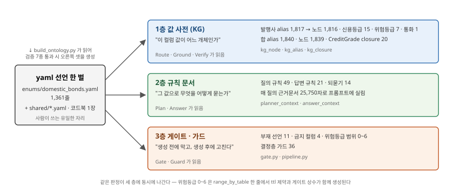
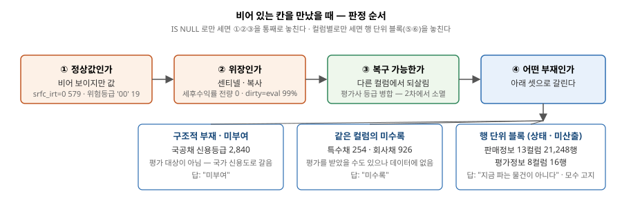
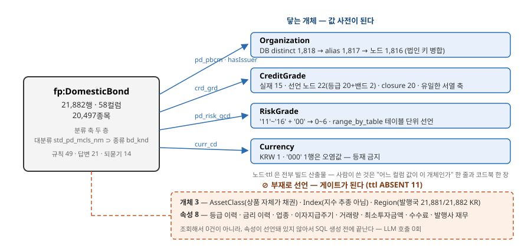
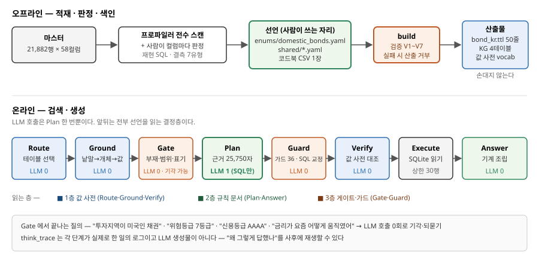
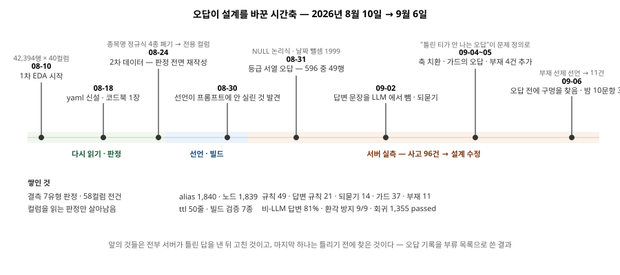

# 기술 제안서 — 국내채권 도메인

> **조판 안내** — 주최 6대 목차(01 아키텍처 · 02 제안 방법 · 03 구성도 · 04 흐름도 · 05 기대효과 · 06 부록)를 그대로 따르되 내용을 국내채권으로만 채운 원고다. 합본에 그대로 들어가는 정본 절은 §2.2 · §4 · §5 · §6 이고, §1 · §2.1 · §2.3 · §3 은 리드의 횡단 절과 겹치는 보강 단락이라 리드가 삽입하거나 뺀다. 그림은 `figures/` 의 SVG 를 삽입한다. 수치는 2026-09-06 실측이며 `scripts/audit_bond_manuscript.py` 한 번으로 84건이 다시 검사된다(§6.4).
>
> **세 날짜를 구분해 쓴다.** 데이터 as-of 2026-08-22 · 판정·표기 기준일 2026-08-24(구매가능·만기 판정) · 스냅샷 종가일 2026-08-21. 본문의 "기준일"은 8/24 다.

---

# 01. 전체 아키텍처 및 특화기능

## 1.1 도착점부터 — 우리 온톨로지는 무엇인가

우리 온톨로지는 그래프를 탐색하는 장치가 아니다. **LLM 이 관계형 마스터에 대해 SQL 을 틀리지 않게 만드는 세 층의 장치**다. 값을 미리 접지하는 사전(값 사전), 규칙을 프롬프트에 싣는 문서(규칙 문서), 생성 전후를 막고 고치는 장치(게이트·가드). 세 층이 한 벌의 yaml 선언에서 생성되고, 같은 선언을 읽는다.



채권 도메인에서 이 세 층의 실물은 다음과 같다. 값 사전에는 발행사·신용등급·위험등급·통화 네 축의 alias 1,840개와 노드 1,839개가 있다. 규칙 문서에는 질의 규칙 49개, 답변 규칙 21개, 되묻기 14개가 있고, 매 질의마다 25,750자의 근거문서로 프롬프트에 실린다. 게이트·가드에는 부재 선언 11건, 금지 컬럼 4개, 위험등급 범위 0~6, 그리고 결정층 가드 36개가 있다. 선언은 `enums/domestic_bonds.yaml` 1,358줄과 `bond_kr.ttl` 50줄이다.

수치는 이것이 전부다. 이 원고의 나머지는 **여기까지 어떻게 왔는지**를 겪은 순서대로 적은 것이다. 순서대로 적는 이유는, 각 결정이 앞 단계에서 만난 문제에서 나왔고 그 문제가 무엇이었는지를 빼면 결정이 임의로 보이기 때문이다.

## 1.2 채권이 다른 상품군과 달랐던 자리

국내채권은 네 상품군 중 **유일하게 외부 수집이 없다.** 마스터 한 장, 21,882행 × 58컬럼이 전부다. 다른 상품군이 구성종목 1,052,478행을 밖에서 모아 답의 폭을 넓히는 동안, 채권은 같은 행을 다시 읽는 것 말고 쓸 수 있는 수가 없었다.

이 제약이 채권 도메인의 작업을 규정했다. "무엇을 더 모을까"를 풀 수 없으니 **"있는 것을 무엇으로 읽을까"**를 풀어야 했고, 그 과정에서 마주친 결측·표기·분류의 문제를 하나씩 채권이라는 상품의 성격으로 되돌아가 판정했다. 그 판정을 선언으로 고정했고, 선언이 실행되게 만들었고, 그래도 어긋나는 자리엔 강제 장치를 붙였다.

02장부터 그 순서대로다. 02-①은 데이터를 다시 읽으면서 만난 것, 02-②는 그것을 선언으로 옮긴 것, 02-③은 선언이 읽히는 자리를 찾은 것이다. 04장은 서버에 물어보기 시작한 뒤 오답이 설계를 어떻게 바꿨는지, 05장은 그 결과 지금 무엇이 쉬운지다.

## 1.3 주최 필수 구성요소 대응

| 필수 구성요소 | 채권에서 이것을 맡는 것 |
| :-- | :-- |
| Parsing / Ontology | 58컬럼 전수 프로파일링 → 결측 7유형 판정 → yaml 선언 → `bond_kr.ttl` 자동 생성 |
| Extraction / Entity Resolution | 발행사 표기 병합(법인 키) 1,817 alias → 1,816 노드 · 등급 표기 `AA0` = `AA` · 로마자↔한글 음역(SK ↔ 에스케이) |
| NL2SQL / Retrieval | 값 접지 → 게이트 → 규칙 주입 → SQL 생성 → 값 검사 |
| 근거 기반 / 환각 방지 | 부재 선언 11 · 값 사전 대조 · 답변 문장 기계 조립 · 되묻기 4 · 금지 컬럼 4 |

---

# 02. 제안 방법

## 2.1 어떤 특화 데이터를 어떻게 수집·정제했는가

### 2.1.1 EDA 를 하다 결측을 만났다

8월 10일부터 1차 데이터(42,394행 × 40컬럼)를 기계 프로파일러로 전수 스캔하고, 컬럼마다 재현 SQL 을 붙여 뜻을 판정했다. 처음 눈에 들어온 것은 결측의 양이었다. 신용등급 컬럼이 40% 넘게 비어 있었고, 판매 조건 컬럼 13개는 거의 전부 비어 있었다. 평가정보 컬럼 일부도 NULL 이었다.

당연히 처음 든 생각은 **밖에서 채우자**였다. 다른 세 상품군이 그렇게 하고 있었다. ETF 는 구성종목 75,859행과 906,848행을, 펀드는 설명서 구성종목 59,206행과 상품 페이지 10,565건을 외부에서 모았다. 채권도 같은 길을 가려고 무엇을 모을 수 있는지 봤다.

### 2.1.2 채권에서는 그 결측이 당연한 것이었다

볼 것이 없었다. 그리고 그 이유가 전부 **채권이라는 상품의 성격**에 있었다.

첫째, 채권은 바스켓이 아니라 **발행사에 대한 단일 청구권**이다. ETF 와 펀드는 "무엇을 담고 있나"가 상품의 내용이라 구성종목을 밖에서 가져오면 답의 폭이 넓어진다. 채권에는 그 질문 자체가 성립하지 않는다. 발행사·표면금리·만기·등급이 상품 그 자체이고, 전부 마스터 58컬럼 안에 있다.

둘째, **종목 단위 상품 페이지가 없다.** 펀드는 상품 페이지에서 보수·설정일을 긁어 보강했다. 채권은 발행 시점의 증권신고서만 있고 종목별 상시 소개면이 없다. 마스터 58컬럼을 전수 스캔해도 url·설명서·공시 참조 컬럼이 0개다. 긁을 주소가 없다.

셋째, **시장데이터를 긁어도 비어 있다.** 장내 17,746행 중 종가가 있는 행은 1,270행(7.2%)이고, 16,476행(92.8%)은 0 — 그날 거래가 없었다는 뜻이다. 장외 4,136행은 종가 자체가 NULL 이다. 채권은 대부분 만기까지 보유되는 상품이라 유통이 적고, 밖에 시세가 쌓이지 않는다.

넷째, 남은 것 — 발행사 재무·계열·등급 이력 — 은 유료 DB 이거나 주최 규약 밖이다.

여기서 결측을 보는 눈이 바뀌었다. **비어 있는 칸은 채워야 할 구멍이 아니라 그 상품의 성격이 남긴 자국이었다.** 신용등급이 없는 4,020행을 다시 보니, 그중 2,840행이 국공채였다. 국공채는 발행 주체가 국가·중앙은행이라 평가사가 별도 등급을 매기지 않고 국가 신용도로 갈음한다. 등급이 없는 것이 정상이다. 나머지 1,180행(특수채 254 · 회사채 926)은 평가를 받았을 수도 있으나 데이터에 없는 경우다. 같은 NULL 인데 뜻이 정반대다 — 하나는 "해당 없음", 하나는 "미수록". 답변 문장도 달라야 한다.

판매 조건 13컬럼이 21,248행에서 동시에 NULL 인 것도 같은 눈으로 보였다. 개인이 채권을 사는 주된 경로는 거래소 호가가 아니라 증권사가 보유 물량을 파는 장외 매출이다. 판매 조건은 팔 물량이 있는 행에만 붙고, 같은 종목이라도 물량 단위(LOT)마다 조건이 달라 행이 갈린다. 13컬럼의 결측이 아니라 **"지금 파는 물건이 아니다"라는 사실 하나**다. 값이 있는 634행은 전부 장외 LOT 이고 종목으로는 326개다.

### 2.1.3 그래서 채우지 않고 갈랐다

값을 고치거나 채우는 대신 **비어 있음을 일곱 유형으로 갈라 판정**했다. 구조적 부재(국공채 등급), 같은 컬럼의 미수록(회사채 등급), 상태 표현(판매정보 13컬럼 블록), 미산출(평가정보 8컬럼 블록 — 16행, 전부 장외, 만기는 미래), 복구 가능(평가사 등급 컬럼 병합), 센티넬·위장 결측(세후평균수익률 전량 0 · 통화 `'000'` 1행 · 만기일 0값 4행), 복사 위장(`dirty` 가 `eval_price` 와 21,655/21,866행에서 같음 — 더티 가격은 원래 클린 가격에 경과이자를 더한 것이라, 같다는 건 경과이자가 반영되지 않았다는 뜻이다), 정상값 오해(`srfc_irt` 0인 579행 · 위험등급 `'00'` 19행 — 비어 보이지만 값이다).



판정 순서가 있다. **정상값인가 → 위장인가 → 복구 가능한가 → 어떤 부재인가.** `IS NULL` 로만 세면 정상값·위장을 통째로 놓친다. 그리고 컬럼별로만 세면 판매정보·평가정보처럼 **행 단위로 정보 묶음이 통째로 빠진 것**을 놓친다. 이 둘은 "동시 NULL = 하나라도 NULL" 로 검증됐고, 답변 정책도 컬럼 21개가 아니라 블록 2개에 하나씩 붙었다.

기각한 대안 셋을 적어 둔다. 최빈값이나 같은 발행사 등급으로 대치하는 안은 값을 만드는 순간 환각이고 주최 공지("0·결측은 의도된 내용")와 충돌한다. "확인할 수 없습니다"로 일괄 답하는 안은 국공채에 오답이다 — 실제로 서버가 국고채 답변에 "신용등급 정보 없음"을 낸 적이 있다. 등급 조건 질의에서 결측 행을 조용히 빼는 안은 모수를 밝히지 않고 "전체 중"이라 말하게 되어 오답이다.

### 2.1.4 밖에서 필요한 것은 딱 하나였다

결측을 정리하고 나니 밖에서 들여올 것이 하나 남았다. 값이 아니라 **지식**이었다.

신용등급 컬럼에는 `AAA`·`AA0`·`AA-` 같은 문자열 15종이 있다. 그런데 "AA- 이상"이 어느 등급들인지, `BBB-` 와 `BB+` 사이가 투자적격과 투기등급을 가르는 경계라는 사실은 데이터 어디에도 없다. 신용등급은 발행사의 채무상환능력을 서열로 나타낸 **평가 체계**이고, 데이터에는 그 체계의 결과만 들어온다. 순서와 경계는 평가사 쪽에 있다. `>= 'AA-'` 는 사전순이지 서열이 아니다.

그래서 한국기업평가 등급정의 한 장을 코드북으로 들여왔다. 표 21행, 표준등급 20(`C0`/`C` 동일), 투자/투기 밴드 2. 이 한 장은 행을 늘리지 않는다 — 이미 있는 `crd_grd` 문자열에 순서와 경계를 붙일 뿐이다. `as_of` 2026-08-20 으로 규약(8/24 이전 발행 자료)을 지킨다.

### 2.1.5 데이터가 통째로 갈렸을 때 살아남은 것

8월 24일 2차 데이터가 왔다. 21,882행 × 58컬럼 — 행은 절반, 컬럼은 18개가 늘었다. 1차에 맞춰 쓴 판정이 흔들렸다.

종목명을 정규식으로 읽던 판정 4종(사모·FRN·할인채·듀레이션 0)이 전부 무효가 됐다. 2차에는 전용 컬럼이 생겼기 때문이다 — 공모/사모는 `bd_ofr_tcd`, 금리 구분은 `bd_inrt_tcd`, 이자지급 방식은 `bd_intp_tcd`. 이름을 읽던 판정은 버리고 컬럼을 읽게 고쳤다. 결측 유형 하나(평가사 등급 컬럼 병합)는 컬럼 자체가 사라져 유형이 소멸했다. 외화채 21건(USD 19 · JPY 1 · EUR 1)도 2차에서 사라져 통화가 상수가 됐다.

이 경험이 한 가지를 가르쳐 줬다. **표기를 읽던 판정은 데이터 판이 바뀌면 죽고, 컬럼과 성격을 읽던 판정은 살아남는다.** 이것이 뒤에 05장 확장성의 기준이 됐다.

### 2.1.6 정제가 표본이 아님을 확인한 방법

58컬럼 전부의 NULL·빈 문자·0값·패딩을 실측해 yaml 판정과 대조했고 어긋난 컬럼이 0이었다(해당없음 16 · 미수록 14 · 혼합 6 · 정상 22). yaml 에 적힌 실측치 127건을 DB 로 재현해 불일치 0, 규칙이 말하는 확정식 114건을 그대로 실행해 전건 일치를 확인했다. 재현 절차는 §6.4 에 있다.

## 2.2 어떤 온톨로지 엔지니어링을 적용했는가

> *합본 §2.2.2. 공유 개체 11종의 정의는 리드 §2.2.1 이 맡는다.*

### 2.2.1 결측을 정리한 뒤 채권들의 관계를 봤다

결측이 정리되자 다음 질문이 왔다. **채권들은 서로 어떻게 묶이고 나뉘는가.** 사용자는 "국고채", "은행채", "AA- 이상", "한전 채권" 같은 말로 묻는데, 그 말이 데이터의 어느 컬럼·어느 값에 닿는지가 정해져야 SQL 이 나온다.

그 전에 한 가지를 먼저 정해야 했다. **행 하나가 종목 하나가 아니다.** 21,882행은 20,497종목이고, 같은 종목이 장내·장외 양쪽에 수록되거나 장외 판매 물량(LOT)마다 줄이 갈려 1,078종목이 2~4행이다. 그중 1,070종목은 두 줄의 값이 같아 한 번만 답하면 되지만, 8종목은 장외행의 종류·등급·발행사·듀레이션이 전부 NULL 이라 어느 줄을 골라도 정보가 손실된다. 개수는 언제나 `COUNT(DISTINCT pd_no)` 로 세고(`COUNT(*)` 의 과대율은 조건마다 달라 전체 +6.8%, 판매 축은 +94.5%다), 값이 갈리는 종목은 두 줄을 병기하되 결측을 옆 줄 값으로 채우지 않는다. "기록 없음"과 "AA-"는 다른 정보고, 없는 값을 옆 줄로 채우면 그것은 데이터가 아니라 추측이다.

채권 마스터에는 분류 축이 두 층 있다. 대분류 `std_pd_mcls_nm`(국공채·특수채·회사채 …)과 그 아래 종류 `bd_knd`(일반회사채·할부금융채·MBS·특수은행채 …)다. 여기에 등급 축(`crd_grd`), 발행사 축(`pd_pbcm`), 위험등급 축(`pd_risk_gcd`)이 따로 선다.



### 2.2.2 사람이 쓰는 말은 어느 층에도 딱 맞지 않았다

첫 번째로 만난 것은 **통칭과 실값의 어긋남**이었다. "국고채 몇 종목이야"를 대분류 `국공채` 로 세면 2,840종목이 나오는데 정답은 295다 — 국공채 대분류에는 국고채 말고도 지방채·통안채가 들어 있다. "통안증권"의 실값은 `통화안정채권` 이다. STRIPS 21행은 종류 컬럼이 비어 있어 ISIN 접두로만 잡힌다. "특수은행채"는 발행주체 분류로는 특수채인데 종류로는 은행채다. 대분류로 넓혀 대체하면 오답이고, 종류 하나로 좁혀도 오답이다.

그래서 통칭마다 **확정식**을 선언했다. 다의 통칭 3종(국고채·은행채·지방채)은 확정식 그대로, 나머지는 종류 별칭표와 동의어 57개로 실값에 붙인다. 은행채 하나를 보면 `TRIM(bd_knd) IN ('일반은행채','특수은행채')` 두 값이고 2,031행이다. 여기서 부수적으로 발견한 것이 고정폭 패딩이다 — `bd_knd` 값에 공백이 채워져 있어 `TRIM` 없이 같은 조건을 걸면 16행만 나온다. 값을 고치지 않고 조회 시 `TRIM` 하는 것으로 선언했고, 패딩이 실재하는 컬럼 7개를 포함해 13개 컬럼에 적용했다.

### 2.2.3 순서가 있는 축은 하나였다

두 번째는 **등급**이었다. 2.1.4 에서 들여온 코드북이 여기서 개체가 된다. 표준등급 20을 rank 1(AAA)~20(D) 노드로 세우고, 투자등급(rank 1~10)·투기등급(11~20) 두 밴드를 상위 개념(`skos:broader`)으로 두었다. 빌드가 밴드→등급을 closure 20으로 펼친다. DB 표기 `AA0` 는 사용자가 말하는 `AA` 와 같은 노드의 alias 로 흡수된다 — 사용자의 `AA` 는 DB 에 0건이고 `AA0` 로 적혀 있다(한국식 중간값 표기).

이 축은 채권이 네 상품군 중 **유일하게 갖는 서열 축**이다. "AA- 이상" 같은 순서 질의는 이 closure 없이는 SQL 로 옮길 수 없다. 규칙 `등급서열` 은 "이상·이하가 붙으면 `TRIM(crd_grd) IN (서열 확장 목록)`, `=` 단일 등급은 오답"을 싣는다.

표준표에 있으나 이 적재분에 없는 등급(`CCC`·`D` 등 6종)은 지우지 않고 `status: pending` 으로 남겼다. 표준 체계를 적재분에 맞춰 자르면 새 데이터의 `D` 등급을 조용히 못 알아본다. 그래서 "존재하지 않는 등급"과 "표준에는 있으나 해당 채권 없음"을 갈라 답한다. 이 구분은 뒤에 게이트의 4분기(§2.3.4)가 된다.

### 2.2.4 발행사는 표기가 갈렸다

세 번째는 **발행사**다. DB distinct 는 1,818개인데 같은 법인이 `한국전력공사(주)`·`(주)중소기업은행`처럼 `(주)` 위치와 꼬리 공백이 제각각이고, 같은 그룹이 로마자(`SK이노베이션(주)`)와 한글 음역(`에스케이온(주)`)으로 갈린다. 빌드가 `(주)`·`주식회사`·공백을 뗀 법인 키로 병합해 alias 1,817 → 노드 1,816 이 됐다(종류명 `'국고채권'` 1건은 발행사가 아니라 등재 제외).

통칭도 여기서 나왔다. 사용자는 "한전", "산은", "LH" 라고 말한다. 처음엔 통칭 6개를 손으로 적었다. 그런데 대표 발행사 23표기로 접지를 실측하니 6표기가 접지 0건이었고, 전부 '한국' 접두나 '공사' 접미를 뗀 일상 표기였다(산업은행·기업은행·도로공사·수출입은행·토지주택공사·한국전력). 통칭은 낱말 목록이 아니라 **접두·접미를 떼는 변형**이었다. 그래서 목록 대신 변환 규칙을 선언했다 — `한국` 접두 제거, `공사`·`공단` 접미 제거, 최소 길이 4, 다른 개체 라벨과 겹치면 생성 금지. 발행사 1,816곳에서 통칭 86개가 저절로 생기고, 접지가 17/23 → 21/23 이 됐다. 발행사가 늘면 통칭도 데이터에서 저절로 생긴다.

로마자↔한글 음역도 같은 식이다. `LIKE '%SK%'` 는 에스케이하이닉스·에스케이온 등 16곳을 놓쳐 "SK그룹 계열사 채권 발행잔액 큰 3개"의 모수가 307 이어야 할 자리에 205 가 나왔다. SK↔에스케이 한 줄을 적는 대신 **알파벳 26자의 한글 자모명 표** 하나를 두어 어떤 약칭이든 양방향으로 변환한다. DB 실측 8쌍(SK·LG·GS·CJ·KT·DB·HD·DL)이 전부 이 표와 일치했고, 다음 그룹에서 표를 늘릴 일이 없다. 매칭은 접두로만 한다 — 그룹 약칭은 발행사명 머리에 오고, 부분열로 잡으면 `KDB생명`(DB)·`인디비제삼차`(디비)가 오탐으로 걸린다. 이름은 계열 소속의 대용물일 뿐이라(SK증권은 2018년 그룹 이탈) 답변 머리줄에 "발행사명 기준"을 밝힌다.

### 2.2.5 위험등급은 신용등급과 다른 축이었다

네 번째는 **위험등급**이다. `pd_risk_gcd` 는 `'11'~'16'` 과 `'00'` 이다. 이 컬럼은 신용등급이 아니라 상품을 팔 때 투자자 성향과 맞추는 **금융투자상품 위험등급**이고, 표기 관행상 1등급이 가장 위험하고 6등급이 가장 안전하다 — 숫자가 클수록 안전하다. 6등급이 8,929행으로 전체의 40.8%다. `'00'`(해당없음) 19행은 결측이 아니라 **위험등급 부여 대상이 아닌 상품**에 붙는 값이다.

반면 펀드는 등급이 없는 클래스가 NULL 로 들어와 0이 아니다. 같은 축인데 테이블마다 정의역이 다르다. 처음엔 공용 상수 1~6을 코드에 두었는데, 그 상수가 펀드에서 0등급을 정의역으로 허용해 게이트가 발동하지 않는 사고가 났다. 그 뒤 **테이블마다 범위를 선언**하는 것으로 바꿨다.

```yaml
# ontology/shared/risk_grade.yaml — 사람이 쓰는 유일한 자리
range_by_table:
  domestic_bonds: {min: 0, max: 6, unclassified: 0, unclassified_label: "해당없음"}
  public_funds:   {min: 1, max: 6}
  domestic_etfs:  {min: 1, max: 6}
```

이 한 줄에서 둘이 생성된다. 제출용 ttl 의 값 범위 제약과 런타임 게이트의 상수다.

```turtle
# ontology/bond_kr.ttl — GENERATED, 손으로 고치지 않는다
fp:riskGradeValue_DomesticBond rdfs:subPropertyOf fp:riskGradeValue ;
    rdfs:domain fp:DomesticBond ;
    rdfs:range [ a rdfs:Datatype ; owl:onDatatype xsd:integer ;
                 owl:withRestrictions ( [ xsd:minInclusive 0 ] [ xsd:maxInclusive 6 ] ) ] .
```

같은 사실을 ttl·KG·프롬프트·코드 상수 네 자리에 따로 적으면 반드시 어긋난다는 것을 이 사고에서 배웠다. 그래서 선언 한 곳에서 넷을 생성하게 했고, 이 원칙이 채권 온톨로지 전체에 적용됐다.

### 2.2.6 이표채를 전제로 만든 컬럼에 다른 구조가 들어와 있었다

다섯 번째는 **같은 컬럼에 다른 뜻이 섞인 자리**다. 표면금리 `srfc_irt` 한 컬럼에 고정금리 이표채 20,904행, 변동금리 830행(기준일 현재 적용금리 스냅샷), 할인채 689행이 함께 있다. 할인채는 이자를 따로 주지 않고 액면보다 싸게 발행해 액면으로 상환하는 구조라 '표면금리'라는 개념이 성립하지 않는다 — 그 칸의 값은 발행 할인율이다. 영구채(신종자본증권) 266행은 만기일 `mat_dt` 가 만기가 아니라 1차 콜 행사 개시일이다. 만기가 없거나 초장기이고 실질 상환이 콜옵션 행사로 이뤄져 시장이 콜일을 만기처럼 쓰기 때문이다. 그래서 잔존이 짧게 잡히고, 듀레이션 이론위반 198행 중 101행이 영구채다.

셋을 한 축에 놓고 정렬하지 않는다. 다만 이 분리는 추천·랭킹에만 적용한다 — 조건검색에 넣으면 모수가 599 → 497종목으로 줄어 그 자체가 오답이 된다. 답변에는 영구채는 "만기일 = 콜 개시일"을, 자본성증권은 원금 상각·이자 미지급 조건이 붙을 수 있음을 밝힌다. ttl 의 `couponRate` 주석에 할인채 689행 사실을 명시했다.

### 2.2.7 축 자체가 없는 것은 없다고 선언했다

여섯 번째는 **없는 축**이다. "투자지역이 미국인 채권"을 물으면 어떻게 답해야 하는가. 채권 마스터에 투자지역 컬럼은 없다. 발행국 `pd_ctry_cd` 는 21,881/21,882행이 KR 이고 나머지 1행은 국가 코드가 아니라 국제예탁기구 식별 코드 `XS` 다. 통화도 21,881행이 KRW 다.

처음엔 발행국을 Country 개체로 등재해 투자지역 질의에 발행국을 대신 답하는 안을 검토했다. 기각했다. 발행국은 투자지역이 아니고, 상수 컬럼을 축으로 올리면 "미국 채권"이 `XS` 1행에 접지된다. 그리고 더 근본적으로, 채권에는 투자지역이라는 축이 애초에 없다 — 펀드·ETF 는 돈을 어디에 굴리는지가 축이 되지만, 채권은 발행사에 대한 단일 청구권이라 투자 대상이 발행사 하나로 정해져 있다. 발행국·통화가 상수인 것은 데이터 품질 문제가 아니라 **이 마스터의 수록 범위 그 자체**다.

그래서 `hasRegion` 을 **부재로 선언**했다. 조회해서 0건이 나오는 것이 아니라, 온톨로지에 그 속성이 선언돼 있지 않아서 SQL 생성 전에 끝난다. 답변도 "정보가 없습니다"가 아니라 "원화 채권만 수록되어 있습니다"가 된다 — 어느 쪽인지는 상품의 성격을 먼저 읽어야 정해진다.

같은 방식으로 선언한 부재가 처음엔 셋이었다(자산군·기초지수·투자지역). 서버에 물어보기 시작한 뒤 넷이 더 붙었고(등급 이력·금리 이력·업종·이자지급주기 — 04장), 마지막에 사고 없이 넷이 더 붙어(거래량·최소투자금액·수수료·발행사 재무) 지금 열하나다. 채권의 부재 선언 11건은 네 상품군 중 가장 많다. 더 모을 수 없었기 때문에 "모아서 채운다"는 선택지가 처음부터 없었고, 남은 답이 없다고 말하는 것이었다.

### 2.2.8 판정을 선언으로 옮긴 자리 — 세 종류

지금까지의 판정이 yaml 에 세 종류의 선언으로 모였다.

**개체 선언** — 어느 컬럼 값이 어느 개체인가. 발행사(Organization) 1,817 alias · 신용등급(CreditGrade) 15 alias, 선언 노드 22 · 위험등급(RiskGrade) 7 · 통화(Currency) 1. 합쳐 alias 1,840, 노드 1,839. 사람이 쓴 것은 "어느 컬럼 값이 이 개체인가" 한 줄과 코드북 한 장이고, 노드와 ttl 은 전부 빌드 산출물이다.

**부재 선언** — 무엇이 없는가. 개체 3(자산군·기초지수·투자지역) + 속성 8(등급 이력·금리 이력·업종·이자지급주기·거래량·최소투자금액·수수료·발행사 재무) = ttl ABSENT 11줄. 수수료는 채권에서 보수 구조가 상품 속성이 아니라 판매사·계좌 조건에서 정해지는 것이고, 발행사 재무는 데이터가 상환 능력에 대해 말할 수 있는 것이 신용등급·위험등급뿐이라는 뜻이다.

**규칙 선언** — 그 값으로 무엇을 어떻게 물어야 하는가. 질의 규칙 49(그중 35은 지시와 근거를 분리, 2는 선언 자체가 SQL 을 고치는 `enforce` 슬롯) · 답변 규칙 21 · 되묻기 14(다의어 7 · 사람의 선택 5 · 존재하지 않는 개체 1 · 조건부 계산 1). 전수는 부록 §6.2.

### 2.2.9 빌드가 산출물을 거부한다

선언에서 산출물을 만드는 빌드는 검증 7종을 통과하지 못하면 산출물을 만들지 않는다. 죽은 alias(선언은 있는데 DB 에 값이 없음), 한 원본 값이 두 노드에 매달림, 미완 포인터, 코드북 출처·`as_of` 누락, 존재하지 않는 컬럼 참조, 부재로 선언했는데 실제로는 컬럼이 있음, alias 확장 대상 없음. `XS` 를 국가로, `'000'` 을 통화로 등재하는 실수는 yaml 에 적는 순간이 아니라 빌드에서 막힌다.

현재 오류 0, 경고 9다. 경고 9건은 전부 "표준에는 있으나 이 적재분에 없음"으로 미리 선언한 값(신용등급 6 + 통화 3)이고, 3차 데이터에 다시 들어오면 선언은 그대로 두고 값 사전만 갱신되면 된다.

### 2.2.10 한계

신용등급 결측 18.4%는 외부 원천이 없어 보완 불가다. 다만 결측의 뜻이 미부여(국공채)와 미수록(회사채·특수채)으로 갈리고, 둘을 뭉쳐 "등급 없음"으로 답하면 국공채를 저신용으로 읽히게 만든다. 값이 갈리는 중복 8종목의 두 줄 병기는 선언까지만 있고 런타임 강제가 아직 없다. 발행주체 유형·만기 구간·담보 유형·발행사 분류 4축은 경계값이 도메인 합의 사항이라 골격만 두었다.

## 2.3 어떤 검색 방법론을 선택했고 왜 그렇게 설계했는가

### 2.3.1 왜 SQL 생성인가

원천이 관계형 마스터 한 장이고 사용자 질문의 답은 대부분 SQL 한 문장이다. "판매 가능한 원화채권 중 AA- 이상"은 유사한 문서를 찾는 문제가 아니라 **조건 세 개를 정확히 조립하는 문제**다. 벡터 검색은 채택하지 않았다 — 등급 `AA-` 와 `A-` 는 임베딩상 가깝지만 답으로는 정반대다. 그래프 탐색도 채택하지 않았다 — KG 는 값 접지 사전으로 쓰고 런타임에 걷지 않는다. 0행 자동 재시도와 `LIKE` 완화도 하지 않았다 — 거절이 정답인 문항에서 조건을 풀면 없는 답을 만든다.

### 2.3.2 선언을 해 놓고 물어보니 챗봇이 안 읽고 있었다

8월 30일, 선언이 프롬프트에 실리는지 처음 실측했다. "싼 채권 알려줘"에 되묻기 규칙이 yaml 에 있었는데 모델이 되묻지 않고 단정했다. 규칙은 있었으나 **런타임이 그 슬롯을 읽지 않고 있었다.**

이 발견이 검색 설계의 출발점이 됐다. 컬럼 판정이 문서에 있는 것과 챗봇이 그대로 행동하는 것은 다른 문제다. 런타임이 yaml 에서 실제로 읽는 슬롯을 전부 실측했다.

| yaml 슬롯 | 어디로 가나 | 채권 분량 |
| :-- | :-- | --: |
| `query_rules` 49 | 플래너 — 지시만 싣고 근거는 뺀다 | 25,750자 |
| `answer_rules` 21 | 답변 조립기 | 3,390자 |
| `clarify` · `synonyms` · `normalization` | 플래너·되묻기 | 1,489 · 559 · 727자 |
| 값 사전 | 리터럴 검사 | 3,389자 |
| `absent_properties` · `gate_constants` | 게이트 — 프롬프트 0자 | — |
| `forbidden_columns` · `similarity_axes` · `risk_factor_profile` | 결정층 — 프롬프트 0자 | — |
| `columns` 판정문 23,456자 | **읽지 않는다** | — |

마지막 줄이 요점이었다. `missing_reason`·`answer_policy` 같은 판정문은 사람이 읽는 글이고, 행동이 되려면 규칙 슬롯으로 한 번 더 옮겨져야 한다. 결측·함정 판정 40컬럼 중 9컬럼이 어느 슬롯에도 없었다. 판매채널 컬럼은 yaml 에 답변 문장까지 써 두고 챗봇은 볼 수 없는 상태였다. 답변 규칙 한 줄로 7컬럼을 회수했다. 같은 날 ETF 담당도 같은 부류를 고쳤다 — 두 도메인이 독립적으로 같은 구멍을 밟았다.

### 2.3.3 선언이 읽히는 네 지점

파이프라인은 Route → Ground → Gate → Plan → Guard → Verify → Execute → Answer 다. 온톨로지는 네 곳에서 읽힌다.

값 접지(Route·Ground)에서 질문의 낱말을 KG 개체로 매핑하고 실제 컬럼 값으로 바꾼다 — `'AA-' → CG_AAm → crd_grd='AA-'`. LLM 호출 0회. 생성 전 기각(Gate)에서 물어본 것이 없는 축이면 SQL 을 만들지 않는다 — 부재 선언 11, 등급 표준표 4분기, 범위 0~6, 상수 컬럼. LLM 호출 0회. 규칙 주입(Plan)에서 개체 매핑·도메인 규칙·되묻기 규칙·스키마를 근거문서로 조립해 넘긴다. LLM 호출 1회, SQL 만 만든다. 검증·조립(Verify·Answer)에서 단일 SELECT·화이트리스트·LIMIT·WHERE 값 사전 대조를 통과하면 실행하고, 답변 문장은 기계가 조립한다. LLM 호출 0회.

### 2.3.4 되묻기와 답변불가도 정답이다

되묻기는 채권에 넷이다 — 위험(축 셋), 싸다(가격 낮음 ↔ 수익률 높음), 유사채권 기준(기준 채권이 여러 만기 구간), 등급 표기(표준·데이터에 없는 토큰). 넷 다 LLM 호출 전에 끝난다. 답변불가는 세 종류가 각각 다른 층에서 끝난다 — 존재하지 않는 값은 게이트에서 0회, 매칭 없는 개체는 0집계 기계 조립, 부분일치만 있는 상품명은 유사 후보 되묻기.

등급 토큰의 4분기를 여기 적어 둔다. "신용등급 AAAA 인 채권"은 목록에 없어서 기각되는 것이 아니다. 등급에는 **표기 형태**가 있다 — 같은 글자의 반복에 부호 한 자리. `AAAA` 는 형태는 맞으나 표에 없고(되묻기), `CCC` 는 형태·표 둘 다 맞고 데이터 0건이고("해당 채권 없음"), `CB` 는 글자가 섞여 등급꼴이 아니다(통과 — 전환사채다). 목록으로 막았으면 새 등급이 들어올 때마다 목록을 고쳐야 했다.

```python
# src/runtime/gate.py — 등급의 '모양'. 목록이 아니라 표의 형태에서 온 규칙이다
_GRADE_SHAPE = re.compile(r"^([A-D])\1{0,3}[+\-0]?$")
```

---

# 03. 시스템 구성도



오프라인에서는 마스터 21,882행을 적재하고, 프로파일러 전수 스캔과 사람의 판정이 `enums/domestic_bonds.yaml`·`shared/*.yaml`·코드북 CSV 로 들어간다. `build_ontology.py` 가 검증 7종을 통과하면 `bond_kr.ttl`, KG 4테이블, 값 사전을 생성한다. 사람은 왼쪽 yaml 까지만 쓰고 오른쪽 ttl 과 KG 는 손대지 않는다.

온라인에서는 질문이 Route → Ground → Gate 를 LLM 0회로 지나고, Plan 에서 근거문서 25,750자를 조립해 SQL 을 생성하고(LLM 1회), Guard 36이 SQL 을 고치고, Verify 가 값 사전과 대조하고, Execute 가 SQLite 를 읽고, Answer 가 목록·집계·분포를 기계로 조립한다(LLM 0회). 응답에 함께 나가는 `think_trace` 는 각 단계가 실제로 한 일의 로그이고 LLM 생성물이 아니다.

---

# 04. 주요 기능 흐름도 — 수집 → 온톨로지 설계 → 그래프 구축 → 검색

주최가 정한 이 장의 흐름은 우리가 밟은 작업 순서와 같다. 02장이 수집·설계·구축을 겪은 순서대로 적었으니, 이 장은 마지막 걸음 — **검색을 시작한 뒤 오답이 설계를 어떻게 바꿨는가** — 를 적는다.



## 4.1 서버에 물어보기 시작하자 오답이 났다

8월 29일 첫 관측부터 9월 6일까지 오답 82건을 기록했다. 질문 → 오답 → 정답 → 원인 층 → 수정 → 상태를 전건 남겼다. 그중 설계를 바꾼 것을 순서대로 적는다.

**SQL 이 조용히 틀렸다 (8월 30~31일).** 추천 질의의 제외 조건 `NOT (pd_risk_gcd='11' OR crd_grd='C0')` 가 등급이 NULL 인 국공채 2,840행을 통째로 떨어뜨렸다. NULL 이 논리식을 삼킨다. "3년 안에 만기"의 `mat_dt <= 2029-08-22` 는 따옴표가 없어 SQLite 가 뺄셈으로 읽었고 `1999` 가 되어 만기일 0값 4행만 통과했다. 둘 다 오류가 나지 않는 오답이다.

```sql
-- 제외 조건: NULL-안전 확정식으로
WHERE pd_risk_gcd <> '11' AND COALESCE(TRIM(crd_grd),'') <> 'C0' AND bd_ofr_tcd <> '사모'

-- 날짜: REAL 적재라 세 표기가 전부 다른 결과
mat_dt <= 2029-08-22     -- 뺄셈 → 1999 → 0값 4행만
mat_dt <= '20290822'     -- REAL < TEXT 타입 서열 → 전 행 통과
mat_dt <= 20290822       -- 정수 리터럴만 정답
mat_dt <= 20260824 + 90  -- 날짜 산술도 금지: 90일 뒤가 아니라 정수 덧셈 20260914 — 실행은 되고 창만 틀림
```

이때부터 모든 규칙을 DB 에서 실행해 모수를 확인한 뒤 적는 것이 원칙이 됐다.

**등급 서열이 없어 상위가 통째로 빠졌다 (8월 31일).** "A등급 이상 회사채 표면금리 5% 초과"가 `crd_grd='A-'` 단일 등급으로 나가 모수 596종목 중 49행만 조회됐다. 같은 날 밤에는 모델이 만든 불완전한 `IN` 목록으로 상위 209종목이 누락돼 1위 우리금융캐피탈458(7.5%) 대신 SC은행(5.2%)이 답으로 나갔다. 규칙 문서에 서열을 실어 모델이 목록을 만들게 두는 안은 여기서 기각됐다. 가드 `expand_grade_comparison` 이 단일 비교나 불완전한 목록을 서열 전개식으로 통째로 교체한다.

```sql
WHERE TRIM(crd_grd) = 'A-'                                        -- 모델 생성. 49행
WHERE TRIM(crd_grd) IN ('AAA','AA+','AA0','AA-','A+','A0','A-')   -- 가드 교체 후
```

목록은 코드에 없다. `loader.grade_scale` 이 표준표 rank 순서와 값 사전 실재의 교집합으로 매번 만든다.

**답변 문장에서 1위가 증발했다 (9월 2일).** 정렬 결과의 2·4·5·6·7위만 나열돼 1위 3.986% 가 빠졌다. 다른 문항에서는 `COUNT` 가 1,929 를 돌려줬는데 "정보가 없다"고 답했다. **값은 전부 실제 행이라 환각 검사에 걸리지 않는다.** 이 부류는 프롬프트로 닫히지 않았다. 목록·집계·분포의 답변 문장을 LLM 에서 통째로 뺐다. 조회 결과를 기계가 조립하고, 가드 `ensure_top_row_cited` 가 정렬 결과를 순서 그대로 위에서부터 옮기는지 확인한다. 이 결정이 서버 실측에서 답변 문장을 LLM 이 쓰지 않은 문항 81%의 기원이고, 이 유형의 회귀는 그 뒤 0이다.

**애매한 질문에 단정했다 (9월 2일).** "가장 위험한 채권 뭐야"에 모델이 1등급 필터 + 수익률 내림차순으로 답해 유동화 후순위 5종목(최고 728.5%)이 나갔다. 수익률이 좋은 것이 아니라 평가가가 액면의 27~45%인 원금 손실 위험이 가격에 반영된 것이다. 위험은 채권에서 성격이 다른 둘로 갈린다 — 신용위험은 발행사가 못 갚을 가능성이고, 금리위험은 금리가 움직일 때 가격이 얼마나 흔들리는가로 잔존만기·듀레이션이 결정한다. 둘은 반대로 간다 — 부도위험이 낮은 국공채일수록 초장기 발행이 가능해 듀레이션이 길어진다(국공채 평균 3.97년 > 회사채 1.99년). 여기에 판매 현장의 투자위험등급이 세 번째 축으로 얹힌다. 어느 축을 묻는지에 따라 정반대의 목록이 나오므로 기본값을 금지하고, 축 단서가 없으면 LLM 호출 전에 되묻게 했다. 되묻기는 축별 규모를 DB 실측으로 함께 낸다 — 투자위험등급 1등급 1,394종목, 신용등급 C0 103종목. 실측 0.3초, LLM 0회.

**"판매 가능"의 정의부터 데이터에 없었다 (9월 2일).** 매수가능수량 컬럼 `buyable_quantity` 는 >0 이 296행, =0 이 338행이지만 주최 공지로 값 자체가 무효였다. 판매 조건이 있는 행으로 읽으면 97.1%가 사라진다. 남는 것은 만기 경과 여부인데, 데이터 as-of 는 8월 22일 토요일이고 실제 결제 가능일은 8월 24일 월요일이다. 구매가능 = `curr_cd='KRW' AND mat_dt >= 20260824` 로 정했다(21,814행 · 20,431종목). 판정 기준일 8/24 는 as-of 8/22 와 다르고, 답변 머리줄에 "(기준일 2026-08-24)"를 붙인다.

**모수가 붙는 질문과 안 붙는 질문이 갈렸다 (9월 4일).** 그 구매가능 선언이 '살 수 있나'라는 문형 어휘에 걸려 있어서, 같은 모수를 써야 할 개수 질의("복리채 몇 종목")에는 아무 조건도 안 붙었다. 만기 경과 65종목을 세면서 답변에는 기준일을 달았다 — 표기와 모수의 불일치다. 규칙을 프롬프트로 미는 대신 **선언 자체가 SQL 을 고치게** 했다(`enforce` 슬롯). 채권 gold 51문항 중 6문항의 값이 바뀌었고 전부 정정했다. 선언이 문서에서 실행 계층으로 내려온 첫 자리다.

**축이 바뀐 오답을 만났다 (9월 4일).** "표면금리 높은 순"이 수익률 `applied_yield` 로 정렬됐다. 등급 서열·회사채 필터·기준일이 전부 맞았고 정렬 축 하나만 틀렸는데, 실린 1·2위의 표면금리는 7.1%·3.0%로 상위권이 아니다(정답 1위 7.5%). 값이 전부 실제 행이다. 이 문서의 문제 정의가 여기서 확정됐다 — **틀렸는데 틀린 티가 안 나는 오답**이 우리가 막는 것이다. 질문의 낱말과 컬럼을 고정하는 규칙 `정렬축` 과 가드 `ensure_sort_axis` 를 세우고, 동률에는 `ensure_tie_break` 가 2차 정렬(등급 서열 → 만기 → 종목코드)을 넣는다 — 없으면 같은 질문을 두 번 물을 때 등수가 뒤바뀐다. 같은 주에 "한전 채권 중 만기가 제일 긴 것"에 묻지도 않은 상한 `mat_dt <= 20291231` 이 붙어 2029년 종목이 최장으로 나온 사고도 있었다(실제 최장은 2052년). 질문에 시점 낱말이 없는데 SQL 에 상한이 있으면 날조로 보고 걷어낸다.

**막는 장치가 새 오답을 냈다 (9월 5일).** "최근 6개월 안에 **발행된** 회사채"에 창 강제 가드가 **만기** 창을 덧붙여, 답한 5종목의 발행일이 전부 창 밖이었다. 오답을 막으려 넣은 가드가 질문이 정하지 않은 축을 갈아끼웠다. 가드에 불개입 조건을 달았다 — 발행·신규 낱말이 있고 만기·상환 낱말이 없으면 발행일 축으로 가고 만기 창을 강제하지 않는다. 결정층은 오답을 막는 자리이자 만드는 자리라는 것을 여기서 배웠다.

**없는 축을 있는 컬럼으로 메꿨다 (9월 4~5일).** "최근 6개월 사이 신용등급이 오른 채권"에 모델이 등급 부여일 컬럼을 이력인 양 썼다. "한전 채권 금리가 요즘 어떻게 움직였어"에 만기순 목록을 시간순인 양 서술했다. "우주항공 관련 발행사 채권"에 업종을 종목명 `LIKE '%우주항공%'` 로 옮겨 적어 0행을 내고 "상품 자체가 없다"고 답했다(한화에어로스페이스 11행 실재). "이자를 몇 개월마다 줘"에 지급 **방식** 컬럼을 **주기**라 불렀다. 넷이 같은 부류다 — 축이 없으면 모델은 비슷해 보이는 컬럼으로 메꾼다. 넷을 부재로 선언했다(등급 이력·금리 이력·업종·이자지급주기). 코드 변경은 0이다.

부재를 선언하는 일의 절반은 어디까지 막지 않을지를 정하는 일이었다. 업종은 축 이름(업종·섹터·테마)은 무조건 막되 "우주항공 관련 발행사" 같은 문형은 발행사·종목 개체가 하나도 접지되지 않았을 때만 막는다 — 접지된 질문까지 막으면 답할 수 있는 질의가 죽는다. 지급주기는 '이자·쿠폰·이표'가 함께 있을 때만 걸린다 — 아니면 "만기 몇 개월 남았어"를 오폭한다. 그리고 지급주기를 전역 규칙으로 올렸으면 안 됐다. 같은 축이 국내ETF 에는 실재한다(`pd_dvid_cycl` 분기 698 · 연 306 · 월 196 · 반기 8). **부재는 도메인의 성질이지 어휘의 성질이 아니다.** 게이트가 라우팅된 한 테이블의 선언만 보게 설계한 것이 여기서 값을 했다.

**개체 경계가 틀렸다 (9월 5일).** "신용등급 BBB++ 인 채권"에 값 사전이 `BBB++` 안의 `BBB+` 를 잡아 100종목을 답했다. 환각이 아니라 결정층 매칭이다. 등급꼴 라벨은 앞뒤 등급 기호(+·-·0)까지 경계로 보게 고치고, 표준·데이터 표기에 없는 토큰은 가까운 등급을 후보로 되묻는다.

**마지막엔 오답이 나기 전에 구멍을 찾았다 (9월 6일).** 분류를 전수조사하다 게이트에 아직 안 걸린 축 둘을 발견했다 — 거래량("거래가 제일 활발한 채권")과 최소투자금액("최소 얼마부터 살 수 있어"). 둘 다 마스터에 컬럼이 없는데 9문형이 전건 통과했다. 통과하면 모델이 없는 축을 있는 컬럼으로 메꾸는 자리이고, 그 부류는 이미 네 번 터진 뒤였다. 사고를 기다리지 않고 같은 형식으로 먼저 닫았다. 같은 날 부재축 어휘를 축 이름에서 떼어 선언으로 채우는 작업에서 둘이 더 나왔다 — 수수료(채권은 보수 구조가 상품 속성이 아니라 판매사·계좌 조건에서 정해진다)와 발행사 재무(데이터가 상환 능력에 대해 말할 수 있는 것은 신용등급·위험등급뿐이다). 부재 선언은 9에서 11이 됐다. 앞의 것들이 전부 서버가 틀린 답을 낸 뒤 고친 것이라면, 이 넷은 틀리기 전에 찾은 것이다. 오답 기록을 개별 수리 목록이 아니라 부류 목록으로 쓴 결과다.

여기서도 어휘를 낱말로 걸지 않았다. `'거래'` 단독은 거래구분(장내/장외)과 거래된 가격도 가리키므로, 거래량의 앵커는 '거래·매매·체결'에 양을 묻는 낱말이 붙을 때다. "장내에서 실제 거래된 가격이 가장 비싼 채권"은 가격 축이라 계속 답한다.

```yaml
# absent_properties: hasTradingVolume — '거래' 단독은 걸지 않는다
vocab:
  - '(?:거래|매매|체결)\s*(?:량|대금|건수|빈도|회전율)'
  - '유동성|환금성|회전율'
```

## 4.2 지금 한 질의가 어떻게 흐르는가 — 공식 예시 #1

*"현재 판매 가능한 원화채권 중 AA- 이상 종목 알려줘"* — 서버 실측 2.4초, LLM 호출 1회(SQL 생성만).

Route 가 "채권"으로 `domestic_bonds` 단일 테이블을 고르고 값 `['AA-']` 를 잡는다. Ground 가 `'AA-'` 를 `CG_AAm` 으로, `'원화'` 를 `Curr_KRW` 로 접지한다. Gate 가 등급 토큰을 표준표와 대조해 통과시킨다. Plan 이 개체 매핑·규칙(`구매가능`·`등급서열`·`등급정규화`·`대표행`)·되묻기·스키마를 근거문서로 조립해 SQL 을 생성한다. Guard 가 단일 등급 비교를 서열 목록으로 교체한다. Verify 가 WHERE 리터럴을 값 사전과 대조한다. Answer 가 30행을 기계로 조립한다.

```sql
SELECT DISTINCT pd_no, pd_nm, crd_grd FROM domestic_bonds
WHERE TRIM(crd_grd) IN ('AAA', 'AA+', 'AA0', 'AA-')
  AND curr_cd = 'KRW' AND mat_dt >= 20260824
LIMIT 30
```

응답 첫 줄 — *"조건에 해당하는 채권은 전체 15,792종목이며, 그중 30개는 다음과 같습니다 (기준일 2026-08-24)."* 한 줄에 세 개의 선언이 들어 있다. 등급 조건은 코드북 서열에서, 통화·만기 조건은 구매가능 선언에서, 15,792는 `LIMIT 30` 과 무관한 별도 집계 `COUNT(DISTINCT pd_no)` 에서 왔다. 등급 결측 4,020행은 모수 밖이며 "AA- 미만"이 아니다.

## 4.3 LLM 호출 0회로 끝나는 질의

| 질의 | 어디서 끝나나 | 답 |
| :-- | :-- | :-- |
| "투자지역이 미국인 채권" | Gate — `hasRegion` 부재 | "투자지역 컬럼이 없습니다. 발행국은 21,881/21,882행이 KR 입니다" |
| "신용등급 AAAA 인 채권" | Gate — 등급 표기 형태 | 목록에 없어서가 아니라 표기 규칙에 없어서 되묻기 |
| "위험등급 7등급 채권" | Gate — 범위 0~6 | "0(매우높은위험)~6(매우낮은위험) 범위로 정의되어 있습니다" |
| "한전 채권 금리가 요즘 어떻게 움직였어" | Gate — `hasYieldHistory` 부재 | 기각 + 발행연도별 표면금리 안내 |
| "가장 위험한 채권 뭐야" | 결정층 되묻기 | 세 기준을 규모와 함께 제시 — 0.3초 |

---

# 05. 기대효과 · 확장성

## 5.1 효과

서버 실측 239문항 기준이다. 답변 문장을 LLM 이 쓰지 않은 문항 193/239(81%), LLM 을 한 번도 호출하지 않은 문항 14(게이트 기각 10 · 되묻기 3), 환각 방지 문항(주최 답변불가 3 + 자체 6) 9/9 정답, 전체 정답 170/231(74% — 개별 조회 90% · 목록 74% · 집계 72%), 응답 시간 중앙값 3.2초.

첫 수치와 세 번째 수치는 함께 읽혀야 한다. 목록 전사와 집계 해석을 LLM 에 맡겼을 때 1위가 빠지고 양수를 "없다"로 읽는 사고가 났고, 기계 조립으로 옮긴 뒤 이 유형의 회귀는 0이다. 환각 방지 9/9는 별도 방어막의 결과가 아니라 그 결정의 결과다.

## 5.2 확장성 — 기준은 "코드를 안 고쳐도 되는가"

확장성은 yaml 이 있다는 것으로 증명되지 않는다. 데이터나 상품군이 바뀔 때 코드를 고쳐야 하면 확장이 아니라 재작업이다. 이 기준으로 보면 지금 무엇이 쉬운가.

**평가사나 등급 체계가 바뀌면** 코드북 CSV 한 장을 교체하고 빌드 한 번이다. rank·밴드·closure·게이트 표준표·서열 확장 가드가 전부 그 파일에서 다시 생성된다. 등급 관련 코드 상수는 0이다 — 처음엔 실재 15종을 적은 상수가 코드에 있었는데, 과적합 점검에서 찾아 표준표 rank ∩ 값 사전으로 옮겼다.

**외화채가 다시 적재되면** `scope.currency` 에 통화를 더한다. 그러면 "외화 채권은 수록 범위 밖" 게이트가 저절로 꺼진다. KG 는 이미 열려 있다 — USD·JPY·EUR 노드는 `status: pending` 으로 남겨 두었다.

**새 채권 종류가 생기면** `kind_filters` 에 확정식 한 줄이다. 종류 확정식 15개와 서술형 9개가 처음엔 코드에 있었고, 같은 점검에서 선언으로 옮겼다.

**발행사가 늘면** 통칭이 저절로 생긴다. 변환 규칙이 선언돼 있기 때문이다. 그룹 약칭도 자모명 표가 받는다.

**다른 상품군에 같은 것을 하려면** 그 도메인 yaml 에 같은 키를 선언한다. `range_by_table` 은 이미 세 테이블이 쓰고 있다. "비슷한 상품"의 뜻(축·폭·구간)은 `similarity_axes` 표에 있고 코드는 표만 읽으므로, ETF·펀드가 같은 키를 선언하면 같은 확정식과 되묻기가 돈다. '위험요인'을 무엇으로 설명할지도 `risk_factor_profile` 재료 표에 있다.

**3차 데이터가 오면** 같은 조건식을 다시 돌려 유형표를 갱신한다. 1차에서 2차로 갈 때 이미 해 봤고, 유형 하나가 소멸하는 것까지 확인됐다. 새로 생긴 값은 값 사전만 갱신하면 서열·게이트가 따라온다.

이 여섯이 가능한 이유는 하나다. **무언가를 나눌 때 낱말로 나누지 않고 그것이 무엇의 성질인지를 물었기 때문이다.** 공모/사모는 종목명의 `(사)` 가 아니라 발행 방식 컬럼의 성질이라 이름 규약이 바뀌어도 판정이 흔들리지 않는다. 등급 서열은 코드북의 성질이고 실재 여부는 데이터의 성질이라 둘을 나눠 두었다. 통칭은 접두·접미 변형의 성질이라 목록이 아니라 규칙이다. 위험등급 범위는 테이블의 성질이라 테이블마다 선언했다. 부재는 도메인의 성질이지 어휘의 성질이 아니라 테이블 단위로 선언했다. 낱말로 나누면 규칙이 사례 목록이 되고 사례는 데이터가 바뀔 때마다 사람이 늘려야 한다. 성격으로 나누면 규칙이 일반 규칙이 되고 새 값·새 표기·새 상품군이 그 규칙을 그대로 통과한다. 확장성은 따로 만든 기능이 아니라 그 판단의 부산물이다.

채권은 표기에 정보가 많이 실린 도메인이다. 특수구조 10종은 종목명에만 있고, ESG 라벨도, 발행사 약칭도, 등급의 한국식 `0` 표기도 전부 이름과 표기의 문제다. 낱말로 나누고 싶은 유혹이 가장 큰 도메인이었고, 매번 그 반대로 갔다. 표기를 보되 표기로 판정하지 않았다.

## 5.3 현업 적용 지점

결측 등급을 미부여(국공채)와 미수록(회사채·특수채)으로 구분해 답하는 것이 그대로 설명의무 관점의 가치다 — "등급 없음 = 위험"이라는 오해를 시스템이 만들지 않는다. 규제 문구가 코드가 아니라 답변 규칙 yaml 에 있어 원금 손실 주의 문구·사모·1등급 제외 고지·모수 고지가 전부 yaml 한 줄이고 문구 변경에 배포가 필요 없다. 위험 축이 셋으로 갈리는 질문에 단정하지 않고 되묻는 것은 창구 직원이 "위험한 상품"을 물으면 어떤 위험인지 되묻는 현장 접점의 실제 동작과 같다.

## 5.4 한계

신용등급 결측 18.4%는 외부 원천이 없어 보완 불가다. 값이 갈리는 중복 8종목의 두 줄 병기는 선언까지만 있고 런타임 강제가 아직 없다. 발행주체 유형·만기 구간·담보 유형·발행사 분류 4축은 경계값이 도메인 합의 사항이라 골격만 두었다. 등급 이력·발행사 재무·계열 정보는 데이터에 없어 답하지 않는다 — 이것은 결함이 아니라 선언이다.

## 5.5 닫으며

우리가 만든 것은 채권 챗봇이 아니라, 판정을 선언으로 고정하고 그 선언이 실행되게 하는 틀이다. 채권은 그 틀이 가장 좁은 조건에서 시험된 도메인이었다. 더할 데이터가 없었기 때문에 없는 것을 없다고 말하는 법을 먼저 배웠고, 데이터가 좁아 값 오류는 금방 드러났기 때문에 값이 전부 진짜인데 답이 틀린 부류를 정면으로 만났고, 데이터 판이 한 번 통째로 갈렸기 때문에 선언이 데이터보다 오래 살아야 한다는 기준을 실제로 겪었다. 그 셋이 채권에서 나왔지만 채권에만 남지 않는다. 부재 선언도, 유사 상품의 축 표도, 위험요인 재료 표도 테이블 단위 선언이라 다른 상품군이 같은 키를 선언하면 같은 코드가 돈다.

---

# 06. 부록 — 채권분

## 6.1 온톨로지 스키마 — `ontology/bond_kr.ttl`

생성물 50줄(5,866자). 클래스 · 속성 · 값 범위 제약 · 부재 선언 11줄. 전문은 `04_도메인_채권.md` §E.1.

```turtle
# GENERATED by scripts/build_ontology.py — DO NOT EDIT
fp:DomesticBond  rdfs:subClassOf  fp:Bond .

# ABSENT: fp:hasAssetClass          — 상품 자체가 채권
# ABSENT: fp:tracksIndex            — 지수 추종 상품이 아님
# ABSENT: fp:hasRegion              — 투자지역 컬럼 없음 (발행국 21,881/21,882 KR)
# ABSENT: fp:hasCreditGradeHistory  — 기준일 현재 등급만
# ABSENT: fp:hasYieldHistory        — 8/21 스냅샷 한 시점만
# ABSENT: fp:hasIndustrySector      — 발행사 업종 분류 컬럼 없음
# ABSENT: fp:hasCouponFrequency     — 지급 방식은 있고 주기는 없음
# ABSENT: fp:hasTradingVolume       — 거래량·거래대금·체결건수 컬럼 없음
# ABSENT: fp:hasMinimumInvestment   — 최소투자금액·매수단위 컬럼 없음
# ABSENT: fp:hasFee                 — 매매수수료·보수 컬럼 없음 (비용은 판매사·계좌 조건)
# ABSENT: fp:hasIssuerFinancials    — 발행사 재무제표·부채비율 없음 (상환 능력은 등급만)

# 값 범위 — fp:riskGradeValue 0~6 (0 = 미분류 코드 '00' 19건 실재)
```

| 개체 | alias | 노드 | 비고 |
| :-- | --: | --: | :-- |
| Organization | 1,817 | 1,816 | DB distinct 1,818 → 종류명 1건 제외 → 표기 변형 2 alias 병합 |
| CreditGrade | 선언 21 / 실재 15 | 선언 22 | 등급 20 + 밴드 2 · closure 20 |
| RiskGrade | 7 | 7 | 0~6 |
| Currency | 1 | 1 | KRW |
| **합** | **1,840** | **1,839** | 종목→발행사 closure 2 |

## 6.2 규칙 전수 — 부류별

전문은 `ontology/enums/domestic_bonds.yaml`. 대표 항목만 적는다.

**A. 결측·0 의 뜻 (8)** — `영값배제`(수치 11컬럼의 0은 미수록) · `수익률정상`(YTM 0인 201행은 산출 대상 아님) · `듀레이션정상` · `과세수익률금지`(전량 0) · `더티금지`(99.0%가 복사) · `판매행`(13컬럼 블록, 모수 634/21,882 고지) · `장내종가`(유효 1,270) · `장외등급해석`(결측 48.9%를 "미평가"로)

**B. 값의 뜻 (13)** — `위험등급방향` · `등급서열` · `등급정규화`(`AA`→`AA0`) · `금리유형`(고정+변동 148 병기) · `이자유형분리` · `무이자질의`(할인채 689) · `공모사모판정`(`(사)` 는 사모가 아님) · `ESG라벨` · `구조표시`(특수구조 10종 3,581행) · `신용보강`(6층 CASE) · `유동화위험금지`(발행자가 SPC) · `영구채필터` · `등급일사용금지`

**C. 무엇을 하나로 세는가 (8)** — `대표행` · `개수질문`(`COUNT(*)` 과대율: 전체 +6.76% · 판매 축 +94.48%) · `기본모수`(enforce) · `구매가능` · `등급별집계` · `시장집계금지`(enforce) · `외화채없음` · `존재질문`

**D. 어떻게 적혀 있는가 (7)** — `문자열비교`(패딩 7컬럼) · `날짜표기`(REAL · 날짜 산술 금지) · `기준일` · `만기윈도우` · `종류필터` · `종류비교` · `발행사조회`

**E. 질문을 어느 축으로 읽는가 (8)** — `정렬축`(혼동쌍 표) · `필터컬럼표시` · `추천개수정렬` · `수익최상급조회`(몰래 좁히는 것이 오답) · `고위험제외`(NULL-안전) · `익일값` · `발행시점축` · `유사채권`

**F. 되묻기 (14)** — 다의어 7 · 사람의 선택 5 · 존재하지 않는 개체 1 · 조건부 계산 1

**G. 답변 규약 (21)** — 조회 결과에 없는 종목명·날짜·숫자·등급을 만들지 않는다 · 국공채는 "미부여"이지 "정보 없음"이 아니다 · 분포 답변에서 '해당없음' 버킷을 빼지 않는다 · 정렬 결과를 순서 그대로 위에서부터 옮긴다 · 기준일 표기를 8/24로 통일한다 (외 16)

**대표 확정식**

```sql
-- 신용보강 — "정부가 책임지는 채권"은 국공채 단독 필터로는 오답 (C층 통째 누락)
WHERE (TRIM(std_pd_mcls_nm) = '국공채'
    OR COALESCE(TRIM(pd_pbcm),'') = '한국은행'
    OR pd_nm LIKE '%(정부보증)%'
    OR TRIM(pd_pbcm) IN ('한국주택금융공사','한국토지주택공사','한국산업은행','(주)중소기업은행'))
-- SELECT 에 '보강' 열을 CASE 로 붙여 A~F 6층을 함께 답한다 (A 2,873 · B 7 · C 2,968 · D 3,171 · E 2,648 · F 10,215)
-- D층은 특별법 공공기관이라 '정부 보증'이라 말하지 않는다

-- 개수질문 — 행 수가 아니라 종목 수
SELECT COUNT(DISTINCT pd_no) FROM domestic_bonds WHERE ...
```

**결정층 가드 36** — yaml 이 이름으로 지목한 `pipeline.py` 함수를 센 수다. 그 규칙으로 실측하면 39가 나오고, 조립 헬퍼 3개(`build_grounding`·`compose_answer`·`normalize_table_names`)를 빼면 36이다. 규칙 49 · 답변 규칙 21 · 되묻기 14에 가드 36 — 수가 맞지 않는 것이 정상이다. 선언만으로 지켜지는 규칙에는 가드를 붙이지 않았고, 가드는 실측에서 실제로 어긋난 자리에만 달았다.

## 6.3 낱말이 아니라 성격으로 나눈 자리 — 전수

| # | 낱말로 나눴다면 | 우리가 본 성격 | 자동으로 따라온 것 |
| :-: | :-- | :-- | :-- |
| 1 | 종목명에 `(사)` 가 있으면 사모 | 공모/사모는 발행 방식 — `bd_ofr_tcd`(공모 19,875 · 사모 2,007). `(사)` 1,984행은 사회적채권 라벨 | 이름 규약이 바뀌어도 판정 불변 |
| 2 | 등급 목록에 없으면 기각 | 등급에는 표기 형태가 있다 | 새 등급이 들어와도 목록을 안 고침. `CB`·`ABS` 는 통과, `CCC`·`D` 는 "해당 채권 없음" |
| 3 | `LIKE '%SK%'` | 약칭은 로마자↔한글 자모명 대응 | 알파벳 26자 표 하나로 LG·GS·KT 가 함께 풀림 |
| 4 | 통칭 6개를 손으로 | 통칭은 접두·접미 변형 | 1,816곳에서 통칭 86개 자동 생성 · 접지 17/23 → 21/23 |
| 5 | 공용 상수 1~6 | 범위는 테이블의 성질 | ttl 제약·게이트가 한 줄에서 생성 |
| 6 | 서열은 코드 상수 | 서열은 코드북, 실재는 데이터 | 평가사 교체 = CSV 한 장 · 등급 코드 상수 0 |
| 7 | 지급주기 전역 차단 | 부재는 도메인의 성질 | ETF 분배주기(`pd_dvid_cycl` 분기 698 · 연 306 · 월 196 · 반기 8)는 안 막힘 |
| 8 | '거래' 들어가면 거래량 | '거래' 는 구분·가격도 가리킨다 | "거래된 가격" 질의는 계속 답함 |
| 9 | "비슷한 채권" 전용 코드 | '비슷하다' 는 축·폭·구간 | 다른 상품군이 키만 선언하면 같은 코드 |

## 6.4 평가 재현 절차

```bash
export PYTHONIOENCODING=utf-8
python scripts/gen_proposal_numbers.py            # ① 수치 정본 재생성
python scripts/build_ontology.py --check          # ② 빌드 검증 V1~V7
python -m pytest tests -q                          # ③ 회귀
python eval/run_gold_check.py                      # ④ 로컬 gold
python scripts/audit_bond_manuscript.py            # ⑤ 이 원고의 수치 84건 재검사
```

| 확인 항목 | 결과 (2026-09-06) |
| :-- | :-- |
| 빌드 검증 V1~V7 | 오류 0 · 경고 9 (전부 "선언된 부재" — 신용등급 6 + 통화 3) |
| 회귀 테스트 | 1,029 passed · 실패 0 |
| 로컬 gold | 평가셋 226문항 중 SQL 정답이 붙은 163건 전건 실행 성공 · 실패 0 · 의도된 0행 3 |
| 규칙 조건식 재현 | 114건 전건 일치 |
| 수치 주장 재현 | 127건 불일치 0 |
| 이 원고의 수치 | DB 43 · 선언 16 · KG 10 · 프롬프트 3 · 가드 1 · 재료 11 — 불일치 0 |
| 외부 수집 | 합계 1,052,478행 · 채권 몫 0 |
